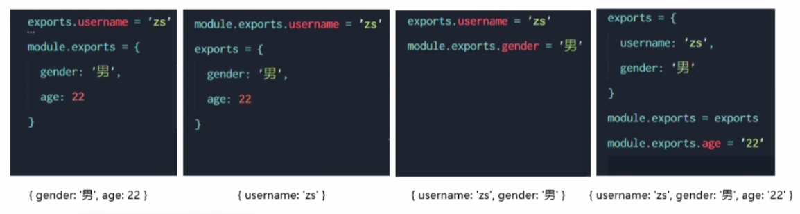
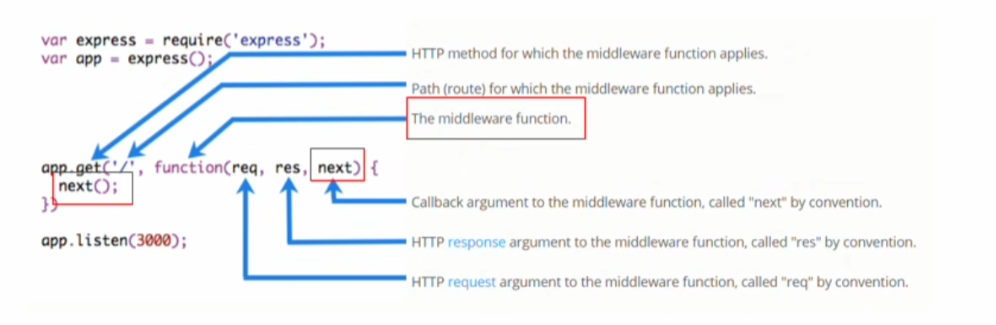

来源：https://www.bilibili.com/video/BV1a34y167AZ

# Node.js

## 1、初识Node.js

### 1.1、初始Node.js

#### 1.1.1、浏览器中的JavaScript组成


#### 1.1.2、为什么JavaScript可以再浏览器中被执行


#### 1.1.3、为什么JavaScript可以操作DOM和BOM？


每个浏览器都内置了DOM、BOM这样的API函数，因此，浏览器中的JavaScript才可以调用他们

#### 1.1.4、浏览器中的JavaScript运行环境

运行环境是指代码正常运行所需的必要环境


总结：

1. V8引擎负责解析和执行JavaScript代码
2. 内置API是由运行环境提供的特殊接口，只能在所属的运行环境中被调用

### 1.2、Node.js简介

#### 1.2.1、什么是Node.js

Node.js是一个基于Chrome V8引擎的JavaScript运行环境

#### 1.2.2、Node.js中的JavaScript运行环境


注意

1. 浏览器是JavaScript的前端运行环境
2. Node.js是JavaScript的后端运行环境
3. Node.js中无法调用DOM和BOM等浏览器内置API

#### 1.2.3、Node.js可以做什么

Node.js作为一个JavaScript的运行环境，仅仅提供了基础功能的API。然而，基于Node.js提供的这些基础功能，很多强大的工具和框架如雨后春笋，层出不穷。

1. 基于Express框架，可以快速构建WEB应用
2. 基于Electron框架，可以构建跨平台应用
3. 基于restify框架，可以快速构建API应用接口
4. 读写和操作数据库，创建使用的命令行工具辅助前端开发等等

#### 1.2.4、学习路径

浏览器中的JavaScript学习路径：

JavaScript基础语法 + 浏览器内置API（BOM + DOM）+ 第三方库（JQuery，art-template 等）

Node.js的学习路径：

JavaScript基础语法 + Node.js内置API模块(fs、path、http等) + 第三方API模块（express、mysql等）

### 1.3、Node.js环境安装

#### 1.3.1、安装

访问Node.js官网下载后双击安装即可

#### 1.3.2、查看已安装的Node.js版本

```shell
node -v
```


#### 1.3.3、什么是终端

终端：是专门为开发人员设计的，用于实现人机交互的一种方式。

### 1.4、在Node.js环境中执行JavaScript代码

打开终端，输入要执行的js文件路径


## 2、fs文件系统模块

### 2.1、什么是fs文件模块系统

fs模块是Node.js官方提供的、用来操作文件的模块，它提供了一系列的方法和数学，用来满足用户对文件的操作需求。

例如

* fs.readFile()	用来读取指定文件中的内容
* fs.writeFile()	用来向指定的文件中写入内容

如果要在JavaScript代码中使用fs模块来操作文件，则需要使用如下方式先导入它

```javascript
const fs = require('fs')
```

### 2.2、如何读取指定文件中的内容

#### 2.2.1、fs.readFile()的语法格式

使用fs.readFile()方法，可以读取指定文件中的内容，语法格式如下

```javascript
fs.readFile(path[,options], callback)
```

* path： 必选参数，字符串，表示文件的路径
* options： 可选参数，表示以什么编码格式来读取文件
* callback： 必选参数，文件读取完成后，通过回调函数拿到读取结果

#### 2.2.2、fs.readFile()的示例代码

以utf8的编码格式，读取指定文件的内容，并打印

```javascript
const fs = require('fs');
const path = 'test.txt';
fs.readFile(path,'utf8', function (err, data) {
    if (err) throw err;
    console.log(data);
})
```

#### 2.2.3、判断文件是否读取成功

可以判断err对象是否为null，从而知晓结果

```javascript
const fs = require('fs');
const path = 'test1.txt';
fs.readFile(path,'utf8', function (err, data) {
    if (err) {
        return console.log('文件读取失败\n'+err);
    }
    console.log(data);
})
```

### 2.3、向指定的文件中写入内容

#### 2.3.1、fs.writeFile()的语法格式

使用fs.writeFile()方法，可以向指定问文件中写入内容，语法格式如下：

```javascript
fs.readFile(file, data[,options], callback)
```

* path： 必选参数，字符串，表示文件的路径
* data： 必选参数，表示写入的内容
* callback： 可选参数，表示以什么格式写入的文件内容，默认值utf8

#### 2.3.2、fs.writeFile()的示例代码

```javascript
const fs = require('fs');
const path = 'test1.txt';
const data = '写入了一段文字';
fs.writeFile(path, data, function(err) {
    if (err) {
        return console.log(err);
    }
    console.log('文件 ' + path + ' 已保存');
})
```

#### 2.3.3、判断文件是否写入成功

如果文件写入成功，则err为null
如果文件写入失败，则err为错误对象

### 2.4、fs模块 - 路径动态拼接的问题

在使用fs模块操作文件时，如果提供的操作路径是以./或../开头的相对路径，很容易出现路径动态拼接错误的问题。
原因：代码在运行的时候，会执行node命令所在的目录，动态拼接出文件的完整路径

解决：

在使用fs模块操作文件时，直接使用完整路径，不要使用相对路径。在node中，可以使用

```javascript
__dirname
```

表示当前文件所处的目录。改路径不会随着node运行路径改变而改变


## 3、path路径模块

### 3.1、什么是path路径模块

path模块是Node.js官方提供的，用来处理路径的模块。它提供了一系列的方法和属性，用来满足用户对路径的处理和需求

例如：

* path.join()方法，用来将多个路径片段拼接成一个完整的路径字符串
* path.basename()方法，用来从路径字符串中，将文件名解析出来

如果在JavaScript代码中，使用path模块来处理路径，则需要使用如下的方式先导入它：

```javascript
const path = require('path')
```

### 3.2、路径破解

#### 3.2.1 、path.join()的语法格式

使用path.join()方法，可以把多个路径片段拼接成一个完整的路径字符串，语法格式入下：

```javascript
path.join([...paths])
```

参数：

* ...paths <string> 路径片段的序列
* 返回值：<string>

#### 3.2.12、path.join()的代码示例

```javascript
const path = require('path');
const pathStr = path.join('/a', '/b/c', '../d/e/f', 'g');
console.log(pathStr);

const pathStr2 = path.join(__dirname, '../test1.txt');
console.log(pathStr2);
```

返回结果


###  3.3、获取路径中的文件名

#### 3.3.1、path.basename() 的语法格式

使用 path.basename() 方法，可以获取路径中的最后一部分，经常通过这个路径中的文件名，语法格式如下

```javascript
path.basename(path[,ext])
```

参数解读：

* path <string> 必选参数，表示一个路径的字符串
* ext <string> 可选参数，表示文件拓展名
* 返回：<string> 表示路径中的最后一部分

3.3.2、path.basename() 的代码示例

```javascript
const fpath = 'test1.txt';

const fullName = path.basename(fpath);
console.log(fullName); // test1.txt

const nameWithoutExt = path.basename(fpath, '.txt');
console.log(nameWithoutExt); // test1
```

### 3.4、获取路径中的文件拓展名

#### 3.4.1、path.extname() 的语法格式

使用path.extname() 方法，可以获取路径中的拓展名部分，语法格式如下：

```javascript
path.extname(path)
```

参数解读：

* path<string> 必选参数，表示一个路径的字符串
* 返回：<string> 返回得到的拓展名字符串

3.4.2、path.extname() 的示例代码

```javascript
const fpath2 = 'test1.txt';
const ext = path.extname(fpath2);
console.log(ext);
```

### 3.5、总结

* path.wirteFile()只能创建文件，不能创建目录
* 重复调用path.writeFile()会覆盖之前内容

## 4、HTTP模块

### 4.1、什么是HTTP模块

回顾：什么是客户端，什么是服务器？

在网络节点中，负责消息资源的电脑，叫客户端；负责对外提供网络资源的电脑，叫做服务器

HTTP模块是Node.js官方提供的、用来创建web服务器的模块。通过HTTP模块提供的http.createServer()方法，就能方便的把一台普通的电脑，变成一台Web服务器，从而对外提供Web资源服务

如果要希望使用HTTP模块创建Web服务器，则要先导入他：

```js
const http = require('http')
```

### 4.2、进一步理解HTTP模块的作用

服务器和普通电脑的区别在于，服务器上安装了web服务器软件，例如：IIS、Apache等。通过安装这些服务器软件，就能把一台普通的电脑变成一台web服务器

在Node.js中，我们不需要使用IIS，Apache等这些第三方web服务器软件。因为我们可以基于Node.js提供的HTTP模块，通过几行简单的代码，就能轻松的手写一个服务器软件，从而对外提供web服务

### 4.3、服务器的相关概念

#### 4.3.1、IP地址

IP地址就是互联网上每台电脑的唯一地址，因此IP地址具有唯一性。如果把“个人电脑”比作“一台电脑”，那么“IP地址”就相当于“电话号码”。只有在知道对方IP地址的前提下，才能与对应的电脑之间进行数据通信。

IP地址的格式通常用“点分十进制”表示成（a.b.c.d）的形式，其中，a,b,c,d都是0~255之间的十进制整数。例如：192.168.1.1

注意：

1. 互联网中每台web服务器都有直接的IP地址
2. 在开发期间，直接的电脑就是一台服务器，也是一个客户端。输入127.0.0.1或localhost就能访问

#### 4.3.2、域名和域名服务器

尽管IP地址能够唯一得标记网络上的计算机，但IP是一长串数字，不直观，而且不便记忆，于是人们又发明了另一套字符型的地址方案，即域名地址

IP地址和域名是一一对应的关系，这份对应关系存放在一种叫做域名服务器（DNS服务器）的电脑中，使用者只需要通过好记的域名访问对应的服务器即可，对应的转换工作由域名服务器实现。因此，域名服务器就是提供IP地址和域名之间转换的服务器

#### 4.3.3、端口号

计算机中的端口号就好像现实中的门牌号

在一台电脑中可以运行多个web服务，每个web服务都对应唯一的端口号。客户端发送过来的网络请求，通过端口号，可以被准确地交给对应的web服务进行处理

注意：

1. 每个端口号不能被多个web服务占用
2. 在实际应用中，80端口可以被省略

### 4.4、创建最基本的web服务器

#### 4.4.1、创建web服务器的基本步骤

1. 导入HTTP模块
2. 创建web服务器实例
3. 为服务器绑定request事件，监听客户端的请求
4. 启动服务器

#### 4.4.2、创建web服务器

步骤1 - 导入HTTP模块

```javascript
const http = require('http')
```

步骤2 - 创建web服务器实例

调用http.createServer()方法，即可快速创建一个web服务器实例

```javascript
const server = http.createServer()
```

步骤3 - 为服务器绑定request事件

```javascript
server.on('request',(req,res) => {
	console.log('响应了一个请求')
})
```

步骤4 - 启动服务器

调用.listen()方法即可启动

```javascript
server.listen(3000, function() {
    console.log('Server is running at http://localhost:3000');
}
```

例：

```javascript
const http = require('http');
const server = http.createServer();
server.on('request', function(req, res) {
    res.writeHead(200, {'Content-Type': 'text/plain'});
    res.end('Hello World\n');
})
server.listen(3000, function() {
    console.log('Server is running at http://localhost:3000');
})
```

#### 4.4.3、req请求对象

只要服务器接收到了客户端的请求，就会调用server.on()为服务器绑定的request事件处理函数。如果想要在事件处理函数中，访问客户端相应的数据或属性，可以使用如下的方法

```javascript
server.on('listening', function(req) {
    console.log(`Your request url is ${req.url}, adn request method is ${req.method}`);
})
```

#### 4.4.4、req相应对象

在服务器的request事件处理函数中，如果想访问与服务器相关的数据或属性，可以使用如下犯法

```javascript
server.on("request", function(req, res) {
    res.writeHead(200, {'Content-Type': 'text/plain'});
    res.end('Hello World\n');
})
```

#### 4.4.5、解决中文乱码问题

添加响应头

```javascript
res.writeHead(200, {'Content-Type': 'text/html;charset=utf-8'});
或
res.setHead('Content-Type','text/html;charset=utf-8');
```

### 4.5、根据不同的url响应不同的请求

#### 4.5.1、核心实现步骤

1. 获取请求的url地址
2. 设置默认的响应内容
3. 判断但用户请求的
4. 响应内容给客户端

#### 4.5.2、动态的响应内容

```javascript
server.on('request', function(req, res) {
    const url = req.url;
    let content = '404 not found';
    if (url === '/' || url === '/index') {
        content = 'you\'re at index page';
    }
    if (url === '/about') {
        content = 'you\'re at about page';
    }
    res.writeHead(200, {'Content-Type': 'text/plain'});
    res.end(content);
})
```

##  5、模块化

### 5.1、模块化的基本概念

#### 5.1.1、什么是模块化

模块化是指解决一个复杂问题时，自顶向下逐层把系统划分成若干模块的过程。对于整个系统来说，模块是可组合，分解和更换的单元

现实中的模块化

游戏机和卡带

#### 5.1.2、编程领域中的模块化

编程领域中的模块化，就是遵循固定的规则，把一个大文件拆成独立互相依赖的多个小模块。

把代码拆分的好处：

1. 提高了代码的复用性
2. 提高了代码的可维护性
3. 可以实现按需加载

### 5.2、模块化规范

模块化规范就是对代码模块化的拆分和组合时，需要遵守的那些规则

例如：

* 用什么语法格式来引用模块
* 在模块中用什么样的语法来向外暴露成员

模块化规范的好处：大家都遵守同样的模块化规范写代码，降低了沟通的成本，极大方便了各个模块之间的相互调用，利人利己

## 6、Node.js中的模块化

### 6.1、Node.js中模块的分类

Node.js中根据模块来源的不同，将模块分为了三大类，分别是：

* 内置模块（内置模块是由Node.js官方提供的，例如fs，path，http等）
* 自定义模块（用户自己创建的每个.js文件，都是自定义模块）
* 第三方模块（由第三方开发出来的模块，并非官方提供的内置模块，也不是用户创建的自定义模块，使用前需要先下载）

### 6.2、加载模块

使用require()方法可以加载需要的内置模块，用户自定义模块和第三方模块镜像使用

```javascript
const mname = require('mname')
```

**注意：在使用require()方法来加载其他模块时，会执行被加载模块中的代码**

### 6.3、模块作用域

#### 6.3.1、什么是模块作用域

和函数作用域类似，在自定义模块中定义的变量，方法等成员，只能在当前模块内被访问，这种模块级别的访问限制，叫做模块作用域

#### 6.3.2、模块作用域的好处

防止全局变量污染的问题

### 6.4、向外共享模块作用域中的成员

#### 6.4.1、module对象

在每个js自定义模块中都有一个module对象，它里面储存了和当前模块有关的信息

```javascript
console.log(module)
```


#### 6.4.2、module.exports对象

在自定义模块中可以使用module.exports对象将模块内的成员共享出去，供外界使用

外界用require()方法导入自定义模块时，得到的就是module.exports所指向的对象


#### 6.4.3、共享成员时的注意点

使用require()方法导入模块时，导入的结果，永远以module.exports指向的对象为准

#### 6.4.4、export对象

由于module.exports单词写起来比较复杂，为了简化向外共享成员的代码，Node提供了exports对象。默认情况下，exports和module.exports指向同一个对象。最终共享的结果，还是以module.exports为准

#### 6.4.5、exports和module.exports的使用误区

时刻谨记，require()模块时，得到的永远是module.export指向的对象


为了防止混乱，不要再同一个模块中同时使用exports和module.exports

### 6.5、Node.js中的模块化规范

Node.js遵循了CommonJS模块化规范，CommonJS规定了模块的特性和各模块之间如何相互依赖

CommonJS规定：

1. 每个模块内部，module变量代表当前模块
2. module变量是一个对象，它的exports属性是对外接口
3. 加载某个模块，其实是加载该模块的module.exports属性。require()方法用于加载模块

## 7、npm和包

### 7.1、包

#### 7.1.1、什么是包

Node.js中的第三方模块又叫做包

第三方模块和包是同一个东西，只是叫法不同

#### 7.1.2、包的来源

不同于Node.js中的内置模块和自定义模块，包是由第三方个人或团队开发出来的，免费供所有人使用

Node.js中的包都是免费，开源的

#### 7.1.3、为什么需要包

由于Node.js的内置模块仅提供了一些底层API，导致在基于内置模块进行项目开发时，效率很低

包时基于内置模块封装出来的，提供了更高级，更方便的API，极大的提高了开发效率

包和内置模块之间的关系，类似于JQuery和浏览器内置API之间的关系

#### 7.1.4、从哪里下载包

国外有一家IT公司，叫npm,Inc，这家公司旗下有一个非常著名的网站：https://www.npmjs.com/，他是全球最大的包共享平台，你可以从这个网站上搜索到任何你需要的包，只要你有足够的耐心

到目前为止，全球约1100多玩的开发人员，通过这个包共享平台，开发并共享了超过120多玩个包供我们使用

npm,Inc公司还提供了一个地址为https://registry.npmjs.org/的服务器，来对外共享所有的包，我们可以从这个服务器上下载之间所需的包

#### 7.1.5、如何下载包

npm,Inc公司提供了一个包管理工具，我们可以使用这个包管理工具，从https://registry.npmjs.org/的服务器把需要的包下载到本地使用。

这个包管理工具的名字叫做Node Package Manager（npm包管理工具），这个包管理工具随着Node.js安装包一起被安装到了用户的电脑上

可以在终端中输入

```shell
 npm -v 
```

查看之间点啊弄上安装的npm包管理工具的版本


### 7.2、npm初体验

#### 7.2.1、格式化时间的传统做法


```javascript
function dateFormat(dateStr){
    const date = new Date(dateStr);

    const year = date.getFullYear();
    const month = date.getMonth() + 1;
    const day = date.getDate();
    const hour = date.getHours();
    const minute = date.getMinutes();
    const second = date.getSeconds();

    const yearStr = year;
    const monthStr = month > 9 ? month : '0' + month;
    const dayStr = day > 9 ? day : '0' + day;
    const hourStr = hour > 9 ? hour : '0' + hour;
    const minuteStr = minute > 9 ? minute : '0' + minute;
    const secondStr = second > 9 ? second : '0' + second;

    return `${yearStr}-${monthStr}-${dayStr} ${hourStr}:${minuteStr}:${secondStr}`;
}

exports.dateFormat = dateFormat;
```

#### 7.2.2、在项目中安装包的命令

```shell
npm install 包名
或
npm i 包名
```

#### 7.2.3、通过第三方包格式化时间

1. 使用npm包管理工具，在项目中安装格式化事件的包moment
2. 使用require()导入格式化事件的包
3. 参考moment官方的API文档对事件格式化

```javascript
const moment = require('moment');

const date = moment().format('YYYY-MM-DD HH:mm:ss');
console.log(date);
console.log(new Date());
```

#### 7.2.4、初次装包后多了哪些文件


node_modules：用来存放已安装到项目的包。require()导入第三方包时，就是从这个项目中查找并加载包
package-loc.json：用来记录node_modules目录下的每一个包的下载信息，入名字，版本号，下载地址等

注意：非必要千万不要修改这些文件或文件夹中的任何代码，npm包管理根据会自动维护

#### 7.2.5、安装指定版本的包

默认情况下，npm install会自动安装最新版本的包，如需安装指定版本的包，可以在包名之后，通过@符号指定具体版本

例如：

```shell
npm install moment@2.22.2
```

#### 7.2.6、包的语义化版本规范

包的版本号是以“点分十进制”形式进行定义的，共有三位数字，例如2.24.0

其中每一位数字代表的含义如下：

第一位数字：大版本

第二位数字：功能版本

第三位舒总：Bug修复版本

版本号提升规则：只要前面的版本号增长了，则后面的版本号归零

### 7.3、包管理配置文件 --- package.json

npm规定，在项目根目录中，必须提供一个叫package.json的包管理配置文件。用来记录项目有关的一些配置信息，例如：

* 项目的名称、版本号、描述等
* 项目中都用到了哪些包
* 哪些包只在开发期间会用到
* 哪些包在开发和部署时都需要用到

在项目根目录中创建一个叫做package.json的配置文件，即可记录项目中安装了哪些包，从而方便剔除node_modules目录之后，方便团队成员之间共享项目的源代码

npm包管理工具提供了一个快捷命令，可以在执行命令时所在的目录中，快速创建package.json这个包管理配置文件

```shell
npm init -y
```

注意：项目文件夹名称不要出现中文或者空格

dependencies节点：用来记录npm安装了哪些包

devDependencies节点：只在项目开发阶段使用，用如下命令安装

```shell
npm i package-name -D
或
npm install package-name --save-dev
```

通过package.json，可以使用npm install一次性安装所有的包

使用npm uninstall 可以卸载指定包

### 7.4、解决下包速度慢

#### 7.4.1、为什么下包速度慢

因为墙

#### 7.4.2、淘宝npm镜像服务器

淘宝在国内搭建了一个服务器，专门把国外官方服务器的包同步到国内服务器，提高了下包速度


拓展：镜像（Mirroring）是一种文件存储形式，一个磁盘上的数据在另一个磁盘上存在一个完全按相同的副本即为镜像

#### 7.4.3、切换nom的下包镜像

下包的镜像源，指的就是下包服务器地址

```shell
npm config get registry	#查看当前下包镜像源
npm config set registry=https://registry.npm.taobao.org/	#设置淘宝镜像源
npm config get registry	#查看是否配置成功
```

#### 7.4.4、nrm

为了能够更下方便的切换下包的镜像源，我们可以安装nrm这个小工具，利用nrm提高的终端命令，可以快速查看和切换下包的镜像源

```shell
npm install nrm -g	#全局安装nrm
nrm ls	#查看所有所有可用源
nrm use taobao	#设置镜像源
```

### 7.5、包的分类

#### 7.5.1、项目包

那些被安装到项目的node_modules目录中的包，都是项目包

项目包又分为两类，分别是：

* 开发依赖包（被记录到devDependencies节点的包，只会在开发期间用到）
* 核心依赖包（被记录到dependencies节点的包，在开发期间和项目上线之后都会用到）

#### 7.5.2、全局包

在执行npm install命令时，如果提高了-g参数，则会把包安装为全局包

全局包的安装和卸载与普通一样，不同之处在于在末尾添加 -g 参数

注意：

1. 只有工具性质的包，才有全局安装的必要性，因为它们提供了好用的终端命令
2. 判断某个包是否需要全局安装后才能使用，可以参考官方文档使用说明

#### 7.5.3、i5ting_toc

可以将md文档转换为html页面的小工具，使用步骤如下

```shell
i5ting_toc -f md路径 -o
```

### 7.6、规范的包结构

再清楚包概念、以及如何下载和使用包之后，接下来深入探讨一下包的内部结构

一个规范的包，它的组成结构必须符合以下三点：

1. 包必须以单独的目录而存在
2. 包的顶级目录下必须包含package.json这个包管理配置文件
3. package.json中必须包含name，version，main这三个属性，分别代表包的名字，版本号，包的入口

### 7.7、开发属于自己的包

#### 7.7.1、需要实现的功能

#### 7.7.2、初始化包的基本结构

新建包文件夹，作为包的根目录

在包文件夹中，新建

* package.json（包管理配置文件）
* index.js（包的入口文件）
* README.md（包的说明文档）

#### 7.7.3、初始化package.json

```json
{
    "name": "包名",
    "version": "1.0.0",
    "description": "包介绍",
    "homepage": "项目首页",
    "author": "项目作者",
    "keywords": [
    	"关于",
        "你的包",
        "的",
        "标签",
    ],
    "license": "开源许可"
}

```

#### 7.7.4、实现包的功能

## 8、模块的加载机制

### 8.1、优先从缓存中加载

模块在第一次加载后台后被缓存，这也意味着多次调用require()不会导致模块的代码被执行多次

注意：不论是内置模块、用户自定义模块还是第三方模块，他们都会优先从缓存中加载，从而提高模块的加载效率

### 8.2、内置模块的加载机制

内置模块是由Node.js官方提供的模块，内置模块的加载优先级最高

### 8.3、自定义模块的记载机制

使用require()加载自定义模块时，必须以指定的./或../开头的路径标识符。在加载自定义模块时，如果没有指定./或../这样的路径标识符，则Node会把它当作内置模块或第三方模块加载

同时，在require()导入自定义模块时，如果省略了文件的拓展名，则Node.js会按顺序分别尝试加载以下文件

* 按照确切的文件名进行加载
* 补全.js拓展名进行加载
* 补全.json拓展名进行加载
* 补全.node拓展名进行加载
* 加载失败，终端报错

### 8.4、第三方模块的加载机制

如果传递给require()的模块标识符不是一个内置模块，也没用以./会../开头，则Node.js会从当前模块的父目录开始，尝试从node_modules文件夹加载第三方模块

如果没有找到对应的第三方模块，则移动到再上一层父目录，进行加载，知道文件系统的根目录

### 8.5、目录作为模块

当把目录作为模块标识符，传递给require()进行加载的时候，有三种加载方式：

1. 在被加载的目录下查找一个叫做package.json的文件，并寻找main属性，作为require()加载的入口、
2. 如果目录中没有package.json文件或者mian入口不存在或无法解析，则Node.js会试图加载目录下的index.js文件
3. 如果以上两部都失败了，则Node.js会在终端打印错误信息，报告模块的确实：Error:Cannot find module 'xxx'

## 9、初始Express

### 9.1、Express简介

#### 9.1.1、什么是Express

官方给出的概念：Express时基于Node.js平台，快速、开放、极简的Web开发框架

通俗的理解：Express的作用和Node.js内置的http模块类似，时专门用来创建Web服务器的

Express的本质：就是一个npm上的包，提供了快速创建Web服务器的便捷方法

#### 9.1.2、进一步了解Express

* 不适用Express能否创建Web服务器？
  能，使用Node.js提供的原生http模块即可
* 有了http内置模块，为什么还有Express
  http内置模块用起来复杂，开发效率低；Express是基于http模块进一步封装出来的，能极大的提高开发效率
* http内置模块与Express是什么关系
  类似浏览器中Web API和JQuery的关系，后者是基于前者进一步封装出来的

#### 9.1.3、Express能做什么

对于前端程序员来说，最常见的两种服务器，分别是

* Web网站服务器：专门对外提供Web网页资源的服务器
* API接口服务器：专门对外提供API接口的服务器

使用Express，我们可以方便、快速的创建Web网站的服务器或API接口的服务器

### 9.2、Express的基本使用

#### 9.2.1、安装

在项目所处的根目录中，运行如下的终端命令，即可将Express安装到项目中使用

```shell
npm install express
```

#### 9.2.2、创建最基本的Web服务器

```javascript
const express = require('express');

const app = express()

app.listen(3000, () => {
    console.log('Server is running on port 3000');
})
```

#### 9.2.3、监听GET请求

通过app.get()可以监听客户端的GET请求

```javascript
app.get('请求url', (req, res) => {
    
});
```

#### 9.2.4、监听POST请求

通过app.post()可以监听客户端的GET请求

```javascript
app.post('/', (req, res) => {
    
});
```

#### 9.2.5、把内容响应给客户端

通过res.send()方法可以把处理好的内容发送给客户端

```javascript
app.get('/', (req, res) => {
    res.send('Hello World!');
});
app.post('/', (req, res) => {
    res.send('Hello World!');
});
```

#### 9.2.6、获取URL中携带的查询参数

通过req.query对象，可以访问到客户端通过查询字符串的形式，发送到服务器的参数

```javascript
app.get('/', (req, res) => {
    const data = req.query;
    console.log(data);
    res.send(data);
});
```

#### 9.2.7、获取URL中的动态参数

通过req.params对象，可以访问到URL中，通过 : 匹配到的动态参数

```javascript
app.get('/:id', (req, res) => {
    const params = req.params;
    console.log(params);
    res.send(params);
});
```

### .3、托管静态资源

#### 9.3.1、express.static()

express提供了一个非常好用的函数，叫做express.static()，通过它，我们可以非常方便地创建一个静态资源服务器，例如，通过如下代码就可以将public目录下的图片、css文件、JavaScript文件对外开放访问

```avascript
app.use(express.static('public'))
```

意：Express在指定的静态资源目录中查找文件，并对外提供资源的访问路径，因此，存放静态文件的目录名不会出现在URL中

#### 9.3.2、托管多个静态资源目录

如果要托管多个静态资源目录，请多次调用express.static()函数

访问静态资源时，express.static()函数会根据目录的添加顺序查找所需的文件

#### 9.3.3、挂载路径前缀

如果希望在托管的静态资源访问路径之前，挂载路径前缀，则可以使用如下的方式：

```javascript
app.use('/public',express.static('public'))
```

### 9.4、nodemon

#### 9.4.1、为什么要使用nodemon

在编写调试Node.js项目的时候，如果修改了项目的代码，则需要频繁的手动close掉，非常繁琐

现在，我们可以使用nodemon这个工具，它能够监听项目文件的变动，当代码被修改后，nodemon会自动帮我们重启项目，极大方便了开发和调试

#### 9.4.2、安装nodemon

```shell
npm install -g nodemon
```

#### 9.4.3、使用nodemon

当基于Node.js编写了一个网站应用的时候，传统的方式是运行node app.js命令来启动项目，这样的坏处是：当代码被修改后，需要手动重启项目

现在，我们可以将node命令替换为nodemon命令，使用nodemon app.js来启动项目。这样做的好处是：代码被修改之后，会被nodemon监听到，从而实现自动重启项目的效果

## 10、Express路由

### 10.1、路由的概念

#### 10.1.1、什么是路由

广义上来讲，路由就是映射关系

#### 10.1.2、现实生活中的路由


#### 10.1.3、Express中的路由

在Express中，路由指的是客户端的请求与服务器处理函数之间的映射关系

Express中的路由分为三部分组成，分别是请求的类型、请求的URL地址、处理函数，格式如下

```javascript
app.METHOD(PATH,HANDLER)
```

#### 10.1.4、Express中路由的地址

```javascript
app.get('/', (req, res) => {
    const data = req.query;
    console.log(data);
    res.send(data);
});

app.get('/:id', (req, res) => {
    const params = req.params;
    console.log(params);
    res.send(params);
});
```

#### 10.1.5、路由的匹配过程

每当一个请求到达服务器之后，需要先经过路由的匹配，只有匹配成功之后，才会调用对应的处理函数。

在匹配时，会按照路由的顺序进行匹配，如果请求类型和请求的URL同时匹配成功，则Express会将这次请求转交给对应的function函数进行处理


路由匹配的注意点：

1. 按照定义的先后顺序进行匹配
2. 请求的类型和请求的url地址同时匹配成功，才会调用对应的处理函数

### 10.2、路由的使用

#### 10.2.1、最简单的用法

在Express中使用路由最简单的方式，就是把路由挂载到app上，示例代码如下：

```javascript
const express = require('express');

const app = express()

app.get('/', (req, res) => {
    const data = req.query;
    console.log(data);
    res.send(data);
});

app.get('/:id', (req, res) => {
    const params = req.params;
    console.log(params);
    res.send(params);
});

app.listen(3000, () => {
    console.log('Server is running on port 3000');
});
```

#### 10.2.2、模块化路由

为了方便对路由进行模块化的管理，Express不建议将路由直接挂载到app上，而是推荐将路由抽离为单独的模块

实现步骤：

1. 创建路由模块对应的.js文件
2. 调用express.Router()函数路由对象
3. 向路由对象上挂在具体的路由
4. 使用module.exports()向外共享路由对象
5. 使用app.use()函数注册路由模块

#### 10.2.3、创建路由模块

```javascript
const express = require('express');
const router = express.Router();

router.get('/get/:id', (req, res) => {
    res.send(req.params);
});

module.exports = router;
```

#### 10.2.4、注册路由模块

```javascript
const express = require('express');
const app = express();

const router = require('./router');
app.use(router);

app.listen(3000, () => {
    console.log('Server is running on port 3000');
});
```

注意：

* app.use()的作用就是注册全局中间件

#### 10.2.5、为路由模块添加访问前缀

```javascript
app.use('/path', router);
```

## 11、Express中间件

### 11.1、中间件的概念

#### 11.1.1、什么是中间件

中间件（Middleware），特指业务流程的中间处理环节

#### 11.1.2、现实生活中的例子

在处理污水的时候，一般都要经过三个处理环节，从而保证处理过后的废水达到排放标准


处理污水的这三个中间处理环节，就可以叫做中间件

#### 11.1.3、Express中间件的调用流程

当一个请求到达Express服务器后，可以连续调用多个中间件，从而对这次请求进行预处理


#### 11.1.4、Express中间件的格式

Express中间件，本质上就是一个function处理函数，Express中间件的格式如下：



注意：中间件处理函数的形参列表中，必须包含next函数。而路由处理函数中只包含req和res

#### 11.1.5、next函数的作用

next函数是实现多个中间件连续调用的关键，他表示把流转关系转交给下一个中间件或路由


### 11.2、Express中间件初体验

#### 11.2.1、定义中间件函数

可以通过如下方式，定义一个最简单的中间件函数

```javascript
const mw = function (req, res, next) {
    console.log('middleware');
    next();
}
```

#### 11.2.2、全局生效的中间件

客户端发起的任何请求，到达服务器后都会触发的中间件，叫做全局生效的中间件。

通过调用app.use(中间件函数)，即可定义一个全局生效的中间件，示例代码如下

```javascript
const mw = function (req, res, next) {
    console.log('middleware');
    next();
}
app.use(mw);
```

会先执行中间件，在执行路由代码

#### 11.2.3、定义全局中间件的简化模式

```javascript
app.use((req, res,next) => {
    res.send('全局中间件简易模式');
    next();
});
```

#### 11.2.4、中间件的作用

多个中间件之间，共享同一份res和req。基于这样的特性，我们可以在上游的中间件中，统一为req或res对象添加自定义的属性或方法，供下游的中间件或路由进行使用


```javascript
const mw = function (req, res, next) {
    req.startTime = Date.now();
    console.log('middleware');
    next();
}

```

```javascript
router.get('/get/:id', (req, res) => {
    res.send(req.params.id+'\n'+req.startTime);
});
```

#### 11.2.5、定义多个全局中间件

可以使用啊app.use()连续定义u东哥全局中间件。客户端请求到达服务器之后，会按照中间件定义的先后顺序，依次进行调用，示例代码如下

```javascript
const mw1 = function (req, res, next) {
    console.log('middleware1');
    next();
}
app.use(mw1);

const mw2 = function (req, res, next) {
    console.log('middleware2');
    next();
}
app.use(mw2);
```

#### 11.2.6、局部生效的中间件

不使用app.use()定义的中间件，叫做局部生效的中间件，示例代码如下

```javascript
const express =require('express');
const app = express();

const mw1 = function (req, res, next) {
    console.log('middleware1');
    next();
}

app.get('/mw1', mw1, (req, res) => {
    console.log('mw1');
    res.send(req.params);
});

app.get('/mw2', (req, res) => {
    res.send(req.params);
});


app.listen(3000, () => {
    console.log('Server is running on port 3000');
});
```

#### 11.2.7、定义多个局部中间件

可以在路由中，通过如下两种等价的方式，使用多个局部中间件

```javascript
app.get('/mw1', mw1, mw2, (req, res) => { }
app.get('/mw1',[mw1, mw2], (req, res) => { }
```

#### 11.2.8、中间件的使用注意

* 一定要在路由之前注册中间件
* 客户端发送过来的请求，开源连续调用多个中间件处理
* 执行完中间件的业务代码之后，不要忘记调用next()函数
* 为了防止代码逻辑的混乱，调用next()后不要再写其他的代码了
* 连续调用多个中间件的时候，多个中间件之间是共享res和req的

### 11.3、中间件的分类

为了方便记忆，express官方把常用的中间件用法分为了五大类：

* 应用级别的中间件
* 路由基本的中间件
* 错误基本的中间件
* Express 内置的中间件
* 第三方的中间件

#### 11.3.1、应用级别的中间件

通过app.use() app.get() app.post()绑定到app实例上的中间件，叫做应用级中间件

#### 11.3.2、路由级别的中间件

绑定到express.Router()实例上的中间件，叫做路由级别的中间件，它的用法和应用级别的中间件没有任何区别，只不过，应用级别的中间件是绑定到app实例上，路由级别的中间件是绑定到router实例上

例：

```javascript
router.use((req, res, next) => {
    console.log('router');
    next();
});
```

#### 11.3.3、错误级别的中间件

错误级别的中间件：专门用来捕获整个项目中发生的异常错误，从而防止项目异常崩溃的问题

格式：错误级别中间件的function处理函数中，必须有四个形参，形参从前到后分别是err,req,res,next

```javascript
app.get('/mw2', (req, res) => {
    throw new Error('mw2');
    res.send(req.params);
});

app.use(function (err, req, res, next) {
    console.log('mwerr');
    next(err);
});
```

注意：错误级别的中间件必须注册在整个路由之后

#### 11.3.4、Express的内置中间件

自Express 4.16.0版本开始，Express内置了3个常用的中间件，极大的提高了Express项目的开发效率和体验

* express.static 快速托管静态资源的内置中间件（无兼容性）

* express.json 解析JSON格式请求体数据（有兼容性，仅在4.16.0+版本中可用）

  ```javascript
  app.use(express.json());
  
  app.get('/:id', (req, res) => {
      // 默认情况下，如果不配置解析表单数据的中间件，则req.body默认为 undefined
      console.log(req.body)
      res.send(req.params);
  })
  ```

* express.urlencoded 解析URL-encoded格式的请求体数据（有兼容性，仅在4.16.0+版本中可用）

  ```javascript
  app.use(express.urlencoded({extended: false}))
  ```

#### 11.3.5、第三方的中间件

非Express官方内置的，而是由第三方开发出来的中间件，叫第三方中间件。在项目中，可以按需求下载并配置第三方中间件，从而提高开发效率，使用require导入中间件，然后调用app.use注册中间件即可

### 11.4、自定义中间件

#### 11.4.1、需求描述和实现步骤

开发时情况各不相同，这篇没有笔记，摆烂

## 12、使用Express写接口

### 12.1、创建基本的服务器

```javascript
const express =require('express');
const app = express();


app.listen(3000, () => {
    console.log('Server is running on port http://localhost:3000');
});
```

### 12.2、创建API路由模块

APIRouter

```javascript
const express = require('express');
const router = express.Router();

// 在这里挂在对应的路由

module.exports = router;
```

```javascript
const express =require('express');
const APIRouter = require('./APIRouter');

const app = express();
app.use('/api', APIRouter);

app.listen(3000, () => {
    console.log('Server is running on port http://localhost:3000');
});
```

### 12.3、编写GET接口

```javascript
const express = require('express');
const router = express.Router();

router.get('/', (req, res) => {
    res.send({
        code: 200,
        msg: 'get:load router api success'
    });
});

router.get('/get/:id', (req, res) => {
    res.send({
        code: 200,
        msg: `get: ${req.params.id}`
    });
});

module.exports = router;
```

12.4、编写POST接口

```javascript
router.post('/add/:id', (req, res) => {
    res.send({
        code: 200,
        msg: `post: ${req.params.id}`
    });
});
```

注意：如果要获取URL-encoded格式的请求体数据，必须配置中间件 app.use(express.urlencoded({extend: false}))

### 12.5、CORS跨域资源共享

#### 12.5.1、接口的跨域问题

刚写的GET和POST接口，不支持跨域请求

解决法案有两种：

* CORS（主流方案）
* JSONP（只支持GET请求）

#### 12.5.2、使用cors中间件解决跨域问题

cors时Express的一个第三方中间件，可以通过安装和配置cors解决跨域问题

```shell
npm install cors
```

```javascript
const express =require('express');
const cors = require('cors');
const APIRouter = require('./APIRouter');

const app = express();
app.use(cors());
app.use('/api', APIRouter);

app.listen(3000, () => {
    console.log('Server is running on port http://localhost:3000');
});
```

#### 12.5.3、什么时cors

CORS（Cross-Origin Resource Sharing，跨域资源共享）由一系列HTTP响应头组成，这些HTTP响应头决定浏览器是否阻止前端js代码跨域获取资源

浏览器的同源安全策略会默认阻止网页跨域获取资源，但如果接口服务器配置了CORS相关的HTTP响应头，就可以解除浏览器端的跨域访问限制


#### 12.5.4、CORS的注意事项

* CORS主要在服务器端进行配置。客户端浏览器无需做任何额外的配置即可开启CORS的接口
* CORS在浏览器中是由兼容性的，只有之前XMLHttpRequestLevel2的浏览器才能正常访问开启了CORS的服务端接口（IE10+、Chrome4+、FireFox3.5+）

#### 12.5.5、CORS响应头 - Access-Control-Allow-Origin

响应头中可以携带一个Access-Control-Allow-Origin字段，其语法如下

```html
Access-Control-Allow-Origin: <origin> | *
```

其中，origin参数的值指定了允许访问该资源的外域URL

#### 12.5.6、CORS响应头 - Access-Control-Allow-Headers

在默认情况下，CORS仅支持客户端向服务器发送9个请求头：

Accept、Accent-Language、Content-Language、DPR、Downlink、Save-Data、Viewport-Width、Width、Content-Type
值仅限于 text/plain、multipart/form-data、application/x-www-form-urlencoded

如果客户端向服务器发送了额外的请求头信息，则需要在服务器端，通过Access-Control-Allow-Headers对额外的请求头进行声明，负责这次请求会失败

```javascript
res.setHeader('Access-Control-Allow-Headers', 'Content-Type,X-Custom-Header')
```

#### 12.5.7、CORS响应头 - Access-Control-Allow-Methods

默认情况下，CORS仅支持客户端发起GET，POST，HEAD请求

如果客户端希望通过PUT、DELETE等方式请求服务器，则需要在服务器端，通过Access-Control-Allow-Methods来指明实际请求允许使用的HTTP方法

#### 12.5.8、CORS请求的分类

客户端在请求CORS接口时，根据请求方式和请求头的不同，可以将CORS的请求分为两大类，分别是：

* 简单请求
* 预检请求

#### 12.5.9、简单请求

同时满足以下两大条件的请求，就属于简单请求：

* 请求方式：GET、POST、HEAD三者之一
* HTTP的头部信息不超过以下几个字段：无自定义头部字段、Accept、Accent-Language、Content-Language、DPR、Downlink、Save-Data、Viewport-Width、Width、Content-Type
  值仅限于 text/plain、multipart/form-data、application/x-www-form-urlencoded

#### 12.5.10、预检请求

只要符合以下任何一个条件的请求都需要进行预检请求：

* 请求方式为GET、POST、HEAD之外的Method类型
* 请求头中包含自定义头部字段
* 向服务器发送了application/json格式的数据

在浏览器与服务器正是通信之前，浏览器会先发送OPTION请求进行预检，以获服务器是否允许该实际请求，所以这一次的OPTION请求成为预检请求，服务器成功响应预检请求后，才会发送真正的请求，并且携带真实数据

#### 12.5.11、简单请求和预检请求之间的区别

简单请求：客户端与服务器之间只会发生一次请求

预检请求：客户端与服务器之间会发送两次请求，OPTION预检请求成功之后，才会发起真正的请求

### 12.6、JSONP接口

#### 12.6.1、回归JSONP的概念和特点

概念：通过浏览器端<script>标签的scr属性，请求服务器上的数据，同时，服务器返回一个函数的调用。这种请求数据的方式叫做JSONP

特点：

* JSONP不属于真正的Ajax请求，因为它没有使用XMLHttpRequest这个对象
* JSONP仅支持GET请求，不支持POST，PUT，DELETE等请求

#### 12.6.2、创建JSONP接口的注意事项

如果项目中已经配置了CORS跨域资源共享，为了防止冲突，必须在配置CORS中间件之前声明JSONP的接口，否则JSONP接口会被处理成开启了CORS的接口

```javascript
app.get('/api/jsonp', (req,res) => {})
```

#### 12.6.3、实现JSONP接口的步骤

1. 获取客户端发送过来的回调函数名字
2. 得到要通过JSONP形式发送给客户端的数据
3. 根据前两步得到的数据，拼接出一个函数调用的字符串
4. 把上一步拼接得到的字符串，响应给客户端的<script>标签进行解析

#### 12.6.4、实现JSONP接口的具体代码

```javascript
app.get('/api/jsonp', (req,res) => {
	const funcName = req.query.callback;
	const data = {name: 'zhang san', age: 18};
	const scriptStr = `${funcName}(${JSON.stringify(data)});`
	res.send(scriptStr)
});
```

#### 12.6.5、在网页中使用JQuery发起JSONP请求

调用Ajax，提高JSOPN的配置选项，从而发起JSONP请求

```javascript
$.('#btn-jsonp').on('click', function(){
	$.ajax({
        method: 'GET',
        url: 'http://localhost:3000/api/jsonp',
        dataType: 'jsonp',
        success: function(data){
            console.log(data)
        }
    });
});
```

# Node.js-MySQL

Java学了，看看热闹就好，笔记就简单写下

// TODO 反正用不着，有空再看

https://www.bilibili.com/video/BV1a34y167AZ
