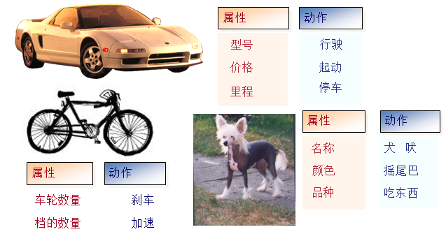
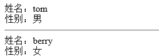
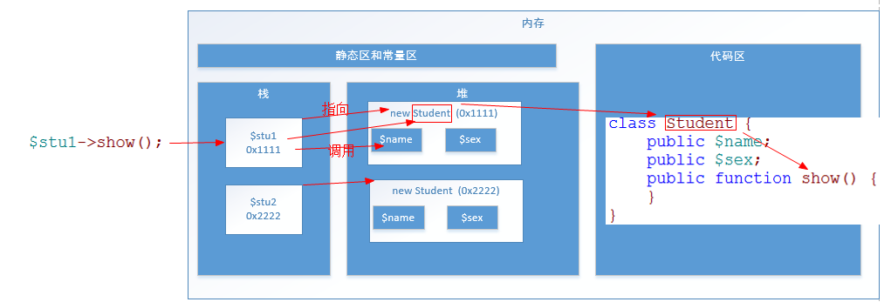
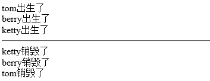
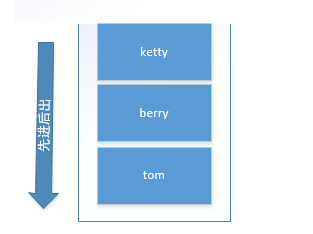
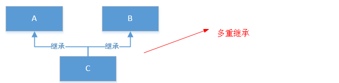
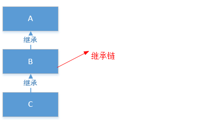

## 1.1 今日目标

1. 了解面向对象的基本概念；
2. 了解面向对象和面向过程的区别；
3. 掌握面向对象的基本语法：封装类；
4. 掌握类成员的基本使用：定义和访问；
5. 掌握访问修饰限定符的作用和实际运用；
6. 掌握$this的概念和使用；
7. 掌握构造方法的和析构方法的目的和触发时间；
8. 了解对象存储和访问的内存原理；
9. 了解对象比较的方式；
10. 掌握对象与类在内存在依赖关系；


## 1.2  面向对象介绍

#### 1.2.1  介绍

面向对象是一个编程思想。编程思想有面向过程和面向对象

面向过程：编程思路集中的是过程上

面向对象：编程思路集中在参与的对象

以去饭馆吃饭为例：

​	面向过程：点菜——做菜——上菜——吃饭——结账——收拾

​	面向对象：服务员，厨师，客人 


#### 1.2.2  面向对象的好处

1. 多人合作方便
2. 减少代码冗余，灵活性高
3. 代码的可重用性发挥到极致
4. 可扩展性强

```
多学一招：
OOP：面向对象编程（Object Oriented Programming，面向对象编程）
OOA: 面向对象分析(Object-Oriented Analysis,OOA)
OOD: 面向对象设计（Object-Oriented Design，OOD）
```


## 1.3  类和对象

1、对象是具体存在的事物，对象是由属性（变量）和方法（函数）组成的

​    


2、类是具有相同属性和行为的一组对象的集合

 

分析：做菜动作——厨师对象——厨师类
结论：我们在开发的时候，先写类，通过类创建对象，然后调用对象的属性和方法实现功能。    类——对象——调用成员


注意：一个类可以创建多个对象 

  


小结：

1、对象是由属性和方法组成的

2、类是所有对象的相同属性和方法的集合

3、在开发的时候先写类，通过类创建对象，通过对象调用方法和属性

4、一个类可以创建多个对象


## 1.4  在PHP中实现类和对象

#### 1.4.1 创建类

语法：

```php
class 类名{
	//属性
	//方法
	//常量
}
类是由属性、方法、常量组成的，也可以说
类成员有：属性、方法、常量    
```

类名的命名规则：

1. 以字母、下划线开头，后面跟的是字母、数字、下划线
2. 不能用PHP关键字做类名
3. 类名不区分大小写（变量名区分，关键字、类名不区分大小写）
4. 类名用帕斯卡命名法（大驼峰 单词的首字母大写）

```php
<?php
class Student {
}
```


#### 1.4.2 对象实例化

通过new关键字来实例化对象。

```php
<?php
//定义类
class Student {
	
}
//实例化对象
$stu1=new Student();
$stu2=new Student;		//小括号可以省略
var_dump($stu1,$stu2);	//object(Student)#1 (0) { } object(Student)#2 (0) { } 
```


#### 1.4.3 对象的比较

**注意：对象的传递是地址传递**

相等：结构和保存的值一样就相等
全等：指向同一个对象才是全等。

```php
<?php
//定义类
class Student {
	
}
//实例化对象
$stu1=new Student();
$stu2=new Student;
$stu3=$stu2; //对象传递的是地址	
//var_dump($stu1,$stu2,$stu3); //object(Student)#1 (0) { } object(Student)#2 (0) { } object(Student)#2 (0) { } 
//对象比较
var_dump($stu1==$stu2);		//bool(true) ,比较对象的结构
echo '<br>';
var_dump($stu1===$stu2);	//bool(false) $stu1和$stu2是否是同一个对象
echo '<br>';
var_dump($stu2===$stu3);	//bool(true) $stu2和$stu3是同一个对象
```


## 1.5 属性

属性本质就是变量

通过`->`调用对象的成员   对象名->属性名  对象名->方法名()

```php
<?php
//定义类
class Student {
	public $name;				//属性
	public $add='地址不详';		//属性
}
//实例化对象
$stu=new Student();
//print_r($stu);	//Student Object ( [name] => [add] => 地址不详 ) 
//操作属性
//1、给属性赋值
$stu->name='tom';
$stu->add='北京';

//2、获取属性的值
echo '姓名：'.$stu->name,'<br>';	//姓名：tom
echo '地址：'.$stu->add,'<br>';		//地址：北京

//3、添加属性
$stu->age=20;
print_r($stu);	//Student Object ( [name] => tom [add] => 北京 [age] => 20 ) 
echo '<br>';
//4、删除属性
unset($stu->add);
print_r($stu);	//Student Object ( [name] => tom [age] => 20 ) 
```


## 1.6 方法

方法的本质就是函数  

```php
<?php
class Student {
	//定义方法
	public function show() {
		echo '这是show方法<br>';
	}
	//public可以省略，如果省略，默认就是public
	function test() {
		echo '这是test方法<br>';
	}
}
$stu=new Student;
$stu->show();	//调用方法
$stu->test();
```

多学一招：

1、方法前面public是可以省略的，如果省略，默认就是public的。

2、属性前面的public不能省略


## 1.7 访问修饰符

用来控制成员的访问权限

|        修饰符         |           描述           |
| :-------------------: | :----------------------: |
|   public（公有的）    | 在类的内部和外部都能访问 |
|   private（私有的）   |    只能在类的内部访问    |
| protected（受保护的） |    在整个继承链上访问    |


**多学一招：**一般来说，属性都用私有的，通过公有的方法对私有的属性进行赋值和取值。

作用：保证数据的合法性

```php
<?php
//访问修饰符
class Student {
	private $name;	//私有属性
	private $sex;	//私有属性
	//通过公有的方法对私有的属性进行赋值
	public function setInfo($name,$sex) {
		if($sex!='男' && $sex!='女'){
			echo '性别必须是男或女';
			exit;
		}
		$this->name=$name;   //$this表示当前对象
		$this->sex=$sex;
	}
	//显示信息
	public function getInfo() {
		echo '姓名：'.$this->name,'<br>';
		echo '性别：'.$this->sex,'<br>';
	}
}
//实例化
$stu=new Student;
$stu->setInfo('tom','男');
$stu->getInfo();
echo '<hr>';
$stu2=new Student;
$stu2->setInfo('berry','女');
$stu2->getInfo();
```

提示：$this表示调用当前方法的对象

运行结果

 


## 1.8 类和对象在内存中的分布

1. 对象的本质是一个复杂的变量
2. 类的本质是一个自定义的复杂数据类型
3. 栈区：运行速度快，体积小，保存基本类型
4. 堆区：运行速度稍慢，体积大，保存复杂类型
5. 实例化的过程就是分配内存空间的过程
6. 对象保存在堆区，将堆区的地址保存到栈区。

分析如下代码的结构

```php
<?php
class Student {
	public $name;
	public $sex;
	public function show() {
	}
}

$stu1=new Student;
$stu2=new Student;

$stu1->show();
```

示意图

 


## 1.9  封装

封装就是有选择性的提供数据

通过访问修饰符来实现封装


## 1.10  构造方法

#### 1.10.1  介绍

构造方法也叫构造函数，当实例化对象的时候自动执行。
语法：

```php
function __construct(){
}
注意：前面是两个下划线
```

例题

```php
<?php
class Student {
	public function __construct() {
		echo '这是构造方法<br>';
	}
}
new Student();	//这是构造方法
new Student();	//这是构造方法
```

注意：在其他语言里，与类名同名的函数是构造函数，在PHP中不允许这种写法。

```php
class Student {
	//和类名同名的方法是构造方法，PHP中不建议使用
	public function Student() {
		echo '这是构造方法<br>';
	}
}
/*
Deprecated: Methods with the same name as their class will not be constructors in a future version of PHP; Student has a deprecated constructor in F:\wamp\www\6-demo.php on line 2
这是构造方法
*/
```


#### 1.10.2  构造函数作用：初始化成员变量

```php
<?php
class Student {
	private $name;
	private $sex;
	//构造函数初始化成员变量
	public function __construct($name,$sex) {
		$this->name=$name;
		$this->sex=$sex;
	}
	//显示信息
	public function show() {
		echo "姓名：{$this->name}<br>";
		echo "性别：{$this->sex}<br>";
	}
}
//实例化
$stu=new Student('tom','男');
$stu->show();
//运行结果
/*
姓名：tom
性别：男
*/
```

注意：构造函数可以带参数，但不能有return。


## 1.11 析构方法

#### 1.11.1  介绍

当对象销毁的时候自动调用

语法

```php
function __destruct(){
}
```

脚下留心：析构函数不可以带参数

例题

```php
<?php
class Student {
	private $name;
	//构造方法
	public function __construct($name) {
		$this->name=$name;
		echo "{$name}出生了<br>";
	}
	//析构方法
	public function __destruct() {
		echo "{$this->name}销毁了<br>";
	}
}
//测试
$stu1=new Student('tom');
$stu2=new Student('berry');
$stu3=new Student('ketty');
echo '<hr>';
```

运行结果

 


#### 1.11.2  计算机的内存管理

计算机内存管理方式：先进先出，先进后出

 先进先出的内存管理方式一般用在业务逻辑中，比如秒杀、购票等等

  

 先进后出是计算机的默认内存管理方式

 


#### 1.11.3  思考题

思考题1

```php
<?php
class Student {
	private $name;
	//构造方法
	public function __construct($name) {
		$this->name=$name;
		echo "{$name}出生了<br>";
	}
	//析构方法
	public function __destruct() {
		echo "{$this->name}销毁了<br>";
	}
}
//测试
$stu1=new Student('tom');
$stu2=new Student('berry');
$stu3=new Student('ketty');
unset($stu2);
echo '<hr>';
/*
tom出生了
berry出生了
ketty出生了
berry销毁了

ketty销毁了
tom销毁了
*/
```

思考题2

```php
<?php
class Student {
	private $name;
	//构造方法
	public function __construct($name) {
		$this->name=$name;
		echo "{$name}出生了<br>";
	}
	//析构方法
	public function __destruct() {
		echo "{$this->name}销毁了<br>";
	}
}
//测试
new Student('tom');
new Student('berry');
new Student('ketty');
/*
tom出生了
tom销毁了
berry出生了
berry销毁了
ketty出生了
ketty销毁了
*/
```

思考题3

```php
<?php
class Student {
	private $name;
	//构造方法
	public function __construct($name) {
		$this->name=$name;
		echo "{$name}出生了<br>";
	}
	//析构方法
	public function __destruct() {
		echo "{$this->name}销毁了<br>";
	}
}
//测试
$stu=new Student('tom');
$stu=new Student('berry');
$stu=new Student('ketty');
/*
tom出生了
berry出生了
tom销毁了
ketty出生了
berry销毁了
ketty销毁了
*/
```


## 1.12  继承

#### 1.12.1 继承介绍

1. 继承使得代码具有层次结构
2. 子类继承了父类的属性和方法，实现了代码的可重用性。
3. 使用extends关键字实现继承
4. 父类和子类是相对的

语法

```
class 子类 extends 父类{
}
```

例题

```php
<?php
//父类
class Person {
	public function show() {
		echo '这是人类<br>';
	}
}
//子类继承父类
class Student extends Person {
}
//测试
$stu=new Student;
$stu->show();			//这是人类
```

执行过程：

第一步：在Student类中查找show()，如果找到就调用，找不到就到父类中查找

第二步：在Person类中查询show()


#### 1.12.2  子类中调用父类成员

```php
<?php
//父类
class Person {
	public function show() {
		echo '这是人类<br>';
	}
}
//子类
class Student extends Person {
	public function test() {
		//方法一；
		/*
		$person=new Person();
		$person->show();		//这是人类
		*/
		//方法二
		$this->show();			//这是人类
	}
}
//测试
$stu=new Student;
$stu->test();
```

小结：

1、方法一：通过实例化父类调用父类的成员

2、方法二：通过$this关键字调用父类的成员


#### 1.12.3   protected

protected：受保护的，在整个继承链上使用

例题：

```php
//例题一：
<?php
class A {
	protected $num=10;	//在整个继承链上访问
}
class B extends A {	
	public function getNum() {
		echo $this->num;
	}
}
//测试
$obj=new B();    //整个继承链上有A和B
$obj->getNum();		//10

//例题二：
<?php
class A {
	public function getNum() {
		echo $this->num;
	}
}
class B extends A {
	protected $num=10;	
}
//测试
$obj=new B();	//整个继承链上有A和B
$obj->getNum();		//10

//例题三：
<?php
class A {
	public function getNum() {
		echo $this->num;
	}
}
class B extends A {
	protected $num=10;	
}
//测试
$obj=new A();     //整个继承链上只有A
$obj->getNum();	 //Notice: Undefined property: A::$num 
```


#### 1.12.4  继承中的构造函数

规则：

```
1、如果子类有构造函数就调用子类的，如果子类没有就调用父类的构造函数。

2、子类的构造函数调用后，默认不再调用父类的构造函数
```

通过类名调用父类的构造函数

```
类名::__construct()
```

例题

```php
<?php
class Person {
    //父类的构造函数
	public function __construct() {
		echo '这是父类<br>';
	}
}
class Student extends Person {
    //子类的构造函数
	public function __construct() {
		Person::__construct();		//通过父类的名字调用父类的构造函数
		parent::__construct();		//parent表示父类的名字
		echo '这是子类<br>';
	}
}
//测试
new Student();
```

注意：parent关键字表示父类的名字，可以降低程序的耦合性


例题：给父类传递参数

```php
<?php
class Person {
	protected $name;
	protected $sex;
    //父类的构造函数
	public function __construct($name,$sex) {
		$this->name=$name;
		$this->sex=$sex;
	}
}
class Student extends Person {
	private $score;
    //子类的构造函数
	public function __construct($name,$sex,$score) {
		parent::__construct($name,$sex);  //调用父类构造函数并传递参数
		$this->score=$score;
	}
    //显示信息
	public function getInfo() {
		echo "姓名：{$this->name}<br>";
		echo "性别：{$this->sex}<br>";
		echo "成绩：{$this->score}";
	}
}
//测试
$stu=new Student('tom','男',88);
$stu->getInfo();
/*
姓名：tom
性别：男
成绩：88
*/
```


#### 1.12.5  $this详解

$this表示当前对象的引用，也就是是或$this保存的当前对象的地址

```php
<?php
class A {
	public function __construct() {
		var_dump($this);
	}
}
class B extends A {
	
}
new A();	//object(A)#1 (0) { } 
echo '<br>';
new B();	//object(B)#1 (0) { } 
```


#### 1.12.6  多重继承

PHP不允许多重继承，因为多重继承容易产生二义性

 


如何实现C继承A和B，使用继承链

 


