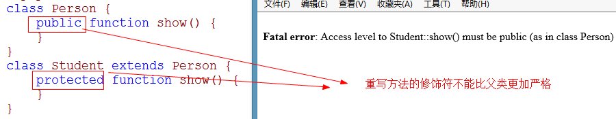

## 1.1  今日目标

1. 掌握静态成员的意义和应用；
2. 掌握self关键字的实际运用；
3. 了解面向对象的三大特性：封装、继承和多态；
4. 掌握PHP中继承机制和基本语法；
5. 掌握访问修饰限定符protected的原理和实际运用；
6. 掌握重写override的作用和实际应用；
7. 了解PHP中继承的特点；
8. 了解静态延迟绑定的作用和使用；
9. 掌握最终类的作用以及具体的使用方式；
10. 掌握抽象类的作用以及具体的使用方式；
11. 掌握接口的作用以及具体的使用方式；


## 1.2  多态

多态：多种形态。

多态分为两种：方法重写和方法重载

#### 1.2.1  方法重写

子类重写了父类的同名的方法

```php
<?php
//父类
class Person {
	public function show() {
		echo '这是父类<br>';
	}
}
//子类
class Student extends Person {
	//子类重写了父类的同名方法
	public function show() {
		echo '这是子类<br>';
	}
}
//测试
$stu=new Student;
$stu->show();			//这是子类
```

注意事项：

1. 子类的方法必须和父类的方法同名
2. 参数个数要一致
3. 子类修饰的不能比父类更加严格

  

 


#### 1.2.2  方法重载

在同一个类中，有多个同名的函数，通过参数的不同来区分不同的方法，称为方法重载

 

注意：PHP不支持方法重载，但是PHP可以通过其他方法来模拟方法重载。


## 1.3  面向对象三大特性

1. 封装
2. 继承
3. 多态


## 1.4 私有属性继承和重写

私有属性可以继承但不能重写。

```php
<?php
class A {
	private $name='PHP';
	public function showA() {
		//var_dump($this);	//object(B)#1 (2) { ["name":"B":private]=> string(4) "Java" ["name":"A":private]=> string(3) "PHP" } 
		echo $this->name,'<br>';	//PHP
	}
}
class B extends A {
	private $name='Java';
	public function showB() {
		//var_dump($this);	//object(B)#1 (2) { ["name":"B":private]=> string(4) "Java" ["name":"A":private]=> string(3) "PHP" } 
		echo $this->name,'<br>';	//Java
	}
}
$obj=new B();
$obj->showA();
$obj->showB();
/*分析：
showA()和showB()中的$this都表示B的对象，B中继承了A的私有属性，所以B中有两个$name.
在showA()中只能访问A中的$name，不能访问B中的$name
在showB()中只能访问B中的$name,不能访问A中的$name
*/
```


练习一

```php
<?php
class A {
	protected $name='tom';	
	public function showA() {
		echo $this->name,'<br>';
	}
}
class B extends A {
	public $name='berry';
	public function showB() {
		echo $this->name,'<br>';
	}
}
//测试
$obj=new B();
$obj->showA();	//berry
$obj->showB();	//berry

/*
分析：B中将A的$name重写，所以$obj中只有一个$name,($name='berry'),不管$this在哪个方法中访问，就只能访问这个$name
*/
```

练习二

```php
<?php
class A {
	private $name='tom';	
	public function showA() {
		echo $this->name,'<br>';
	}
}
class B extends A {
	public $name='berry';
	public function showB() {
		echo $this->name,'<br>';
	}
}
//测试
$obj=new B();
$obj->showA();	//tom
$obj->showB();	//berry
/*
分析：
$obj中有两个$name,一个是私有的，一个是公有的
在showA()中既能访问私有的$name,也能访问公有的$name,但是私有的比公有的权限高，所以输出tom
在showB()中不能访问私有的$name,只能访问公有的$name，所以输出berry
*/
```


## 1.5 方法修饰符

方法修饰符有：static、final、abstract

#### 1.5.1  static【静态的】

1. static修饰的属性叫静态属性、static修饰的方法叫静态方法
2. 静态成员加载类的时候分配空间，程序执行完毕后销毁 
3. 静态成员在内存中就一份。
4. 调用语法    类名::属性    类名::方法名()

```php
<?php
class Person {
	public static $add='北京';    // 修饰符之间没有顺序
	static public function show() {
		echo '这是一个静态的方法<br>';
	}
}
echo Person::$add,'<br>';		//北京
Person::show();					//这是一个静态的方法
```


练习：统计在线人数

```php
<?php
class Student {
	private static $num=0;	//静态变量，在内存中就一份
	public function __construct() {
		self::$num++;      //self表示所在类的类名
	}
	public function __destruct() {
		self::$num--;
	}
	public function show() {
		echo '总人数是：'.self::$num,'<br>';
	}
}
//测试
$stu1=new Student;
$stu2=new Student;
$stu3=new Student;
$stu2->show();			//总人数是：3
unset($stu2);
$stu3->show();			//总人数是：2
```

**注意：**self表示所在类的类名，使用self降低耦合性


静态成员也可以被继承

```php
<?php
class Person {
	public static $add='中国';
	public static function show() {
		echo '这是人类<br>';
	}
}
//继承
class Student extends Person {	
}
//测试
echo Student::$add,'<br>';		//中国   通过子类名称访问父类的静态成员
Student::show();				//这是人类
```


静态延时绑定

static表示当前对象所属的类

```php
<?php
class Person {
	public static $type='人类';
	public function show1() {
		//var_dump($this);		//object(Student)#1 (0) { } 
		//echo self::$type,'<br>';	//人类
		echo static::$type,'<br>';			//学生   延时绑定
	}
}
class Student extends Person {
	public static $type='学生';
	public function show2() {
		//var_dump($this);		//object(Student)#1 (0) { } 
		//echo self::$type,'<br>';	//学生
		echo static::$type,'<br>';			//学生
	}
}
//测试
$obj=new Student();
$obj->show1();
$obj->show2();
```


小结：

1、static在内存中就一份，在类加载的时候分配空间

2、如果有多个修饰符，修饰符之间是没有顺序的

3、self表示所在类的类名

4、static表示当前对象所属的类

5、static有两个作用，第一表示静态的，第二表示类名


#### 1.5.2  final【最终的】

final修饰的方法不能被重写

final修饰的类不能被继承

  

 


作用

1、如果一个类确定不被继承，一个方法确定不会被重写，用final修饰可以提高执行效率。

2、如果一个方法不允许被其他类重写，可以用final修饰。


#### 1.5.3  abstract【抽象的】

1. abstract修饰的方法是抽象方法，修饰的类是抽象类
2. 只有方法的声明没有方法的实现称为抽象方法
3. 一个类中只要有一个方法是抽象方法，这个类必须是抽象类。
4. 抽象类的特点是不能被实例化
5. 子类继承了抽象类，就必须重新实现父类的所有的抽象方法，否则不允许实例化
6. 类中没有抽象方法也可以声明成抽象类，用来阻止类的实例化

例题

```php
<?php
//抽象类
abstract class Person {
	public abstract function setInfo();	//抽象方法
	public function getInfo() {
		echo '获取信息<br>';
	}
}
//继承
class Student extends Person {
    //重写实现父类的抽象方法
	public function setInfo() {
		echo '重新实现父类的抽象方法<br>';
	}
}
//测试
$stu=new Student;
$stu->setInfo();		//重新实现父类的抽象方法
$stu->getInfo();		//获取信息
```

抽象类的作用：

1定义命名规范

   

2、阻止实例化，如果一个类中所有的方法都是静态方法，这时候没有必要去实例化，可以通过abstract来阻止来的实例化。


## 1.6  类常量

类常量是const常量

```php
<?php
class Student {
	//public const ADD； 	//7.1以后才支持访问修饰符
	const ADD='地址不详';
}
echo Student::ADD;
```

问题：define常量和const常量的区别？

答：const常量可以做类成员，define常量不可以做类成员。

问题：常量和静态的属性的区别？

答：相同点：都在加载类的时候分配空间

​	不同点：常量的值不可以更改，静态属性的值可以更改


## 1.7  接口（interface）

#### 1.7.1  接口

1. 如果一个类中所有的方法是都是抽象方法，那么这个抽象类可以声明成接口
2. 接口是一个特殊的抽象类，接口中只能有抽象方法和常量
3. 接口中的抽象方法只能是public，可以省略，默认也是public的
4. 通过implements关键字来实现接口
5. 不能使用abstract和final来修饰接口中的抽象方法。

```php
<?php
//声明接口
interface IPerson {
	const ADD='中国';
	function fun1();
	function fun2();
}
//接口实现
class Student implements IPerson {
	public function fun1() {
		
	}
	public function fun2() {
		
	}
}
//访问接口中的常量
echo IPerson::ADD;
```


#### 1.7.2  接口的多重实现

类不允许多重继承，但是接口允许多重实现。

```php
<?php
interface IPic1 {
	function fun1();
}
interface IPic2 {
	function fun2();
}
//接口允许多重实现
class Student implements IPic1,IPic2 {
	public function fun1() {
		
	}
	public function fun2() {
		
	}
}
```

注意：

1、在接口的多重实现中，如果有同名的方法，只要实现一次即可

2、类可以继承的同时实现接口

```
class Student extends Person implements IPIc1,IPic1{
    
}
```


## 1.8  匿名类

这是了解的内容，PHP7.0支持

```php
<?php
$stu=new class {
	public $name='tom';
	public function __construct() {
		echo '构造函数<br>';
	}
};
echo $stu->name;
/*运行结果；
构造函数
tom
*/
```

小结：

1、如果类只被实例化一次就可以使用匿名类

2、好处，在执行的过程中，类不占用空间


## 1.9  方法绑定

这是了解的内容，PHP7.0支持

作用：将方法绑定到对象上，并调用

语法：

```
闭包->call(对象)：将闭包绑定到对象上,并调用
```

在PHP中匿名函数称为闭包

例题

```php
<?php
$lang='en';
//类
class Student{
}
//匿名函数
if($lang=='ch'){
	$fun=function(){
		echo '我是一名学生';
	};
}else{
	$fun=function(){
		echo 'i am a studnet';
	};
}
//绑定
$stu=new Student;
$fun->call($stu);	//i am a studnet
```


## 1.10  异常处理

集中处理在代码块中发生的异常。

在代码块中发生了异常直接抛出，代码块中不处理异常，将异常集中起来一起处理。

#### 1.10.1  使用的关键字

```
try:监测代码块
catch:捕获异常
throw:抛出异常
finally:无论有无异常都会执行，可以省略
Exception：异常类
```

语法结构

```php
try{
	//检测代码
}catch(Exception $ex){
	//捕获异常
}
finally{
	//不论是否有异常，都要执行，finally可以省略
}
```

例题：

```php+HTML
<?php
if(isset($_POST['button'])) {
	try{
		$age=$_POST['age'];
		if($age=='')
			throw new Exception('年龄不能为空',1001);	//抛出异常
		if(!is_numeric($age))
			throw new Exception('年龄必须是数字',1001);	//抛出异常
		if(!($age>=10 && $age<=30)) 
			throw new Exception('年龄必须在10-30之间',1002);	//抛出异常
		echo '您的年龄合适';
	}catch(Exception $ex){		//捕获异常
		echo '错误信息：'.$ex->getMessage(),'<br>';
		echo '错误码：'.$ex->getCode(),'<br>';
		echo '文件地址：'.$ex->getFile(),'<br>';
		echo '错误行号：'.$ex->getLine(),'<br>';
	}
	finally{
		echo '关闭数据库连接';  //不管是否有异常，finally都要执行
	}
}
?>
<form method="post" action="">
	年龄： <input type="text" name="age"> <br />
	<input type="submit" name="button" value="提交">
</form>
```

注意：抛出异常后，try块终止执行，执行权限交给catch块.

运行结果

 


#### 1.8.2  自定义异常

场景：如果实现异常的分类处理？比如异常有三个级别异常对应三种处理方式

自定义三种异常即可

所有异常类的父类是Exception，Exception中的方法不允许重写

```php+HTML
<?php
//自定义空异常类
class MyNullException extends Exception {
}
//自定义类型异常
class MyTypeException extends Exception {
}
//自定义范围异常
class MyRangeException extends Exception {
}
//逻辑代码
if(isset($_POST['button'])) {
	try{
		$name=$_POST['name'];
		$age=$_POST['age'];
		if($name=='')
			throw new MyNullException('姓名不能为空');
		if($age=='')
			throw new MyNullException('年龄不能为空');
		if(!is_numeric($age))
			throw new MyTypeException('年龄不是数字');
		if($age<10 || $age>30)
			throw new MyRangeException('年龄必须在10-30之间');
		echo '姓名：'.$name,'<br>';
		echo '年龄：'.$age;
	}catch(MyNullException $ex){
		echo $ex->getMessage(),'<br>';
		echo '错误记录在日志中';
	}catch(MyTypeException $ex){
		echo $ex->getMessage(),'<br>';
		echo '发送电子邮件';
	}catch(MyRangeException $ex){
		echo $ex->getMessage(),'<br>';
		echo '给管理员打电话';
	}

}
?>
<form method="post" action="">
	姓名： <input type="text" name="name"> <br />
	年龄： <input type="text" name="age"> <br />
	<input type="submit" name="button" value="提交">
</form>
```


## 1.9  作业实现

1、打印图像

```php+HTML
<body>
<style type="text/css">
	body{
		text-align:center;
		font-size:25px;
	}
	span{
		width:30px;
		height:10px;
		display:inline-block;
	}
</style>
<?php
for($i=1;$i<=9;$i++){
	$n=$i>5?(10-$i):$i;
	$k=2*$n-1;			//星星的个数
	for($j=1;$j<=$k;$j++){
		echo '<span>*</span>';
	}
	echo '<br>';
}
?>
</body>
```


 


2、打印回形

```php+HTML
<body>
<style type="text/css">
	body{
		text-align:center;
		font-size:25px;
	}
	span{
		width:30px;
		height:10px;
		display:inline-block;
	}
</style>
<?php
for($i=1; $i<=10; $i++) {
	for($j=1; $j<=10; $j++) {
		if($i>=3 && $i<=8 && $j>=3 && $j<=8)
			echo '<span></span>';
		else
			echo '<span>*</span>';
	}
	echo '<br>';
}
?>
</body>
```

 

