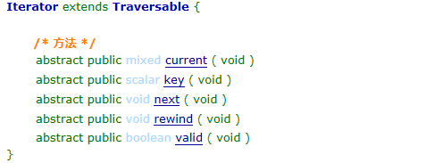
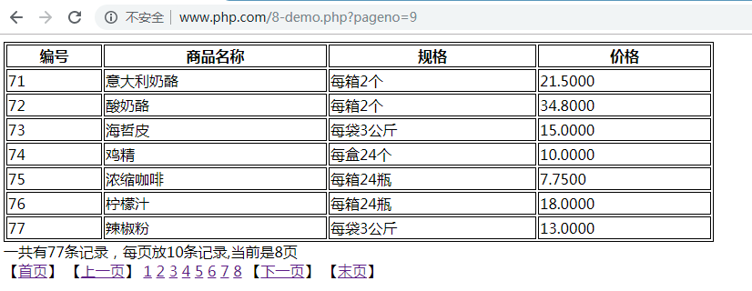

## 1.1  今日目标

1. 掌握trait的作用以及实际应用；
2. 了解预定义接口Iterator对foreach的修改；
3. 掌握命名空间的基本语法；
4. 掌握命名空间的成员控制；
5. 了解子空间的概念；
6. 掌握命名空间的三种访问方式及其区别；
7. 掌握空间引入的使用；
8. 掌握全局空间的概念；
9. 掌握全局空间与其他空间进行引入时的区别；
10. 了解PSR-1基础编码规范；
11. 了解不产生副作用和只产生副作用的概念
12. 能够按照PSR-1规范进行文件分类
13. 了解PSR-2编码规范


## 1.2   命名空间

#### 1.2.1  介绍

在一个大的项目中，可能会遇到同名的类、函数、常量，为了区分这些元素，我们可以将这些元素分别存放到不同的命名空间中。

1、命名空间就是包，用来存放项目中的类、函数、常量

2、通过namespace关键字来声明命名空间


#### 1.2.2  声明命名空间

```php
<?php
namespace China;	//定义命名空间
function getInfo() {
	echo '我是中国人<br>';
}

namespace USA;		//定义命名空间
function getInfo() {
	echo 'I am a America<br>';
}
//调用
getInfo();			//I am a America
\USA\getInfo();		//I am a America
\China\getInfo();	//我是中国人
```

**注意：**`\`表示公共空间


#### 1.2.3  多级命名空间

命名空间的名字可以是多级的（子级命名空间）。

```php
<?php
namespace China\Beijing\Shunyi;
class Student {
	
}
namespace USA\Washington;
class Student {
	
}
//测试：
$stu1=new Student();	//相对路径
$stu2=new \USA\Washington\Student();	//绝对路径
$stu3=new \China\Beijing\Shunyi\Student();	//绝对路径
var_dump($stu1,$stu2,$stu3);

//object(USA\Washington\Student)#1 (0) { }
//object(USA\Washington\Student)#2 (0) { }
//object(China\Beijing\Shunyi\Student)#3 (0) { } 
```

总结：如果将相对路径转成绝对路径

```
公共空间+命名空间+空间元素
公共空间           命名空间                  空间元素
   \         China\Shanghai\PuDong\        Student
```


#### 1.2.4  访问空间元素的三种方式

1、非限定名称访问

2、完全限定名称访问

3、限定名称访问

```php
<?php
namespace China\Beijing\Shunyi;
function getInfo() {
	echo '顺义...<br>';
}

namespace China\Beijing;
function getInfo() {
	echo '北京...<br>';	
}
//访问空间元素的三种方式
getInfo();					//非限定名称访问	北京...			
\China\Beijing\getInfo();	//完全限定名称访问		北京...
Shunyi\getInfo();			//限定名称访问		顺义...
//转成绝对路径如下：
// \China\Beijing\Shunyi\getInfo();
```

练习：将下面的相对路径转成绝对路径

```
例题一：
namespace A\B\C;
fun();		=>	\A\B\C\fun();
a\fun();	=>	\A\B\C\a\fun()
C\fun();	=>	\A\B\C\C\fun();
```


#### 1.2.5  引入命名空间

完全限定名称访问元素路径太长，可以将其他空间引入到当前空间来

通过use引入命名空间

```php
<?php
namespace China\Beijing\Shunyi;
function getInfo() {
	echo '李白<br>';
}
namespace USA;
function getInfo() {
	echo 'Lincoln<br>';
}
//引入命名空间
use China\Beijing\Shunyi;	
//测试
getInfo();			//Lincoln
Shunyi\getInfo();	//李白
/*
分析：
第一步：通过当前空间拼接成绝对路径：\USA\Shunyi\getInfo(),这个地址没有对应的空间元素
第二步：通过引入的空间拼接绝对路径：\China\Beijing\Shunyi+Shunyi\getInfo(),Shunyi是公共部分，只需要取一个，最后拼接的地址是：\China\Beijing\Shunyi\getInfo(),这个地址可以找到对应的元素
*/
```

引入命名空间的拼接规则

```php
公共空间+引入空间+（去除公共部分，公共部分只能有一级）空间元素

比如：
namespace A\B\C;
function getInfo(){}

namespace D\E;
use A\B\C;	//引入命名空间
C\getInfo();	//正确	\A\B\C\getInfo();
B\C\getInfo();	//错误   \A\B\C\B\C\getInfo();
```


#### 1.2.6  引入空间元素

引入类：use

引入函数：use function    [php7.0以后支持]

引入常量：use const	[php7.0以后支持]

```php
<?php
namespace China\Beijing\Shunyi;
class Student {
}
function getInfo() {
	echo '李白<br>';
}
const TYPE='学生';
namespace USA;
//引入类
use China\Beijing\Shunyi\Student;
//引入函数
use function China\Beijing\Shunyi\getInfo;
//引入常量
use const China\Beijing\Shunyi\TYPE;

//测试
$stu=new Student;
var_dump($stu);
echo '<br>';
getInfo();
echo TYPE;
```


#### 1.2.7  给类、函数取别名

如果引入的类和函数与当前空间的类和函数名称相同，需要给引入的类和函数取别名。

通过as取别名

```php
<?php
namespace China\Beijing\Shunyi;
class Student {
	
}
function getInfo() {
	echo '李白<br>';
}
namespace USA\Washington;
class Student {
	
}
function getInfo() {
	echo 'Lincoln<br>';
}
//引入类取别名
use China\Beijing\Shunyi\Student as ChinaStudent;
//引入函数
use function China\Beijing\Shunyi\getInfo as info1;

//测试
$stu=new ChinaStudent;
var_dump($stu);

getInfo();	//Lincoln
info1();	//李白
```


#### 1.2.8  公共空间

如果一个页面没有namespace声明空间，这个页面的元素在公共空间下

公共空间用`\`表示

```php
<?php
function getInfo() {
	echo '李白<br>';
}
\getInfo();		//李白
```


#### 1.2.9  命名空间注意事项

1、命名空间只能存放类、函数、const常量

2、第一个namespace前面不能有任何的代码，空白字符、header()也不行。

3、包含文件不影响当前的命名空间


## 1.3  trait(原型)

trait 为了减少单继承语言的限制，可以在不同层次结构内独立的类中复用类的方法集。

```php
<?php
//原型
trait A{
	public function getInfo() {
		echo '锄禾日当午<br>';
	}
}
//使用原型
class Student {
	use A;	//代码复用
}
//测试
$stu=new Student;
$stu->getInfo();	//锄禾日当午
```

引入多个 trait

```php
<?php
//原型
trait A{
	public function getInfo1() {
		echo '锄禾日当午<br>';
	}
}
trait B{
	public function getInfo2() {
		echo '床前明月光<br>';
	}
}
//使用原型
class Student {
	use A,B;	//引入A、B trait
}
//测试
$stu=new Student;
$stu->getInfo1();	//锄禾日当午
$stu->getInfo2();	//床前明月光
```

trait和继承结合

```php
<?php
trait A{
	public function getInfo() {
		echo '这是trait原型<br>';
	}
}
class Person {
	public function getInfo() {
		echo '这是Person类<br>';
	}
}
//继承类同时代码复用
class Student extends Person {
	use A;		//继承了getInfo，有被A中getInfo覆盖
}
//测试
$stu=new Student;
$stu->getInfo();	//这是trait原型
```

解决同名冲突

```php
<?php
//原型
trait A{
	public function getInfo() {
		echo '锄禾日当午<br>';
	}
}
trait B{
	public function getInfo() {
		echo '床前明月光<br>';
	}
}
//使用原型
class Student {
	use A,B{	//引入A和B的trait，同时解决名称冲突
		//方法一：方法替换
		//A::getInfo insteadof B;	//将A中的getInfo替换掉B中的getInfo
		//B::getInfo insteadof A;		//将B中的getInfo替换到A中的getInfo

		//方法二：改名
		A::getInfo insteadof B;
		B::getInfo as show;		//将B的getInfo改名为show
	}
}
//测试
$stu=new Student;
$stu->getInfo();	//锄禾日当午
$stu->show();		//床前明月光
/*
同名冲突的解决方法有两个：
第一：方法替换
第二：方法改名
```


更改权限

```php
<?php
trait A{
	private function show() {
		echo '锄禾日当午<br>';
	}
}
class Student {
	use A{
		//show as public;	//将show方法权限设为public;
		show as public show2;	//将show方法设置public，并改名为show2
	}
}

$stu=new Student;
//$stu->show();
$stu->show2();

```


**多学一招：**具体参见手册

1、  多个trait可以组成一个trait

2、  trait可以定义抽象成员

3、  trait可以定义静态成员

4、  trait可以定义属性


## 1.4  迭代器

#### 1.4.1  遍历数组

手动遍历数组

步骤：

1、复位数组指针		reset()

2、检查指针是否合法	获取当前指针，如果不为null就是合法的

3、获取当前值			current()

4、获取当前键			key()

5、指针下移				next()

代码实现

```php
<?php
$stu=['tom','berry','ketty','rose'];
reset($stu);	//复位指针
while(key($stu)!==null){//键合法
	echo key($stu),'-',current($stu),'<br>';//获取键、值
	next($stu);		//指针下移
}
/*
0-tom
1-berry
2-ketty
3-rose
*/
```

#### 1.4.2  迭代器

迭代器是PHP内置的接口

 

场景：遍历对象，获取的是对象中属性保存的数组

```php
<?php
//定义类实现迭代器接口
class MyClass implements Iterator{
	//$list属性用来保存学生数组
	private $list=array();
	//添加学生
	public function addStu($name) {
		$this->list[]=$name;
	}
	//实现接口中的复位方法
	public function rewind() {
		reset($this->list);
	}
	//验证当前指针是否合法
	public function valid() {
		return key($this->list)!==null;
	}
	//获取值
	public function current() {
		return current($this->list);
	}
	//获取键
	public function key() {
		return key($this->list);
	}
	//指针下移
	public function next() {
		next($this->list);
	}
}

//创建班级
$class=new MyClass();
//添加学生
$class->addStu('tom');
$class->addStu('berry');
$class->addStu('ketty');
//遍历班级
foreach($class as $k=>$v){
	echo "{$k}-{$v}<br>";
}
/*
0-tom
1-berry
2-ketty
*/
```


## 1.5  PSR编码规范

#### 1.5.1  概述

1. PSR 是 PHP Standard Recommendations 的简写，由 PHP FIG 组织制定的 PHP 规范，是 PHP 开发的实践标准。
2. 目前已表决通过了 6 套标准，已经得到大部分 PHP 框架的支持和认可。
3. 网址：http://psr.phphub.org/

 

#### 1.5.2  PSR-1 基础编码规范

```
1、PHP代码文件 必须 以 <?php 或 <?= 标签开始
2、类的命名大写开头的驼峰命名规范
3、类中的常量所有字母都必须大写，单词间用下划线分隔
4、方法名称必须符合小写开头驼峰命名规范5、
```


副作用：(side effects)，一个文件只做一件事情，如果做了其他事情就是产生了副作用

不产生副作用：一个文件只做一件事

产生副作用：一个文件做了多件事情


#### 1.5.3  PSR-2 编码风格规范

```
代码 必须 使用 4 个空格符而不是「Tab 键」进行缩进
每个 namespace 命名空间声明语句和 use 声明语句块后面，必须 插入一个空白行
类的开始花括号（{） 必须 写在类声明后自成一行，结束花括号（}）也 必须 写在类主体后自成一行
方法的开始花括号（{） 必须 写在函数声明后自成一行，结束花括号（}）也 必须 写在函数主体后自成一行。
类的属性和方法 必须 添加访问修饰符（private、protected 以及 public），abstract 以及 final 必须 声明在访问修饰符之前，而 static 必须 声明在访问修饰符之后。
```


## 1.6  分页

#### 1.6.1  分析

```
-- 1、获取当前页码的数据
页码		SQL语句
1			select * from products limit 0,10
2			select * from products limit 10,10
3			select * from products limit 20,10
结论：
$pageno：页码
$startno:起始位置
$pagesize=10:页面大小
公式：$startno=($pageno-1)*$pagesize;

-- 2、如何获取页码
用户点击页面底端页码，传递当前的页面

-- 3、如何获取总页码		
记录数			页数			计算
60				6			60/10=6
51				6			ceil(51/10)=6

结论：
$rowcount:总记录数
$pagecount：总页数
公式：$pagecount=ceil($rowcount/$pagesize)

-- 4、如何获取总记录数
select count(*) from products;
```

  


#### 1.6.2  步骤

第一步：获取总记录数

第二步：求出总页数

第三步：循环显示页码

第四步：通过当前页面，求出起始位置

第五步：获取当前页面数据，并遍历显示


#### 1.6.3  代码实现

将上一讲的MySQLDB类拷贝到站点下，将测试代码删除，只留下类代码，文件名改为MySQLDB.class.php

分页页面代码如下：

```php+HTML
<?php
//自动加载类
spl_autoload_register(function($class_name){
	require "./{$class_name}.class.php";
});
//获取单例
$param=array(
	'user'		=>	'root',
	'pwd'		=>	'root',
	'dbname'	=>	'data'
);
//获取单例
$db=MySQLDB::getInstance($param);
?>
<!doctype html>
<html>
<head>
<meta charset="utf-8">
<title>无标题文档</title>
<style type="text/css">
	table{
		width:780px;
		border:solid #000 1px;
	}
	td,th{
		border:solid #000 1px;
	}
</style>
</head>

<body>
<?php
$pagesize=10;		//页面大小
//第一步：获取总记录数
$rowcount=$db->fetchColumn('select count(*) from products');
//第二步：求出总页数
$pagecount=ceil($rowcount/$pagesize);
//第四步：通过当前页面，求出起始位置
//$pageno=isset($_GET['pageno'])?$_GET['pageno']:1;
$pageno=$_GET['pageno']??1;
$pageno=$pageno<1?1:$pageno;
$pageno=$pageno>$pagecount?$pagecount:$pageno;
$startno=($pageno-1)*$pagesize;
//第五步：获取当前页面数据，并遍历显示
$sql="select * from products limit $startno,$pagesize";
$rs=$db->fetchAll($sql);
?>
<table>
	<tr>
		<th>编号</th>
		<th>商品名称</th>
		<th>规格</th>
		<th>价格</th>
	</tr>
	<?php foreach($rs as $row):?>
	<tr>
		<td><?=$row['proID']?></td>
		<td><?=$row['proname']?></td>
		<td><?=$row['proguige']?></td>
		<td><?=$row['proprice']?></td>
	</tr>
	<?php endforeach;?>
</table>
<!--第三步：循环显示页码-->
一共有<?=$rowcount?>条记录，每页放<?=$pagesize?>条记录,当前是<?=$pageno?>页 <br />
【<a href="?pageno=1">首页</a>】
【<a href="?pageno=<?=$pageno-1?>">上一页</a>】
<?php for($i=1; $i<=$pagecount; $i++):?>
	<a href="?pageno=<?=$i?>"><?=$i?></a>
<?php endfor;?>
【<a href="?pageno=<?=$pageno+1?>">下一页</a>】
【<a href="?pageno=<?=$pagecount?>">末页</a>】
</body>
</html>
```

运行结果

 


#### 1.6.4 分页优化

在上面的分页代码中，虽然SQL语句比较经典，但是每次都要获取不需要的数据，浪费资源

```mysql
$sql="select * from products limit $startno,$pagesize";
```

优化

```mysql
$sql="select * from products where proid>=(select proid from products limit $startno,1) limit $pagesize";
```


#### 1.6.5  作业

通过异步实现分页


