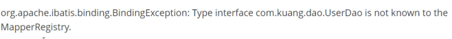
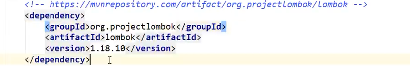
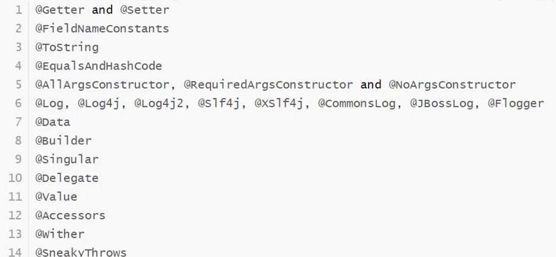
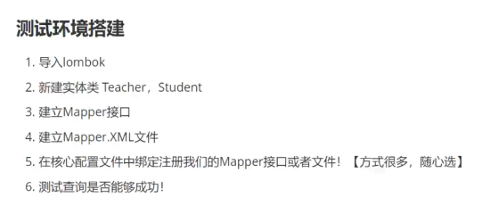
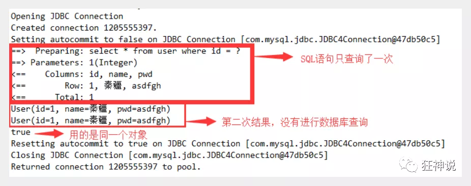
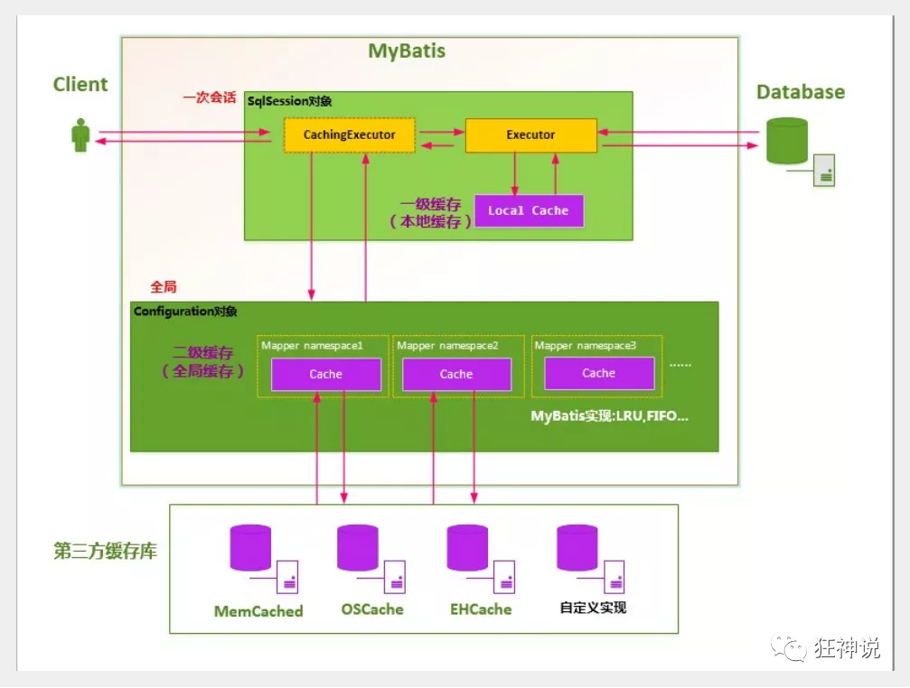

# Mybatis

## 1、简介

### 1.1、什么是Mybatis

MyBatis 是一款优秀的**持久层框架**，它支持定制化 SQL、存储过程以及高级映射。MyBatis 避免了几乎所有的 JDBC 代码和手动设置参数以及获取结果集。MyBatis 可以使用简单的 XML 或注解来配置和映射原生信息，将接口和 Java 的 POJOs(Plain Ordinary Java Object,普通的 Java对象)映射成数据库中的记录。

MyBatis 本是apache的一个开源项目iBatis, 2010年这个项目由apache software foundation 迁移到了google code，并且改名为MyBatis 。2013年11月迁移到Github。

如何获取Mybatis

maven

GitHub

https://github.com/mybatis/mybatis-3

https://github.com/mybatis/mybatis-3/releases

中文文档

https://mybatis.org/mybatis-3/zh/index.html

### 1.2、持久化

数据持久化

- 持久化就是将程序的数据在持久状态和瞬时状态转化的过程

- 内存：断电即失

- 数据库（jdbc），is文件持久化

**为什么要持久化？**

- 有一些对象不能让他丢掉

- 内存太贵了

### 1.3、持久层

Dao层，Service层，Controller层...

- 完成持久化工作的代码块
- 层是界限明显的

### 1.4、为什么要Mybatis

- 方便
- 传统的JDBC代码太复杂，想偷懒，简化，框架哎，自动化
- 帮助程序员将数据存入到数据库中
- 不用Mybatis也可以，更容易上手，技术没有高低之分

**最重要的一点：使用的人多**

Spring SpringMVC SpringBoot

## 2.第一个Mybatis程序

思路：搭建环境-->导入Mybatis-->编写代码测试

### 2.1、搭建环境

搭建数据库

```sql
create schema MybatisTest;
use MybatisTest;

create table user(
    id INT(11) primary key ,
    name VARCHAR(20),
    pass VARCHAR(20)
)ENGINE=INNODB CHAR SET UTF8MB4;

INSERT INTO user VALUES (1,'张三','123');
INSERT INTO user VALUES (2,'李四','123');
INSERT INTO user VALUES (3,'王五','123');
```

新建项目

新建一个普通Maven项目，导入依赖

```xml
        <!--MySQL-->
        <dependency>
            <groupId>mysql</groupId>
            <artifactId>mysql-connector-java</artifactId>
            <version>8.0.25</version>
        </dependency>
        <!--mybatis-->
        <dependency>
            <groupId>org.mybatis</groupId>
            <artifactId>mybatis</artifactId>
            <version>3.5.7</version>
        </dependency>
        <!--junit-->
        <dependency>
            <groupId>junit</groupId>
            <artifactId>junit</artifactId>
            <version>4.12</version>
        </dependency>
```

### 2.2、创建一个模块

* 编写mybatis的核心配置文件

```xml
<?xml version="1.0" encoding="UTF-8" ?>
<!DOCTYPE configuration
        PUBLIC "-//mybatis.org//DTD Config 3.0//EN"
        "http://mybatis.org/dtd/mybatis-3-config.dtd">
<configuration>
    <environments default="development">
        <environment id="development">
            <transactionManager type="JDBC"/>
            <dataSource type="POOLED">
                <property name="driver" value="com.mysql.jdbc.Driver"/>
                <property name="url" value="jdbc:mysql://localhost:3306/mybatis?characterEncoding=UTF-8"/>
                <property name="username" value="root"/>
                <property name="password" value="...."/>
            </dataSource>
        </environment>
    </environments>
    <mappers>
        <mapper resource="org/mybatis/example/BlogMapper.xml"/>
    </mappers>
</configuration>
```


* 编辑mybatis的核心工具类

### 2.3、编写代码

- 实体类

- Dao接口

- 接口实现类由原本的impl类改为Mapper配置文件

- ```xml
  <?xml version="1.0" encoding="UTF-8" ?>
  <!DOCTYPE mapper
          PUBLIC "-//mybatis.org//DTD Mapper 3.0//EN"
          "http://mybatis.org/dtd/mybatis-3-mapper.dtd">
  <mapper namespace="com.test.dao.UserDao">
      <select id="selectAll" resultType="com.test.entity.User">
          select * from mybatistest.user
      </select>
  </mapper>
  ```

  ### 2.3、测试

注意点：



每一个Mapper.xml都需要在mybatis核心配置文件中注册

### 2.4、sqlSession

#### SqlSessionFactoryBuilder

这个类可以被实例化、使用和丢弃，一旦创建了 SqlSessionFactory，就不再需要它了。 因此 SqlSessionFactoryBuilder 实例的最佳作用域是方法作用域（也就是局部方法变量）。 你可以重用 SqlSessionFactoryBuilder 来创建多个 SqlSessionFactory 实例，但最好还是不要一直保留着它，以保证所有的 XML 解析资源可以被释放给更重要的事情。

#### SqlSessionFactory

SqlSessionFactory 一旦被创建就应该在应用的运行期间一直存在，没有任何理由丢弃它或重新创建另一个实例。 使用 SqlSessionFactory 的最佳实践是在应用运行期间不要重复创建多次，多次重建 SqlSessionFactory 被视为一种代码“坏习惯”。因此 SqlSessionFactory 的最佳作用域是应用作用域。 有很多方法可以做到，最简单的就是使用单例模式或者静态单例模式。

#### SqlSession

每个线程都应该有它自己的 SqlSession 实例。SqlSession 的实例不是线程安全的，因此是不能被共享的，所以它的最佳的作用域是请求或方法作用域。 绝对不能将 SqlSession 实例的引用放在一个类的静态域，甚至一个类的实例变量也不行。 也绝不能将 SqlSession 实例的引用放在任何类型的托管作用域中，比如 Servlet 框架中的 HttpSession。 如果你现在正在使用一种 Web 框架，考虑将 SqlSession 放在一个和 HTTP 请求相似的作用域中。 换句话说，每次收到 HTTP 请求，就可以打开一个 SqlSession，返回一个响应后，就关闭它。 这个关闭操作很重要，为了确保每次都能执行关闭操作，你应该把这个关闭操作放到 finally 块中。 下面的示例就是一个确保 SqlSession 关闭的标准模式：

```java
try (SqlSession session = sqlSessionFactory.openSession()) {
  // 你的应用逻辑代码
}
```

在所有代码中都遵循这种使用模式，可以保证所有数据库资源都能被正确地关闭。

## 3、CRUD

### 3.1、namespace

namespace中的包名要和dao/mapper接口的包名一致

### 3.2、select

选择，查询语句

* id：就是对应namespace中的方法名
* resultType：sql语句执行的返回值
* parameterType：参数类型

### 3.3、insert

### 3.4、update

### 3.5、add

```xml
    <select id="getAll" resultType="com.test.entity.User" >
        select * from MybatisTest.user
    </select>

    <select id="getById" resultType="com.test.entity.User" parameterType="int">
        select * from MybatisTest.user where id = #{id}
    </select>

    <insert id="add" parameterType="com.test.entity.User">
        insert into MybatisTest.user values (null ,#{name},#{pass})
    </insert>

    <update id="update" parameterType="com.test.entity.User">
        update MybatisTest.user set pass=#{pass} where id=#{id}
    </update>

    <delete id="delete" parameterType="int">
        delete from user where id=#{id}
    </delete>
```

```java
    /**
     * 查询所有用户
     * @return
     */
    List<User> getAll();

    /**
     * 通过id查询
     * @param id
     * @return
     */
    User getById(int id);

    /**
     * 添加用户
     * @param user
     * @return
     */
    int add(User user);

    /**
     * 修改用户
     * @param user
     * @return
     */
    int update(User user);

    /**
     * 删除用户
     * @param id
     * @return
     */
    int delete(int id);
```

```Java
    @Test
    public void test() {
        // 获取SQLSession对象
        SqlSession sqlSession = MybatisUtils.getSqlSession();
        // 执行Sql

        // 方式1
        UserMapper userMapper = sqlSession.getMapper(UserMapper.class);
        List<User> users = userMapper.getAll();

        // 方式2(不推荐)
        // List<User> users = sqlSession.selectList("com.test.dao.UserMapper.getAll");

        for (User user : users) {
            System.out.println(user);
        }

        // 关闭sqlSession
        sqlSession.close();
    }

    @Test
    public void getById(){
        SqlSession sqlSession = MybatisUtils.getSqlSession();
        UserMapper userMapper = sqlSession.getMapper(UserMapper.class);
        User user = userMapper.getById(1);
        System.out.println(user);
        sqlSession.close();
    }

    //增删改需要提交事务
    @Test
    public void add(){
        SqlSession sqlSession = MybatisUtils.getSqlSession();
        UserMapper userMapper = sqlSession.getMapper(UserMapper.class);
        User user = new User("小七","123");
        int add = userMapper.add(user);
        System.out.println(add);
        if (add>0) {
            sqlSession.commit();
        }
        sqlSession.close();
    }

    @Test
    public void update(){
        SqlSession sqlSession = MybatisUtils.getSqlSession();
        UserMapper userMapper = sqlSession.getMapper(UserMapper.class);
        User user = new User(6,"小七","1234");
        int result = userMapper.update(user);
        System.out.println(result);
        if (result>0) {
            sqlSession.commit();
        }
        sqlSession.close();
    }

    @Test
    public void delete(){
        SqlSession sqlSession = MybatisUtils.getSqlSession();
        UserMapper userMapper = sqlSession.getMapper(UserMapper.class);
        int result = userMapper.delete(6);
        System.out.println(result);
        if (result>0) {
            sqlSession.commit();
        }
        sqlSession.close();
    }
```

注意点：

* 增删改需要提交事务

### 3.6、万能Map

假设实体类的字段过多，可以考虑使用Map

```java
public void add2(){
        SqlSession sqlSession = MybatisUtils.getSqlSession();
        UserMapper userMapper = sqlSession.getMapper(UserMapper.class);

        Map<String,Object> map = new HashMap<>();

        map.put("uid",4);
        map.put("uname","小七");
        map.put("password","123");

        int i = userMapper.add2(map);

        System.out.println(i);

        sqlSession.commit();

        sqlSession.close();
    }
```

```Java
    // 万能的Map
    int add2(Map<String,Object> map);
```

```xml
    <insert id="add2" parameterType="map">
        insert into MybatisTest.user values (#{uid} ,#{uname},#{password})
    </insert>

```

Map传参，在sql中取出key即可

只有一个基本类型参数的情况下，可以直接在sql中取到，

多个参数用Map或注解

### 3.7、模糊查询怎么写

1.Java代码中传入通配符

2.在sql中使用通配符

## 4、配置解析

The content of element type "configuration" must match "(properties?,settings?,typeAliases?,typeHandlers?,objectFactory?,objectWrapperFactory?,reflectorFactory?,plugins?,environments?,databaseIdProvider?,mappers?)".

必须按顺序写

### 4.1、核心配置文件

mybatis-config.xml

```xml
configuration（配置）
properties（属性）
settings（设置）
typeAliases（类型别名）
typeHandlers（类型处理器）
objectFactory（对象工厂）
plugins（插件）
environments（环境配置）
environment（环境变量）
transactionManager（事务管理器）
dataSource（数据源）
databaseIdProvider（数据库厂商标识）
mappers（映射器）
```

### 4.2、配置环境

MyBatis 可以配置成适应多种环境，这种机制有助于将 SQL 映射应用于多种数据库之中， 现实情况下有多种理由需要这么做。例如，开发、测试和生产环境需要有不同的配置；或者想在具有相同 Schema 的多个生产数据库中使用相同的 SQL 映射。还有许多类似的使用场景。

**不过要记住：尽管可以配置多个环境，但每个 SqlSessionFactory 实例只能选择一种环境。**

学会配置多套运行环境

Mybatis默认的事务管理器就是JDBC，连接池POOLED

### 4.3、属性（properties）

可以通过properties来配置属性

编写一个配置文件

```properties
driver=com.mysql.cj.jdbc.Driver
url=jdbc:mysql://localhost:3306/test?characterEncoding=UTF-8
username=root
password=....
```

引入

```xml
<properties resource="db.properties" />
```

注意

* 可以直接引入properties文件
* 可以在内部引入
* 优先使用外部引入的配置

### 4.4、别名

类型别名可为 Java 类型设置一个缩写名字。 它仅用于 XML 配置，意在降低冗余的全限定类名书写。

```xml
    <typeAliases>
        <typeAlias type="com.test.entity.User" alias="User"/>
    </typeAliases>
```

也可以指定一个包名，MyBatis 会在包名下面搜索需要的 Java Bean

扫描一个包，别名为类名首字母小写User-->user

```xml
    <typeAliases>
        <package name="com.test.entity"/>
    </typeAliases>
```

区别：第一种可以diy别名，第二种不行

如果非要改，需要在实体类上注解

```Java
@Alias("user")
```

### 4.5、设置

| 设置名             | 描述                                                         | 有效值                                                       | 默认值 |
| :----------------- | :----------------------------------------------------------- | :----------------------------------------------------------- | :----- |
| cacheEnabled       | 全局性地开启或关闭所有映射器配置文件中已配置的任何缓存。     | true \| false                                                | true   |
| lazyLoadingEnabled | 延迟加载的全局开关。当开启时，所有关联对象都会延迟加载。 特定关联关系中可通过设置 `fetchType` 属性来覆盖该项的开关状态。 | true \| false                                                | false  |
| logImpl            | 指定 MyBatis 所用日志的具体实现，未指定时将自动查找。---------日志实现 | SLF4J \| LOG4J \| LOG4J2 \| JDK_LOGGING \| COMMONS_LOGGING \| STDOUT_LOGGING \| NO_LOGGING | 未设置 |

### 4.6、其他设置

插件

* mybatis-generator-core
* mybatis-plus
* 通用mapper

### 4.7、映射器

MapperRegister：注册绑定我们的Mapper文件

方式一：

```xml
    <mappers>
        <mapper resource="com/test/mapper/UserMapper.xml"/>
    </mappers>
```

方式二：

```xml
    <mappers>
<!--        <mapper resource="com/test/mapper/UserMapper.xml"/>-->
        <mapper class="com.test.mapper.UserMapper"/>
    </mappers>
```

使用class绑定映射

注意点：

* 接口和他的Mapper配置文件必须同名
* 必须在同一包下

方式三：

```xml
    <mappers>
<!--        <mapper resource="com/test/mapper/UserMapper.xml"/>-->
        <package name="com.test.mapper" />
    </mappers>
```

通过扫描包进行注册

注意点：

* 接口和他的Mapper配置文件必须同名
* 必须在同一包下

### 4.8、生命周期和作用域

生命周期类别是至关重要的，因为错误的使用会导致非常严重的并发问题。

**SqlSessionFactoryBuilder**

* 一旦创建了 SqlSessionFactory，就不再需要它了
* 局部变量

**SqlSessionFactory**

* 说白了可以想象为数据库连接池
* SqlSessionFactory 一旦被创建就应该在应用的运行期间一直存在，没有任何理由丢弃它或重新创建另一个实例。
* 因此 SqlSessionFactory 的最佳作用域是应用作用域。
* 最简单的就是使用单例模式或者静态单例模式。

**SqlSession**

* 连接到连接池的一个请求
* SqlSession 的实例不是线程安全的，因此是不能被共享的，所以它的最佳的作用域是请求或方法作用域。
* 用完后要感觉关闭，否则资源占用

这里面的每一个Mapper就代表一个具体的业务

## 5、ResultMap----解决属性名和字段名不一致的问题

### 5.1、问题

解决方法：

* 起别名
* 

### 5.2、resultMap

结果集映射

```xml
<!--        column数据库中的字段，property实体类中的属性-->
    <resultMap id="UserMap" type="user">
        <result column="id" property="id"/>
        <result column="name" property="name"/>
        <result column="pass" property="password"/>
    </resultMap>

    <select id="getById" resultMap="UserMap" parameterType="int">
        select * from MybatisTest.user where id = #{id}
    </select>
```

`resultMap` 元素是 MyBatis 中最重要最强大的元素。它可以让你从 90% 的 JDBC `ResultSets` 数据提取代码中解放出来

ResultMap 的设计思想是，对简单的语句做到零配置，对于复杂一点的语句，只需要描述语句之间的关系就行了。

`ResultMap` 的优秀之处——你完全可以不用显式地配置它们

如果这个世界总是这么简单就好了。

## 6、日志

### 6.1、日志工厂

如果一个数据库操作出现了异常，我们需要排错，日志就是最好的助手

曾经：sout，debug

现在：日志工厂

logImpl  指定 MyBatis 所用日志的具体实现，未指定时将自动查找。---------日志实现  SLF4J | LOG4J | LOG4J2 | JDK_LOGGING | COMMONS_LOGGING | STDOUT_LOGGING | NO_LOGGING  未设置

* SLF4J
* LOG4J    【掌握】
* LOG4J2
* JDK_LOGGING
* COMMONS_LOGGING
* STDOUT_LOGGING    【掌握】
* NO_LOGGING

在Mybatis中具体使用哪个日志实现，在设置中设定

#### STDOUT_LOGGING标准日志输出

在mybatis核心配置文件中配置日志

```xml
    <settings>
        <setting name="logImpl" value="STDOUT_LOGGING"/>
    </settings>
```

```
Opening JDBC Connection
Created connection 1768792843.
Setting autocommit to false on JDBC Connection [com.mysql.cj.jdbc.ConnectionImpl@696da30b]
==>  Preparing: select * from MybatisTest.user where id = ?
==> Parameters: 2(Integer)
<==    Columns: id, name, pass
<==        Row: 2, 李四, 123
<==      Total: 1
User{id=2, name='李四', pass='123'}
Resetting autocommit to true on JDBC Connection [com.mysql.cj.jdbc.ConnectionImpl@696da30b]
Closing JDBC Connection [com.mysql.cj.jdbc.ConnectionImpl@696da30b]
Returned connection 1768792843 to pool.
```

#### LOG4J

什么是log4j

Log4j是Apache的一个开源项目，通过使用Log4j，我们可以控制日志信息输送的目的地是控制台、文件、GUI组件，甚至是套接口服务器、NT的事件记录器、UNIXSyslog守护进程等；

可以通过一个配置文件来灵活地进行配置，而不需要修改应用的代码。

导入log4j

```xml
        <dependency>
            <groupId>log4j</groupId>
            <artifactId>log4j</artifactId>
            <version>1.2.17</version>
        </dependency>
```

log4j.properties

```properties
#将等级为DEBUG的日志信息输出到console和file这两个目的地，console和file的定义在下面的代码
log4j.rootLogger=DEBUG,console,file
encoding=UTF-8
#控制台输出的相关设置
log4j.appender.console = org.apache.log4j.ConsoleAppender
log4j.appender.console.Target = System.out
log4j.appender.console.Threshold=DEBUG
log4j.appender.console.layout = org.apache.log4j.PatternLayout
log4j.appender.console.layout.ConversionPattern=[%c]-%m%n

#文件输出的相关设置
log4j.appender.file = org.apache.log4j.RollingFileAppender
log4j.appender.file.File=./log/test.log
log4j.appender.file.MaxFileSize=10mb
log4j.appender.file.Threshold=DEBUG
log4j.appender.file.layout=org.apache.log4j.PatternLayout
log4j.appender.file.layout.ConversionPattern=[%p][%d{yy-MM-dd}][%c]%m%n

#日志输出级别
log4j.logger.org.mybatis=DEBUG
log4j.logger.java.sql=DEBUG
log4j.logger.java.sql.Statement=DEBUG
log4j.logger.java.sql.ResultSet=DEBUG
log4j.logger.java.sql.PreparedStatement=DEBUG
```

xml配置

```xml
    <settings>
        <setting name="logImpl" value="LOG4J"/>
    </settings>
```

log4j的使用：直接测试运行就行了

简单使用

1.在需要使用Log4j的类中导入包

```java
import org.apache.log4j.Logger;
```

2.日志对象加载参数为当前类的class

```java
    static Logger logger = Logger.getLogger(UserMapperTest.class);
```

日志级别：

```java
logger.info("info:进入了log4jTest");
logger.debug("debug:进入了log4jTest");
logger.error("error:进入了log4jTest");
```

## 7、分页

为什么要分页？

* 减少数据的处理量

### 7.1、使用Limit分页

select * from table limit startIndex,pageSize

使用mybatis实现分页，核心SQL

1. 接口

```Java
/**
 * 分页查询的实现
 * @param map
 * @return
 */
List<User> getUserByLimit(Map<String,Integer> map);
```

1. Mapper.xml

```xml
<select id="getUserByLimit" resultType="user" parameterType="map">
    select * from MybatisTest.user limit #{startIndex},#{pageSize}
</select>
```

1. 测试

```java
@Test
public void getByLimit() {
    SqlSession sqlSession = MybatisUtils.getSqlSession();
    UserMapper userMapper = sqlSession.getMapper(UserMapper.class);

    Map<String,Integer> map = new HashMap<>();

    map.put("startIndex",0);
    map.put("pageSize",2);

    List<User> users = userMapper.getUserByLimit(map);
    System.out.println(users);
    sqlSession.close();
}
```

### 7.2、RowBounds分页

不再使用SQL实现分页

1. 接口

```java
List<User> getUserRowBounds();
```

1. Mappser.xml

```xml
<select id="getUserRowBounds" resultType="user" parameterType="map">
    select * from MybatisTest.user
</select>
```

1. 测试

```javascript
@Test
public void getUserRowBounds() {
    SqlSession sqlSession = MybatisUtils.getSqlSession();
    // RowBounds实现
    RowBounds rowBounds = new RowBounds(1,2);

    // 通过Java代码实现分页
    List<User> users = sqlSession.selectList("com.test.mapper.UserMapper.getUserRowBounds",null,rowBounds);

    System.out.println(users);
    sqlSession.close();
}
```

### 7.3、分页插件

MybatisHelper插件

了解即可，万一以后遇见脑瘫需求需要知道是什么

## 8、使用注解开发

### 8.1、面向接口编程

**根本原因：解耦，可拓展，提高复用性，分层开发中上层不用管具体的实现，大家都遵守共同的标准，开发变得更容易，规范性更好**

### 8.2、使用注解开发

1. 注解在接口上实现

```Java
@Select("select * from MybatisTest.user")
List<User> getAll();
```

2. 需要在核心配置文件中绑定接口

```xml
<mappers>
    <mapper class="com.test.mapper.UserMapper"
</mappers>
```

本质：反射机制实现

底层：动态代理

### 8.3、CRUD

以此内推

## 9、lomdok

目前IDEA以内置此插件，导入JAR包即可使用





## 10、多对一


集合跟关联



### 10.1、按照查询嵌套处理

```xml
<resultMap id="student" type="student">
    <result property="id" column="id"/>
    <result property="name" column="name"/>
    <association property="teacher" column="tid" javaType="teacher" select="getTeacher"/>
</resultMap>
<select id="getAllStuAndTeacher" resultMap="student">
    select * from mybatistest.student s,mybatistest.teacher t where s.tid=t.id;
</select>
```

### 10.2、按照结果嵌套处理

```xml
<select id="getAllStuAndTeacher2" resultMap="student2">
    select s.id sid,s.name sname,t.name tname
    from mybatistest.student s,mybatistest.teacher t
    where s.tid = t.id
</select>
<resultMap id="student2" type="student">
    <result property="id" column="sid"/>
    <result property="name" column="sname"/>
    <association property="teacher" javaType="teacher">
        <result property="name" column="tname"/>
    </association>
</resultMap>
```

## 11、一对多

比如：一个老师有多个学生

环境搭建：

和刚才一样

### 10.1、按照结果嵌套处理

```xml
    <select id="getTeacherAndStu" resultMap="teacher">
        select t.id tid,t.name tname,s.id sid,s.name sname
        from mybatistest.teacher t,mybatistest.student s
        where t.id=s.tid and tid=#{id}
    </select>
    <resultMap id="teacher" type="teacher">
        <result property="id" column="tid"/>
        <result property="name" column="tname"/>
        <collection property="students" ofType="student">
            <result property="id" column="sid"/>
            <result property="name" column="sname"/>
            <result property="tid" column="tid"/>
        </collection>
    </resultMap>
```

### 10.2、按照查询嵌套处理

```xml
<select id="getTeacherAndStu2" resultMap="teacher">
    select * from mybatistest.teacher where id=#{tid}
</select>
<resultMap id="teacher" type="teacher">
    <collection property="students" javaType="ArrayList" ofType="student" select="getStudents" column="id"/>
</resultMap>
<select id="getStudents" resultType="student">
    select * from mybatistest.student where tid=#{tid}
</select>
```

### 小结

复杂的属性我们需要单独处理
对象association		多对一
集合collection			一对多
javaType是一个指定的属性类型
集合中的泛型信息用ofType获取

JavaType依赖指定实体类中属性的类型

ofType用来指定映射到List或者集合中的实体类，泛型中的约束类型

注意点：

SQL的可读性，尽量保证通俗易懂

注意一对多和多对一中字段的问题

如果问题不好排查错误，可以使用日志	log4j


慢SQL

面试高频

* MySQL引擎
* InnoDB底层原理
* 索引
* 索引优化

## 12、动态SQL

什么是动态SQL：动态SQL就是根据不同的条件生成不同的SQL语句

搭建环境

### 12.1、IF

```xml
<select id="getIF" parameterType="map" resultType="blog">
    select * from mybatistest.blog where 1=1
    <if test="title != null">
        and title = #{title}
    </if>
    <if test="author != null">
        and author = #{author
        }
    </if>
</select>
```

### 12.2、choose（when，otherwise）

```xml
<select id="getChoose" parameterType="map" resultType="blog">
    select * from mybatistest.blog
    <where>
        <choose>
            <when test="title!=null">
                title = #{title}
            </when>
            <when test="author != null">
                and author = #{author}
            </when>
            <otherwise>
                and views = #{views}
            </otherwise>
        </choose>
    </where>
</select>
```

只会选择一个SQL去实现，类似Java的switch标签

### 12.3、trim（where，set）

```xml
<where>
    <if test="title != null">
        title = #{title}
    </if>
    <if test="author != null">
        and author = #{author}
    </if>
</where>
```

*where* 元素只会在子元素返回任何内容的情况下才插入 “WHERE” 子句。而且，若子句的开头为 “AND” 或 “OR”，*where* 元素也会将它们去除。

用于动态更新语句的类似解决方案叫做 *set*。*set* 元素可以用于动态包含需要更新的列，忽略其它不更新的列。比如：

```xml
    <update id="update" parameterType="map">
        update mybatistest.blog
            <set>
                <if test="title != null">title = #{title},</if>
                <if test="views != null">views = #{views}</if>
            </set>
        where id=#{id}
    </update>
```

这个例子中，*set* 元素会动态地在行首插入 SET 关键字，并会删掉额外的逗号（这些逗号是在使用条件语句给列赋值时引入的）。

所谓的动态SQL本质还是SQL语句，只是我们可以在SQL层面去执行一个逻辑代码

### 12.4、SQL片段

有点时候我们可能会将某些通用的SQL片段提取出来复用

使用SQL标签抽取公共部分，在需要使用的地方使用include标签引入即可

```xml
<select id="getIF" parameterType="map" resultType="blog">
    select * from mybatistest.blog
    <where>
        <include refid="if-title-author" />
    </where>
</select>

<sql id="if-title-author">
    <if test="title != null">
        title = #{title}
    </if>
    <if test="author != null">
        and author = #{author}
    </if>
</sql>
```

注意：

最好基于单表来定义SQL片段

不要存在where标签

### 12.5、foreach

```xml
<select id="getForEach" parameterType="map" resultType="blog">
    select * from mybatistest.blog
    <where>
        <foreach item="id" collection="ids"
                 open="and (" separator="or" close=")">
            id=#{id}
        </foreach>
    </where>
</select>
```

item	便利出的对象

collection	便利集合

open	开始

separator	分隔符

close	结束

动态SQL就是在拼接SQL语句，我们只要保证SQL的正确性去排列组合就可以了

* 先在MySQL中写出完整的SQL，再去修改成为我们的动态SQL实现通用即可

## 13、缓存

### 13.1、简介

1、什么是缓存 [ Cache ]？

- 存在内存中的临时数据。
- 将用户经常查询的数据放在缓存（内存）中，用户去查询数据就不用从磁盘上(关系型数据库数据文件)查询，从缓存中查询，从而提高查询效率，解决了高并发系统的性能问题。

2、为什么使用缓存？

- 减少和数据库的交互次数，减少系统开销，提高系统效率。

3、什么样的数据能使用缓存？

- 经常查询并且不经常改变的数据。


### 13.2、Mybatis缓存

- MyBatis包含一个非常强大的查询缓存特性，它可以非常方便地定制和配置缓存。缓存可以极大的提升查询效率。

- MyBatis系统中默认定义了两级缓存：**一级缓存**和**二级缓存**

- - 默认情况下，只有一级缓存开启。（SqlSession级别的缓存，也称为本地缓存）
  - 二级缓存需要手动开启和配置，他是基于namespace级别的缓存。
  - 为了提高扩展性，MyBatis定义了缓存接口Cache。我们可以通过实现Cache接口来自定义二级缓存


### 13.3、一级缓存

一级缓存也叫本地缓存：

- 与数据库同一次会话期间查询到的数据会放在本地缓存中。
- 以后如果需要获取相同的数据，直接从缓存中拿，没必须再去查询数据库；

> 测试

1、在mybatis中加入日志，方便测试结果

2、编写接口方法

```
//根据id查询用户
User queryUserById(@Param("id") int id);
```

3、接口对应的Mapper文件

```
<select id="queryUserById" resultType="user">
  select * from user where id = #{id}
</select>
```

4、测试

```
@Test
public void testQueryUserById(){
   SqlSession session = MybatisUtils.getSession();
   UserMapper mapper = session.getMapper(UserMapper.class);

   User user = mapper.queryUserById(1);
   System.out.println(user);
   User user2 = mapper.queryUserById(1);
   System.out.println(user2);
   System.out.println(user==user2);

   session.close();
}
```

5、结果分析




> 一级缓存失效的四种情况

一级缓存是SqlSession级别的缓存，是一直开启的，我们关闭不了它；

一级缓存失效情况：没有使用到当前的一级缓存，效果就是，还需要再向数据库中发起一次查询请求！

1、sqlSession不同

```java
@Test
public void testQueryUserById(){
   SqlSession session = MybatisUtils.getSession();
   SqlSession session2 = MybatisUtils.getSession();
   UserMapper mapper = session.getMapper(UserMapper.class);
   UserMapper mapper2 = session2.getMapper(UserMapper.class);

   User user = mapper.queryUserById(1);
   System.out.println(user);
   User user2 = mapper2.queryUserById(1);
   System.out.println(user2);
   System.out.println(user==user2);

   session.close();
   session2.close();
}
```

观察结果：发现发送了两条SQL语句！

结论：**每个sqlSession中的缓存相互独立**

2、sqlSession相同，查询条件不同

```java
@Test
public void testQueryUserById(){
   SqlSession session = MybatisUtils.getSession();
   UserMapper mapper = session.getMapper(UserMapper.class);
   UserMapper mapper2 = session.getMapper(UserMapper.class);

   User user = mapper.queryUserById(1);
   System.out.println(user);
   User user2 = mapper2.queryUserById(2);
   System.out.println(user2);
   System.out.println(user==user2);

   session.close();
}
```

观察结果：发现发送了两条SQL语句！很正常的理解

结论：**当前缓存中，不存在这个数据**

3、sqlSession相同，两次查询之间执行了增删改操作！

增加方法

```java
//修改用户
int updateUser(Map map);
```

编写SQL

```xml
<update id="updateUser" parameterType="map">
  update user set name = #{name} where id = #{id}
</update>
```

测试

```java
@Test
public void testQueryUserById(){
   SqlSession session = MybatisUtils.getSession();
   UserMapper mapper = session.getMapper(UserMapper.class);

   User user = mapper.queryUserById(1);
   System.out.println(user);

   HashMap map = new HashMap();
   map.put("name","kuangshen");
   map.put("id",4);
   mapper.updateUser(map);

   User user2 = mapper.queryUserById(1);
   System.out.println(user2);

   System.out.println(user==user2);

   session.close();
}
```

观察结果：查询在中间执行了增删改操作后，重新执行了

结论：**因为增删改操作可能会对当前数据产生影响**

4、sqlSession相同，手动清除一级缓存

```java
@Test
public void testQueryUserById(){
   SqlSession session = MybatisUtils.getSession();
   UserMapper mapper = session.getMapper(UserMapper.class);

   User user = mapper.queryUserById(1);
   System.out.println(user);

   session.clearCache();//手动清除缓存

   User user2 = mapper.queryUserById(1);
   System.out.println(user2);

   System.out.println(user==user2);

   session.close();
}
```

一级缓存就是一个map


### 13.4、二级缓存

- 二级缓存也叫全局缓存，一级缓存作用域太低了，所以诞生了二级缓存

- 基于namespace级别的缓存，一个名称空间，对应一个二级缓存；

- 工作机制

- - 一个会话查询一条数据，这个数据就会被放在当前会话的一级缓存中；
  - 如果当前会话关闭了，这个会话对应的一级缓存就没了；但是我们想要的是，会话关闭了，一级缓存中的数据被保存到二级缓存中；
  - 新的会话查询信息，就可以从二级缓存中获取内容；
  - 不同的mapper查出的数据会放在自己对应的缓存（map）中；

> 使用步骤

1、开启全局缓存 【mybatis-config.xml】

```xml
<setting name="cacheEnabled" value="true"/>
```

2、去每个mapper.xml中配置使用二级缓存，这个配置非常简单；【xxxMapper.xml】

```xml
<cache/>

官方示例=====>查看官方文档
<cache
 eviction="FIFO"
 flushInterval="60000"
 size="512"
 readOnly="true"/>
这个更高级的配置创建了一个 FIFO 缓存，每隔 60 秒刷新，最多可以存储结果对象或列表的 512 个引用，而且返回的对象被认为是只读的，因此对它们进行修改可能会在不同线程中的调用者产生冲突。
```

3、代码测试

- 所有的实体类先实现序列化接口
- 测试代码

```java
@Test
public void testQueryUserById(){
   SqlSession session = MybatisUtils.getSession();
   SqlSession session2 = MybatisUtils.getSession();

   UserMapper mapper = session.getMapper(UserMapper.class);
   UserMapper mapper2 = session2.getMapper(UserMapper.class);

   User user = mapper.queryUserById(1);
   System.out.println(user);
   session.close();

   User user2 = mapper2.queryUserById(1);
   System.out.println(user2);
   System.out.println(user==user2);

   session2.close();
}
```

测试：

1. 问题：我们需要将实体类序列化，否侧就会报错

```
 Cause: java.io.NotSerializableException
 解决：import java.io.Serializable
```


> 结论

- 只要开启了二级缓存，我们在同一个Mapper中的查询，可以在二级缓存中拿到数据
- 查出的数据都会被默认先放在一级缓存中
- 只有会话提交或者关闭以后，一级缓存中的数据才会转到二级缓存中


### 13.5、缓存原理图




### 13.6、EhCache-自定义缓存


第三方缓存实现--EhCache: 查看百度百科

Ehcache是一种广泛使用的java分布式缓存，用于通用缓存；

要在应用程序中使用Ehcache，需要引入依赖的jar包

```xml
<!-- https://mvnrepository.com/artifact/org.mybatis.caches/mybatis-ehcache -->
<dependency>
   <groupId>org.mybatis.caches</groupId>
   <artifactId>mybatis-ehcache</artifactId>
   <version>1.1.0</version>
</dependency>
```

在mapper.xml中使用对应的缓存即可

```xml
<mapper namespace = “org.acme.FooMapper” >
   <cache type = “org.mybatis.caches.ehcache.EhcacheCache” />
</mapper>
```

编写ehcache.xml文件，如果在加载时未找到/ehcache.xml资源或出现问题，则将使用默认配置。

```xml
<?xml version="1.0" encoding="UTF-8"?>
<ehcache xmlns:xsi="http://www.w3.org/2001/XMLSchema-instance"
        xsi:noNamespaceSchemaLocation="http://ehcache.org/ehcache.xsd"
        updateCheck="false">
   <!--
      diskStore：为缓存路径，ehcache分为内存和磁盘两级，此属性定义磁盘的缓存位置。参数解释如下：
      user.home – 用户主目录
      user.dir – 用户当前工作目录
      java.io.tmpdir – 默认临时文件路径
    -->
   <diskStore path="./tmpdir/Tmp_EhCache"/>
   
   <defaultCache
           eternal="false"
           maxElementsInMemory="10000"
           overflowToDisk="false"
           diskPersistent="false"
           timeToIdleSeconds="1800"
           timeToLiveSeconds="259200"
           memoryStoreEvictionPolicy="LRU"/>

   <cache
           name="cloud_user"
           eternal="false"
           maxElementsInMemory="5000"
           overflowToDisk="false"
           diskPersistent="false"
           timeToIdleSeconds="1800"
           timeToLiveSeconds="1800"
           memoryStoreEvictionPolicy="LRU"/>
   <!--
      defaultCache：默认缓存策略，当ehcache找不到定义的缓存时，则使用这个缓存策略。只能定义一个。
    -->
   <!--
     name:缓存名称。
     maxElementsInMemory:缓存最大数目
     maxElementsOnDisk：硬盘最大缓存个数。
     eternal:对象是否永久有效，一但设置了，timeout将不起作用。
     overflowToDisk:是否保存到磁盘，当系统当机时
     timeToIdleSeconds:设置对象在失效前的允许闲置时间（单位：秒）。仅当eternal=false对象不是永久有效时使用，可选属性，默认值是0，也就是可闲置时间无穷大。
     timeToLiveSeconds:设置对象在失效前允许存活时间（单位：秒）。最大时间介于创建时间和失效时间之间。仅当eternal=false对象不是永久有效时使用，默认是0.，也就是对象存活时间无穷大。
     diskPersistent：是否缓存虚拟机重启期数据 Whether the disk store persists between restarts of the Virtual Machine. The default value is false.
     diskSpoolBufferSizeMB：这个参数设置DiskStore（磁盘缓存）的缓存区大小。默认是30MB。每个Cache都应该有自己的一个缓冲区。
     diskExpiryThreadIntervalSeconds：磁盘失效线程运行时间间隔，默认是120秒。
     memoryStoreEvictionPolicy：当达到maxElementsInMemory限制时，Ehcache将会根据指定的策略去清理内存。默认策略是LRU（最近最少使用）。你可以设置为FIFO（先进先出）或是LFU（较少使用）。
     clearOnFlush：内存数量最大时是否清除。
     memoryStoreEvictionPolicy:可选策略有：LRU（最近最少使用，默认策略）、FIFO（先进先出）、LFU（最少访问次数）。
     FIFO，first in first out，这个是大家最熟的，先进先出。
     LFU， Less Frequently Used，就是上面例子中使用的策略，直白一点就是讲一直以来最少被使用的。如上面所讲，缓存的元素有一个hit属性，hit值最小的将会被清出缓存。
     LRU，Least Recently Used，最近最少使用的，缓存的元素有一个时间戳，当缓存容量满了，而又需要腾出地方来缓存新的元素的时候，那么现有缓存元素中时间戳离当前时间最远的元素将被清出缓存。
  -->

</ehcache>
```

合理的使用缓存，可以让我们程序的性能大大提升！

现在一般Redis数据库来做缓存
