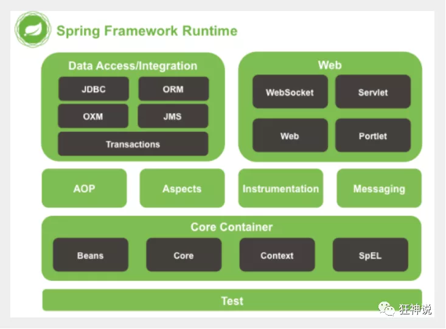
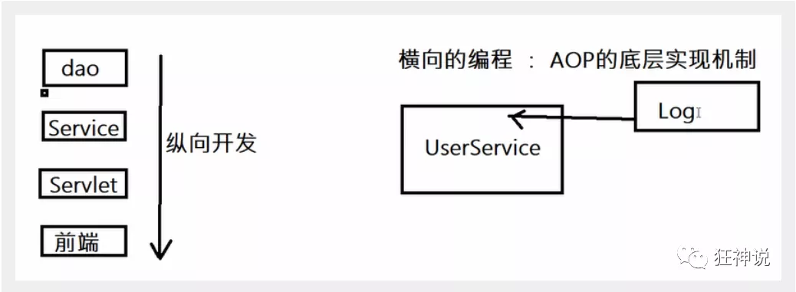
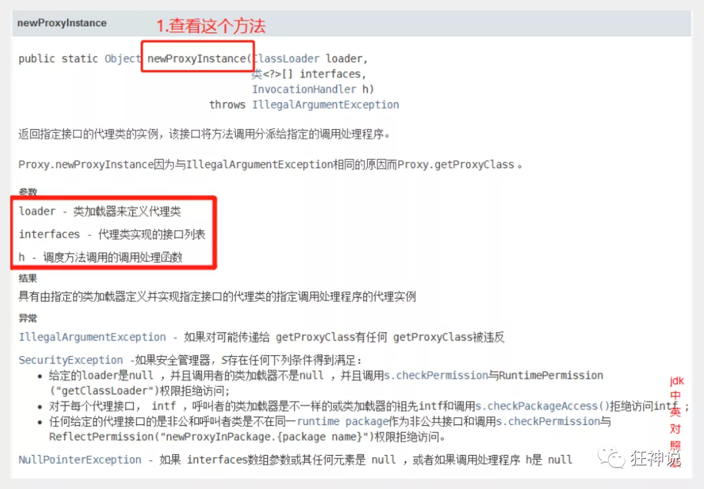

## 1、Spring

### 1.1、简介

Spring框架是由于软件开发的复杂性而创建的。Spring使用的是基本的JavaBean来完成以前只可能由EJB完成的事情。然而，Spring的用途不仅仅限于服务器端的开发。从简单性、可测试性和松耦合性角度而言，绝大部分Java应用都可以从Spring中受益。

Spring框架即以interface21框架为基础，经过重新设计，并不断丰富其内涵，于2004年3月24日正式发布了1.0正式版

Rod Johnson

Spring Framework创始人，著名作者。 Rod在悉尼大学不仅获得了计算机学位，同时还获得了音乐学位。更令人吃惊的是在回到软件开发领域之前，他还获得了音乐学的博士学位。 有着相当丰富的C/C++技术背景的Rod早在1996年就开始了对Java服务器端技术的研究。他是一个在保险、电子商务和金融行业有着丰富经验的技术顾问，同时也是JSR-154（Servlet2.4）和JDO2.0的规范专家、JCP的积极成员，是Java development community中的杰出人物。

Spring理念

使现有的技术更容易使用，本身是一个大杂烩，整合了现有的技术

SSH：Struct2+Spring+Hibernate
SSM：SpringMVC+Spring+Mybatis

下载地址

https://repo.spring.io/ui/native/libs-release-local/org/springframework/spring/

依赖导入

```xml
<dependency>
   <groupId>org.springframework</groupId>
   <artifactId>spring-webmvc</artifactId>
   <version>5.1.10.RELEASE</version>
</dependency>
<dependency>
   <groupId>org.springframework</groupId>
   <artifactId>spring-jdbc</artifactId>
   <version>5.1.10.RELEASE</version>
</dependency>
```

### 1.2、优点

Spring是一款开源的免费的框架

Spring是一个轻量级的，非入侵式框架

**控制反转（IOC），面向切面编程（AOP）**

支持事务的处理，对框架整合的支持

总结：

**Spring就是一个轻量级的控制反转（IOC）和面向切面编程（AOP）的框架**

### 1.3、组成



Spring 框架是一个分层架构，由 7 个定义良好的模块组成。Spring 模块构建在核心容器之上，核心容器定义了创建、配置和管理 bean 的方式 .


组成 Spring 框架的每个模块（或组件）都可以单独存在，或者与其他一个或多个模块联合实现。每个模块的功能如下：

- **核心容器**：核心容器提供 Spring 框架的基本功能。核心容器的主要组件是 BeanFactory，它是工厂模式的实现。BeanFactory 使用*控制反转*（IOC） 模式将应用程序的配置和依赖性规范与实际的应用程序代码分开。
- **Spring 上下文**：Spring 上下文是一个配置文件，向 Spring 框架提供上下文信息。Spring 上下文包括企业服务，例如 JNDI、EJB、电子邮件、国际化、校验和调度功能。
- **Spring AOP**：通过配置管理特性，Spring AOP 模块直接将面向切面的编程功能 , 集成到了 Spring 框架中。所以，可以很容易地使 Spring 框架管理任何支持 AOP的对象。Spring AOP 模块为基于 Spring 的应用程序中的对象提供了事务管理服务。通过使用 Spring AOP，不用依赖组件，就可以将声明性事务管理集成到应用程序中。
- **Spring DAO**：JDBC DAO 抽象层提供了有意义的异常层次结构，可用该结构来管理异常处理和不同数据库供应商抛出的错误消息。异常层次结构简化了错误处理，并且极大地降低了需要编写的异常代码数量（例如打开和关闭连接）。Spring DAO 的面向 JDBC 的异常遵从通用的 DAO 异常层次结构。
- **Spring ORM**：Spring 框架插入了若干个 ORM 框架，从而提供了 ORM 的对象关系工具，其中包括 JDO、Hibernate 和 iBatis SQL Map。所有这些都遵从 Spring 的通用事务和 DAO 异常层次结构。
- **Spring Web 模块**：Web 上下文模块建立在应用程序上下文模块之上，为基于 Web 的应用程序提供了上下文。所以，Spring 框架支持与 Jakarta Struts 的集成。Web 模块还简化了处理多部分请求以及将请求参数绑定到域对象的工作。
- **Spring MVC 框架**：MVC 框架是一个全功能的构建 Web 应用程序的 MVC 实现。通过策略接口，MVC 框架变成为高度可配置的，MVC 容纳了大量视图技术，其中包括 JSP、Velocity、Tiles、iText 和 POI。

### 1.4、拓展

在Spring官网有这个介绍：现代化的Java开发，说白了就是基于Spring的开发


**Spring Boot与Spring Cloud**

- Spring Boot 是 Spring 的一套快速配置脚手架，可以基于Spring Boot 快速开发单个微服务;
- Spring Cloud是基于Spring Boot实现的；
- Spring Boot专注于快速、方便集成的单个微服务个体，Spring Cloud关注全局的服务治理框架；
- Spring Boot使用了约束优于配置（约定大于配置）的理念，很多集成方案已经帮你选择好了，能不配置就不配置 , Spring Cloud很大的一部分是基于Spring Boot来实现，Spring Boot可以离开Spring Cloud独立使用开发项目，但是Spring Cloud离不开Spring Boot，属于依赖的关系。
- SpringBoot在SpringClound中起到了承上启下的作用，如果你要学习SpringCloud必须要学习SpringBoot。

因为现在大多数公司都在使用SpringBoot进行快速开发，学习SpringBoot的前提需要完全掌握Spring及SpringMVC

弊端：发展太久之后，违背了原来的理念，配置十分繁琐，人称“配置地狱”

## 2、IOC理论推导

1. UserDao	接口


1. UserDaoImpl	实现类


1. UserService	接口


1. UserServiceImpl	实现类


在我们之前的业务中，用户的需求可能会影响我们原来的代码，我们需要根据用户的需求去修改源代码，如果代码量十分大，修改一次的成本代价十分昂贵

我们使用一个set接口实现

```java
public class UserServiceImpl implements UserService {
    private UserDao userDao = new UserDaoImpl();

    public void setUserDao(UserDao userDao) {
        this.userDao = userDao;
    }
```

* 之前程序是主动创建对象，控制权在程序员手上
* 使用set后，程序不再具有主动性，而变成了被动的接受对象

这总思想从本质上解决了问题，程序员不用再去管理对象的创建了，系统的耦合性大大降低，专注在业务的扩展上，这是IOC的原型


### 2.1、IOC本质

**控制反转IoC(Inversion of Control)，是一种设计思想，DI(依赖注入)是实现IoC的一种方法**，也有人认为DI只是IoC的另一种说法。没有IoC的程序中 , 我们使用面向对象编程 , 对象的创建与对象间的依赖关系完全硬编码在程序中，对象的创建由程序自己控制，控制反转后将对象的创建转移给第三方，个人认为所谓控制反转就是：获得依赖对象的方式反转了。


**IoC是Spring框架的核心内容**，使用多种方式完美的实现了IoC，可以使用XML配置，也可以使用注解，新版本的Spring也可以零配置实现IoC。

Spring容器在初始化时先读取配置文件，根据配置文件或元数据创建与组织对象存入容器中，程序使用时再从Ioc容器中取出需要的对象。


采用XML方式配置Bean的时候，Bean的定义信息是和实现分离的，而采用注解的方式可以把两者合为一体，Bean的定义信息直接以注解的形式定义在实现类中，从而达到了零配置的目的。

**控制反转是一种通过描述（XML或注解）并通过第三方去生产或获取特定对象的方式。在Spring中实现控制反转的是IoC容器，其实现方法是依赖注入（Dependency Injection,DI）。**

## 3、Hello Spring

> 导入Jar包

注 : spring 需要导入commons-logging进行日志记录 . 我们利用maven , 他会自动下载对应的依赖项 .

```
<dependency>
    <groupId>org.springframework</groupId>
    <artifactId>spring-webmvc</artifactId>
    <version>5.3.13</version>
</dependency>
pendencies>
```

> 编写代码

1、编写一个Hello实体类

```java
package com.test.entity;

public class Hello {
    private String name;

    @Override
    public String toString() {
        return "Hello{" +
                "name='" + name + '\'' +
                '}';
    }

    public String getName() {
        return name;
    }

    public void setName(String name) {
        this.name = name;
    }

    public void show(){
        System.out.println("hello"+name);
    }
}

```

2、编写我们的spring文件 , 这里我们命名为beans.xml

```xml
<?xml version="1.0" encoding="UTF-8"?>
<beans xmlns="http://www.springframework.org/schema/beans"
       xmlns:xsi="http://www.w3.org/2001/XMLSchema-instance"
       xsi:schemaLocation="http://www.springframework.org/schema/beans
       http://www.springframework.org/schema/beans/spring-beans.xsd">

    <!--bean就是java对象 , 由Spring创建和管理-->
    <!--id=变量名，class=new 的对象，property相当于给属性赋值-->
    <bean id="hello" class="com.test.entity.Hello">
        <property name="name" value="Spring"/>
    </bean>

</beans>
```

3、我们可以去进行测试了 .

```java
import com.test.entity.Hello;
import org.springframework.context.support.ClassPathXmlApplicationContext;

public class MyTest {
    public static void main(String[] args) {
        // 获取Spring上下文对象
        ClassPathXmlApplicationContext context = new ClassPathXmlApplicationContext("beans.xml");
        // 我们的对象现在都在Spring中管理了，我们要使用注解去里面取出来进行了
        Hello hello = (Hello) context.getBean("hello");
        System.out.println(hello.toString());
    }
}

```


> 思考

- Hello 对象是谁创建的 ?  【hello 对象是由Spring创建的
- Hello 对象的属性是怎么设置的 ?  hello 对象的属性是由Spring容器设置的

这个过程就叫控制反转 :

- 控制 : 谁来控制对象的创建 , 传统应用程序的对象是由程序本身控制创建的 , 使用Spring后 , 对象是由Spring来创建的
- 反转 : 程序本身不创建对象 , 而变成被动的接收对象 .

依赖注入 : 就是利用set方法来进行注入的.

 IOC是一种编程思想，由主动的编程变成被动的接收

可以通过newClassPathXmlApplicationContext去浏览一下底层源码 .


> 修改案例一

我们在案例一中， 新增一个Spring配置文件beans.xml

```xml
<?xml version="1.0" encoding="UTF-8"?>
<beans xmlns="http://www.springframework.org/schema/beans"
       xmlns:xsi="http://www.w3.org/2001/XMLSchema-instance"
       xsi:schemaLocation="http://www.springframework.org/schema/beans
       http://www.springframework.org/schema/beans/spring-beans.xsd">

    <bean id="mysqlImpl" class="com.test.dao.Impl.UserDaoMysqlImpl"/>
    <bean id="oracleImpl" class="com.test.dao.Impl.UserDaoOracleImpl"/>
    <bean id="userService" class="com.test.service.Impl.UserServiceImpl">
        <!--ref：引用Spring容器中创建好的对象，value：具体的值，基本数据类型-->
        <property name="userDao" ref="oracleImpl"/>
    </bean>

</beans>
```

测试！

```java
import com.test.service.UserService;
import org.springframework.context.support.ClassPathXmlApplicationContext;

public class MyTest {
    public static void main(String[] args) {
        ClassPathXmlApplicationContext context = new ClassPathXmlApplicationContext("beans.xml");
        UserService userService = (UserService) context.getBean("userService");
        userService.getUser();
    }
}

```

OK , 到了现在 , 我们彻底不用再程序中去改动了 , 要实现不同的操作 , 只需要在xml配置文件中进行修改 , 所谓的IoC,一句话搞定 : 对象由Spring 来创建 , 管理 , 装配 ! 

## 4、IOC创建对象的方式

1.使用无参构造创建对象（默认）

2.假设我们要使用有参构造

### 4.1、通过无参构造方法来创建

1、User.java

```
public class User {

   private String name;

   public User() {
       System.out.println("user无参构造方法");
  }

   public void setName(String name) {
       this.name = name;
  }

   public void show(){
       System.out.println("name="+ name );
  }

}
```

2、beans.xml

```
<?xml version="1.0" encoding="UTF-8"?>
<beans xmlns="http://www.springframework.org/schema/beans"
      xmlns:xsi="http://www.w3.org/2001/XMLSchema-instance"
      xsi:schemaLocation="http://www.springframework.org/schema/beans
       http://www.springframework.org/schema/beans/spring-beans.xsd">

   <bean id="user" class="com.kuang.pojo.User">
       <property name="name" value="kuangshen"/>
   </bean>

</beans>
```

3、测试类

```
@Test
public void test(){
   ApplicationContext context = new ClassPathXmlApplicationContext("beans.xml");
   //在执行getBean的时候, user已经创建好了 , 通过无参构造
   User user = (User) context.getBean("user");
   //调用对象的方法 .
   user.show();
}
```

结果可以发现，在调用show方法之前，User对象已经通过无参构造初始化了！


### 4.2、通过有参构造方法来创建

1、UserT . java

```
public class UserT {

   private String name;

   public UserT(String name) {
       this.name = name;
  }

   public void setName(String name) {
       this.name = name;
  }

   public void show(){
       System.out.println("name="+ name );
  }

}
```

2、beans.xml 有三种方式编写

```
<!-- 第一种根据index参数下标设置 -->
<bean id="userT" class="com.kuang.pojo.UserT">
   <!-- index指构造方法 , 下标从0开始 -->
   <constructor-arg index="0" value="kuangshen2"/>
</bean>
<!-- 第二种根据参数名字设置 -->
<bean id="userT" class="com.kuang.pojo.UserT">
   <!-- name指参数名 -->
   <constructor-arg name="name" value="kuangshen2"/>
</bean>
<!-- 第三种根据参数类型设置 -->
<bean id="userT" class="com.kuang.pojo.UserT">
   <constructor-arg type="java.lang.String" value="kuangshen2"/>
</bean>
```

3、测试

```
@Test
public void testT(){
   ApplicationContext context = new ClassPathXmlApplicationContext("beans.xml");
   UserT user = (UserT) context.getBean("userT");
   user.show();
}
```

Spring容器就类似于中介

结论：在配置文件加载的时候。其中管理的对象都已经初始化了！

单例模式+工厂

## 5、Spring配置

### 5.1、别名

alias 设置别名 , 为bean设置别名 , 可以设置多个别名

```
<!--设置别名：在获取Bean的时候可以使用别名获取-->
<alias name="userT" alias="userNew"/>
```

### 5.2、Bean的配置

```xml
<!--bean就是java对象,由Spring创建和管理-->

<!--
   id 是bean的标识符,要唯一,如果没有配置id,name就是默认标识符
   如果配置id,又配置了name,那么name是别名
   name可以设置多个别名,可以用逗号,分号,空格隔开
   如果不配置id和name,可以根据applicationContext.getBean(.class)获取对象;

class是bean的全限定名=包名+类名
-->
<bean id="hello" name="hello2 h2,h3;h4" class="com.kuang.pojo.Hello">
   <property name="name" value="Spring"/>
</bean>
```

### 5.3、import

团队的合作通过import来实现 ，可以将多个配置文件导入合并为一个

假设现在项目中有多个人开发，我们可以用import将所有人的xml合并为一个总的，使用的时候直接配置就行

```xml
<import resource="{path}/beans.xml"/>
```

## 6、DI依赖注入

### 6.1、构造器注入

前面已经说过

### 6.2、Set方式注入【重点】

* 依赖注入：Set注入
  * 依赖：bean对象的创建依赖于容器
  * 注入：bean对象中的所有属性，由容器来注入

【环境搭建】

1、复杂类型

```java
package com.test.entity;

public class Address {
    private String address;

    @Override
    public String toString() {
        return "Address{" +
                "address='" + address + '\'' +
                '}';
    }

    public String getAddress() {
        return address;
    }

    public void setAddress(String address) {
        this.address = address;
    }
}
```

```java
package com.test.entity;

import java.util.*;

public class Student {
    private String name;
    private Address address;
    private String[] books;
    private List<String> hobbies;
    private Map<String,String> gf;
    private Set<String> keys;
    private Properties info;
    private String wife;

    public String getName() {
        return name;
    }

    @Override
    public String toString() {
        return "Student{" +
                "name='" + name + '\'' +
                ", address=" + address +
                ", books=" + Arrays.toString(books) +
                ", hobbies=" + hobbies +
                ", gf=" + gf +
                ", keys=" + keys +
                ", info=" + info +
                ", wife='" + wife + '\'' +
                '}';
    }

    public void setName(String name) {
        this.name = name;
    }

    public Address getAddress() {
        return address;
    }

    public void setAddress(Address address) {
        this.address = address;
    }

    public String[] getBooks() {
        return books;
    }

    public void setBooks(String[] books) {
        this.books = books;
    }

    public List<String> getHobbies() {
        return hobbies;
    }

    public void setHobbies(List<String> hobbies) {
        this.hobbies = hobbies;
    }

    public Map<String, String> getGf() {
        return gf;
    }

    public void setGf(Map<String, String> gf) {
        this.gf = gf;
    }

    public Set<String> getKeys() {
        return keys;
    }

    public void setKeys(Set<String> keys) {
        this.keys = keys;
    }

    public Properties getInfo() {
        return info;
    }

    public void setInfo(Properties info) {
        this.info = info;
    }

    public String getWife() {
        return wife;
    }

    public void setWife(String wife) {
        this.wife = wife;
    }
}
```

```xml
<?xml version="1.0" encoding="UTF-8"?>
<beans xmlns="http://www.springframework.org/schema/beans"
       xmlns:xsi="http://www.w3.org/2001/XMLSchema-instance"
       xsi:schemaLocation="http://www.springframework.org/schema/beans
       http://www.springframework.org/schema/beans/spring-beans.xsd">

    <bean id="student" class="com.test.entity.Student">
        <!--普通值注入-->
        <property name="name" value="张三"/>
        <property name="address" ref="address"/>

    </bean>
    <bean id="address" class="com.test.entity.Address">
        <property name="address" value="成都"/>
    </bean>

</beans>
```

```java
import com.test.entity.Student;
import org.springframework.context.ApplicationContext;
import org.springframework.context.support.ClassPathXmlApplicationContext;

public class MyTest {
    public static void main(String[] args) {
        ApplicationContext context = new ClassPathXmlApplicationContext("beans.xml");
        Student student = (Student) context.getBean("student");
        System.out.println(student.getName());
        System.out.println(student.getAddress());
    }
}
```

```xml
<bean id="student" class="com.test.entity.Student">
    <!--普通值注入-->
    <property name="name" value="张三"/>
    <!--Bean注入-->
    <property name="address" ref="address"/>
    <!--数组注入-->
    <property name="books">
        <array>
            <value>《三国演义》</value>
            <value>《西游记》</value>
            <value>《水浒传》</value>
            <value>《红楼梦》</value>
        </array>
    </property>
    <!--List注入-->
    <property name="hobbies">
        <list>
            <value>唱</value>
            <value>跳</value>
            <value>rap</value>
            <value>篮球</value>
        </list>
    </property>
    <!--Map注入-->
    <property name="gf">
        <map>
            <entry key="1" value="GF1号"/>
            <entry key="2" value="GF2号"/>
            <entry key="3" value="GF3号"/>
        </map>
    </property>
    <!--Set注入-->
    <property name="keys">
        <set>
            <value>1</value>
            <value>2</value>
            <value>3</value>
        </set>
    </property>
    <!--Properties注入-->
    <property name="info">
        <props>
            <prop key="driver">xxx.xxx.xxx</prop>
            <prop key="url">xx.xxx.xx.com</prop>
            <prop key="user">root</prop>
            <prop key="pass">....</prop>
        </props>
    </property>
    <!--空指针注入-->
    <property name="wife">
        <null />
    </property>
</bean>
<bean id="address" class="com.test.entity.Address">
    <property name="address" value="成都"/>
</bean>
```


### 6.3、其他方式

我们可以使用p命名标签和c命名标签注入

官方解释：


```xml
<?xml version="1.0" encoding="UTF-8"?>
<beans xmlns="http://www.springframework.org/schema/beans"
       xmlns:xsi="http://www.w3.org/2001/XMLSchema-instance"
       xmlns:p="http://www.springframework.org/schema/p"
       xmlns:c="http://www.springframework.org/schema/c"
       xsi:schemaLocation="http://www.springframework.org/schema/beans http://www.springframework.org/schema/beans/spring-beans.xsd">
    <!--P命名注入可以直接注入属性的值-->
    <bean id="user" class="com.test.entity.User" p:name="张三" p:age="18"/>
    <!--C命名注入,可以通过构造器注入construct-args-->
    <bean id="user2" class="com.test.entity.User" c:age="18" c:name="李四"/>
</beans>
```

```Java
@Test
public void test2(){
    ApplicationContext context = new ClassPathXmlApplicationContext("UserBeans.xml");
    User user = context.getBean("user",User.class);
    User user2 = context.getBean("user2",User.class);
    System.out.println(user);
    System.out.println(user2);
}
```

注意点：

P命名和C命名空间不能直接使用，需要导入约束

```xml
xmlns:p="http://www.springframework.org/schema/p"
xmlns:c="http://www.springframework.org/schema/c"
```

### 6.4、bean的作用域


1. 代理模式（Spring默认机制）

```xml
<bean id="user2" class="com.test.entity.User" c:age="18" c:name="李四" scope="singleton"/>
```

2. 原型模式：每次从容器中get的时候都会产生一个新对象

```xml
    <bean id="user2" class="com.test.entity.User" c:age="18" c:name="李四" scope="prototype"/>
```

3. 其余的request，session，application只能在web开发中使用到

## 7、Bean的自动装配

自动装配是spring满足bean依赖的一种方式

Spring会在上下文中自动寻炸并装配属性

在Spring中有三种装配的方式

1. 在xml中显示的配置
2. 在java中显示配置
3. 隐式的自动装配Bean【重要】

### 7.1、测试

```xml
<bean id="cat" class="com.test.entity.Cat"/>
<bean id="dog" class="com.test.entity.Dog"/>

<bean id="people" class="com.test.entity.Person">
    <property name="name" value="张三"/>
    <property name="cat" ref="cat"/>
    <property name="dog" ref="dog"/>
</bean>
```

### 7.2、xml自动装配

```xml
<bean id="cat" class="com.test.entity.Cat"/>
<bean id="dog" class="com.test.entity.Dog"/>

<!--
byName：会自动在容器上下文中查找和自己set方法后面的值对应的bean id
byType：会自动在容器上下文中查找和自己对象属性类型一致的bean（必须保证type全局为1）
-->
<bean id="people" class="com.test.entity.Person" autowire="byType">
    <property name="name" value="张三"/>
</bean>
```

小结

* byname的时候需要保证所有的beanid唯一，切需要和自动注入的属性的set方法的值一致
* bytype的时候需要保证bean的class唯一，并且这个bean需要和自动注入的属性的类型一致

### 7.3、使用注解实现自动装配

jdk1.5支持的注解，spring2.5就开始支持了

须知：

1. 导入约束
2. 配置注解的支持

1、在spring配置文件中引入context文件头

```xml
<?xml version="1.0" encoding="UTF-8"?>
<beans xmlns="http://www.springframework.org/schema/beans"
       xmlns:xsi="http://www.w3.org/2001/XMLSchema-instance"
       xmlns:context="http://www.springframework.org/schema/context"
     xsi:schemaLocation="http://www.springframework.org/schema/beans http://www.springframework.org/schema/beans/spring-beans.xsd
       http://www.springframework.org/schema/context http://www.springframework.org/schema/context/spring-context.xsd
">
```

2、开启属性注解支持！

```xml
<context:annotation-config/>
```

**@Autowired**

直接在属性上使用即可

使用Autowired可以不要编写Set方法了，前提是这个自动装配的属性在IOC容器中存在，且符合bytype

科普：

```java
@nullable	注解标记了这个字段，说明可以为null
```

@Autowired(required=false)  说明：false，对象可以为null；true，对象必须存对象，不能为null。

```xml
//如果允许对象为null，设置required = false,默认为true
@Autowired(required = false)
private Cat cat;
```

 **@Qualifier**

- @Autowired是根据类型自动装配的，加上@Qualifier则可以根据byName的方式自动装配
- @Qualifier不能单独使用。

测试实验步骤：

1、配置文件修改内容，保证类型存在对象。且名字不为类的默认名字！

```xml
<bean id="dog1" class="com.kuang.pojo.Dog"/>
<bean id="dog2" class="com.kuang.pojo.Dog"/>
<bean id="cat1" class="com.kuang.pojo.Cat"/>
<bean id="cat2" class="com.kuang.pojo.Cat"/>
```

2、没有加Qualifier测试，直接报错

3、在属性上添加Qualifier注解

```xml
@Autowired
@Qualifier(value = "cat2")
private Cat cat;
@Autowired
@Qualifier(value = "dog2")
private Dog dog;
```

测试，成功输出！

####  

**@Resource**

- @Resource如有指定的name属性，先按该属性进行byName方式查找装配；
- 其次再进行默认的byName方式进行装配；
- 如果以上都不成功，则按byType的方式自动装配。
- 都不成功，则报异常。

实体类：

```java
public class User {
   //如果允许对象为null，设置required = false,默认为true
   @Resource(name = "cat2")
   private Cat cat;
   @Resource
   private Dog dog;
   private String str;
}
```

beans.xml

```xml
<bean id="dog" class="com.kuang.pojo.Dog"/>
<bean id="cat1" class="com.kuang.pojo.Cat"/>
<bean id="cat2" class="com.kuang.pojo.Cat"/>

<bean id="user" class="com.kuang.pojo.User"/>
```

测试：结果OK

配置文件2：beans.xml ， 删掉cat2

```xml
<bean id="dog" class="com.kuang.pojo.Dog"/>
<bean id="cat1" class="com.kuang.pojo.Cat"/>
```

实体类上只保留注解

```java
@Resource
private Cat cat;
@Resource
private Dog dog;
```

结果：OK

结论：先进行byName查找，失败；再进行byType查找，成功。

**小结**

@Autowired与@Resource异同：

1、@Autowired与@Resource都可以用来装配bean。都可以写在字段上，或写在setter方法上。

2、@Autowired默认按类型装配（属于spring规范），默认情况下必须要求依赖对象必须存在，如果要允许null 值，可以设置它的required属性为false，如：@Autowired(required=false) ，如果我们想使用名称装配可以结合@Qualifier注解进行使用

3、@Resource（属于J2EE复返），默认按照名称进行装配，名称可以通过name属性进行指定。如果没有指定name属性，当注解写在字段上时，默认取字段名进行按照名称查找，如果注解写在setter方法上默认取属性名进行装配。当找不到与名称匹配的bean时才按照类型进行装配。但是需要注意的是，如果name属性一旦指定，就只会按照名称进行装配。

它们的作用相同都是用注解方式注入对象，但执行顺序不同。@Autowired先byType，@Resource先byName

## 8、使用注解开发

在Spring4之后，要使用注解开发必须保证AOP包的导入


使用注解需要导入context约束，增加注解支持

```java
@Component：组件，放在类上说明这个类被Spring管理了，就是bean
```

1. bean
2. 属性如何注入

```xml
public class User {
    @Value("张三")
    public String name;
}
```

3. 衍生的注解
   @Component有几个衍生注解，我们在web开发中，会使用mvc三层构架分层
   * dao【@Repository】
   * service【@Service】
   * controller【@Controller】
     这四个注解功能都是一样的，都是代表将某个类注册到Spring中，装配Bean
4. 自动装配
   @Autowired
   @Resourc
   @Qualifier
5. 作用域
   @Scope
   singleton
   prototype
6. 小结
   **xml与注解：**
   xml更加万能，适用于仍和场合，维护简单
   注解不是自己类用不了，维护相对复杂
   **xml与注解：**
   xml用来管理Bean
   注解只负责完成属性的注入
   我们在使用的过程中只需要注意一个问题：必须让注解生效，就需要开启注解的支持

## 9、使用Java的方式配置Spring

我们现在要完全不使用Springxml 的配置了，全权交给Java来做

JavaConfig是Spring的一个子项目，在Spring4之后，成为了一个核心功能

```java
package com.test.entity;

import org.springframework.beans.factory.annotation.Value;
import org.springframework.stereotype.Component;

// 这里这个注解的意思是说明这个类被spring接管了，注册到了容器中
@Component
public class User {
    private String name;

    @Override
    public String toString() {
        return "User{" +
                "name='" + name + '\'' +
                '}';
    }

    public String getName() {
        return name;
    }

    @Value("张三")
    public void setName(String name) {
        this.name = name;
    }
}
```

```Java
package com.test.config;

import com.test.entity.User;
import org.springframework.context.annotation.Bean;
import org.springframework.context.annotation.ComponentScan;
import org.springframework.context.annotation.Configuration;
import org.springframework.context.annotation.Import;

@Configuration
// 这个也会被Spring容器托管注册到容器中，因为它本身就是个Component，就和我们之前的beans.xml一样的
@ComponentScan("com.test.entity")
@Import(MyConfig2.class)
public class MyConfig {

    // 注册一个bean就相当于之前写的一个bean标签
    // id为这个方法的名字，class属性就是方法的返回值
    // return就是要注入的对象
    @Bean
    public User getUser(){
        return new User();
    }
}
```

```java
package com.test.config;

import org.springframework.context.annotation.Configuration;

@Configuration
public class MyConfig2 {
}
```

```java
import com.test.config.MyConfig;
import com.test.entity.User;
import org.junit.Test;
import org.springframework.context.ApplicationContext;
import org.springframework.context.annotation.AnnotationConfigApplicationContext;

public class MyTest {
    @Test
    public void myTest01(){
        // 如果要完全通过配置类的方式使用，就只能通过AnnotationConfigApplicationContext上下文来获取容器，通过配置类class对象加载
        ApplicationContext context = new AnnotationConfigApplicationContext(MyConfig.class);
        User user = context.getBean("getUser", User.class);
        System.out.println(user);
    }
}
```

这种纯Java的配置方式，在SpringBoot中随处可见

## 10、代理模式

为什么要学习代理模式，因为AOP的底层机制就是动态代理！【SpringAOP和SpringMVC】

代理模式：

- 静态代理
- 动态代理

学习aop之前 , 我们要先了解一下代理模式！


### 10.1、静态代理

**静态代理角色分析**

- 抽象角色 : 一般使用接口或者抽象类来实现

- 真实角色 : 被代理的角色

- 代理角色 : 代理真实角色 ; 代理真实角色后 , 一般会做一些附属的操作 .

- 客户  :  使用代理角色来进行一些操作 .

  

**代码实现**

Rent . java 即抽象角色

```
//抽象角色：租房
public interface Rent {
   public void rent();
}
```

Host . java 即真实角色

```
//真实角色: 房东，房东要出租房子
public class Host implements Rent{
   public void rent() {
       System.out.println("房屋出租");
  }
}
```

Proxy . java 即代理角色

```
//代理角色：中介
public class Proxy implements Rent {

   private Host host;
   public Proxy() { }
   public Proxy(Host host) {
       this.host = host;
  }

   //租房
   public void rent(){
       seeHouse();
       host.rent();
       fare();
  }
   //看房
   public void seeHouse(){
       System.out.println("带房客看房");
  }
   //收中介费
   public void fare(){
       System.out.println("收中介费");
  }
}
```

Client . java 即客户

```
//客户类，一般客户都会去找代理！
public class Client {
   public static void main(String[] args) {
       //房东要租房
       Host host = new Host();
       //中介帮助房东
       Proxy proxy = new Proxy(host);

       //你去找中介！
       proxy.rent();
  }
}
```

分析：在这个过程中，你直接接触的就是中介，就如同现实生活中的样子，你看不到房东，但是你依旧租到了房东的房子通过代理，这就是所谓的代理模式，程序源自于生活，所以学编程的人，一般能够更加抽象的看待生活中发生的事情。

**静态代理的好处:**

- 可以使得我们的真实角色更加纯粹 ， 不再去关注一些公共的事情 
- 公共的业务由代理来完成 ， 实现了业务的分工 
- 公共业务发生扩展时变得更加集中和方便 

缺点 :

- 类多了 , 多了代理类 , 工作量变大了 . 开发效率降低 .

我们想要静态代理的好处，又不想要静态代理的缺点，所以 , 就有了动态代理 !


### 10.2、静态代理再理解

同学们练习完毕后，我们再来举一个例子，巩固大家的学习！

练习步骤：

1、创建一个抽象角色，比如咋们平时做的用户业务，抽象起来就是增删改查！

```
//抽象角色：增删改查业务
public interface UserService {
   void add();
   void delete();
   void update();
   void query();
}
```

2、我们需要一个真实对象来完成这些增删改查操作

```
//真实对象，完成增删改查操作的人
public class UserServiceImpl implements UserService {

   public void add() {
       System.out.println("增加了一个用户");
  }

   public void delete() {
       System.out.println("删除了一个用户");
  }

   public void update() {
       System.out.println("更新了一个用户");
  }

   public void query() {
       System.out.println("查询了一个用户");
  }
}
```

3、需求来了，现在我们需要增加一个日志功能，怎么实现！

- 思路1 ：在实现类上增加代码 【麻烦！】
- 思路2：使用代理来做，能够不改变原来的业务情况下，实现此功能就是最好的了！

4、设置一个代理类来处理日志！代理角色

```
//代理角色，在这里面增加日志的实现
public class UserServiceProxy implements UserService {
   private UserServiceImpl userService;

   public void setUserService(UserServiceImpl userService) {
       this.userService = userService;
  }

   public void add() {
       log("add");
       userService.add();
  }

   public void delete() {
       log("delete");
       userService.delete();
  }

   public void update() {
       log("update");
       userService.update();
  }

   public void query() {
       log("query");
       userService.query();
  }

   public void log(String msg){
       System.out.println("执行了"+msg+"方法");
  }

}
```

5、测试访问类：

```
public class Client {
   public static void main(String[] args) {
       //真实业务
       UserServiceImpl userService = new UserServiceImpl();
       //代理类
       UserServiceProxy proxy = new UserServiceProxy();
       //使用代理类实现日志功能！
       proxy.setUserService(userService);

       proxy.add();
  }
}
```

OK，到了现在代理模式大家应该都没有什么问题了，重点大家需要理解其中的思想；

我们在不改变原来的代码的情况下，实现了对原有功能的增强，这是AOP中最核心的思想

聊聊AOP：纵向开发，横向开发




### 10.3、动态代理

- 动态代理的角色和静态代理的一样 .

- 动态代理的代理类是动态生成的 . 静态代理的代理类是我们提前写好的

- 动态代理分为两类 : 一类是基于接口动态代理 , 一类是基于类的动态代理

- - 基于接口的动态代理----JDK动态代理
  - 基于类的动态代理--cglib
  - 现在用的比较多的是 Java字节码javassist 来生成动态代理 . 百度一下javasist
  - 我们这里使用JDK的原生代码来实现，其余的道理都是一样的！、

**JDK的动态代理需要了解两个类**

核心 : InvocationHandler   和   Proxy  ， 打开JDK帮助文档看看

【InvocationHandler：调用处理程序】


```
Object invoke(Object proxy, 方法 method, Object[] args)；
//参数
//proxy - 调用该方法的代理实例
//method -所述方法对应于调用代理实例上的接口方法的实例。方法对象的声明类将是该方法声明的接口，它可以是代理类继承该方法的代理接口的超级接口。
//args -包含的方法调用传递代理实例的参数值的对象的阵列，或null如果接口方法没有参数。原始类型的参数包含在适当的原始包装器类的实例中，例如java.lang.Integer或java.lang.Boolean 。
```

【Proxy  : 代理】




```
//生成代理类
public Object getProxy(){
   return Proxy.newProxyInstance(this.getClass().getClassLoader(),
                                 rent.getClass().getInterfaces(),this);
}
```

**代码实现** 

抽象角色和真实角色和之前的一样！

Rent . java 即抽象角色

```
//抽象角色：租房
public interface Rent {
   public void rent();
}
```

Host . java 即真实角色

```
//真实角色: 房东，房东要出租房子
public class Host implements Rent{
   public void rent() {
       System.out.println("房屋出租");
  }
}
```

ProxyInvocationHandler. java 即代理角色

```
public class ProxyInvocationHandler implements InvocationHandler {
   private Rent rent;

   public void setRent(Rent rent) {
       this.rent = rent;
  }

   //生成代理类，重点是第二个参数，获取要代理的抽象角色！之前都是一个角色，现在可以代理一类角色
   public Object getProxy(){
       return Proxy.newProxyInstance(this.getClass().getClassLoader(),
               rent.getClass().getInterfaces(),this);
  }

   // proxy : 代理类 method : 代理类的调用处理程序的方法对象.
   // 处理代理实例上的方法调用并返回结果
   @Override
   public Object invoke(Object proxy, Method method, Object[] args) throws Throwable {
       seeHouse();
       //核心：本质利用反射实现！
       Object result = method.invoke(rent, args);
       fare();
       return result;
  }

   //看房
   public void seeHouse(){
       System.out.println("带房客看房");
  }
   //收中介费
   public void fare(){
       System.out.println("收中介费");
  }

}
```

Client . java

```
//租客
public class Client {

   public static void main(String[] args) {
       //真实角色
       Host host = new Host();
       //代理实例的调用处理程序
       ProxyInvocationHandler pih = new ProxyInvocationHandler();
       pih.setRent(host); //将真实角色放置进去！
       Rent proxy = (Rent)pih.getProxy(); //动态生成对应的代理类！
       proxy.rent();
  }

}
```

核心：**一个动态代理 , 一般代理某一类业务 , 一个动态代理可以代理多个类，代理的是接口！、**


### 10.4、深化理解

我们来使用动态代理实现代理我们后面写的UserService！

我们也可以编写一个通用的动态代理实现的类！所有的代理对象设置为Object即可！

```
public class ProxyInvocationHandler implements InvocationHandler {
   private Object target;

   public void setTarget(Object target) {
       this.target = target;
  }

   //生成代理类
   public Object getProxy(){
       return Proxy.newProxyInstance(this.getClass().getClassLoader(),
               target.getClass().getInterfaces(),this);
  }

   // proxy : 代理类
   // method : 代理类的调用处理程序的方法对象.
   public Object invoke(Object proxy, Method method, Object[] args) throws Throwable {
       log(method.getName());
       Object result = method.invoke(target, args);
       return result;
  }

   public void log(String methodName){
       System.out.println("执行了"+methodName+"方法");
  }

}
```

测试！

```
public class Test {
   public static void main(String[] args) {
       //真实对象
       UserServiceImpl userService = new UserServiceImpl();
       //代理对象的调用处理程序
       ProxyInvocationHandler pih = new ProxyInvocationHandler();
       pih.setTarget(userService); //设置要代理的对象
       UserService proxy = (UserService)pih.getProxy(); //动态生成代理类！
       proxy.delete();
  }
}
```

测试，增删改查，查看结果！


### 10.5、动态代理的好处

静态代理有的它都有，静态代理没有的，它也有！

- 可以使得我们的真实角色更加纯粹 . 不再去关注一些公共的事情 .
- 公共的业务由代理来完成 . 实现了业务的分工 ,
- 公共业务发生扩展时变得更加集中和方便 .
- 一个动态代理 , 一般代理某一类业务
- 一个动态代理可以代理多个类，代理的是接口！

## 11、AOP

### 11.1、什么是AOP

AOP（Aspect Oriented Programming）意为：面向切面编程，通过预编译方式和运行期动态代理实现程序功能的统一维护的一种技术。AOP是OOP的延续，是软件开发中的一个热点，也是Spring框架中的一个重要内容，是函数式编程的一种衍生范型。利用AOP可以对业务逻辑的各个部分进行隔离，从而使得业务逻辑各部分之间的耦合度降低，提高程序的可重用性，同时提高了开发的效率。


### 11.2、Aop在Spring中的作用

**提供声明式事务；允许用户自定义切面**

以下名词需要了解下：

- 横切关注点：跨越应用程序多个模块的方法或功能。即是，与我们业务逻辑无关的，但是我们需要关注的部分，就是横切关注点。如日志 , 安全 , 缓存 , 事务等等 ....
- 切面（ASPECT）：横切关注点 被模块化 的特殊对象。即，它是一个类。
- 通知（Advice）：切面必须要完成的工作。即，它是类中的一个方法。
- 目标（Target）：被通知对象。
- 代理（Proxy）：向目标对象应用通知之后创建的对象。
- 切入点（PointCut）：切面通知 执行的 “地点”的定义。
- 连接点（JointPoint）：与切入点匹配的执行点。


SpringAOP中，通过Advice定义横切逻辑，Spring中支持5种类型的Advice:


即 Aop 在 不改变原有代码的情况下 , 去增加新的功能 .


### 11.3、使用Spring实现Aop

【重点】使用AOP织入，需要导入一个依赖包！

```xml
<!-- https://mvnrepository.com/artifact/org.aspectj/aspectjweaver -->
<dependency>
   <groupId>org.aspectj</groupId>
   <artifactId>aspectjweaver</artifactId>
   <version>1.9.4</version>
</dependency>
```

**第一种方式**

**通过 Spring API 实现**

首先编写我们的业务接口和实现类

```java
public interface UserService {

   public void add();

   public void delete();

   public void update();

   public void search();

}
public class UserServiceImpl implements UserService{

   @Override
   public void add() {
       System.out.println("增加用户");
  }

   @Override
   public void delete() {
       System.out.println("删除用户");
  }

   @Override
   public void update() {
       System.out.println("更新用户");
  }

   @Override
   public void search() {
       System.out.println("查询用户");
  }
}
```

然后去写我们的增强类 , 我们编写两个 , 一个前置增强 一个后置增强

```java
public class Log implements MethodBeforeAdvice {

   //method : 要执行的目标对象的方法
   //objects : 被调用的方法的参数
   //Object : 目标对象
   @Override
   public void before(Method method, Object[] objects, Object o) throws Throwable {
       System.out.println( o.getClass().getName() + "的" + method.getName() + "方法被执行了");
  }
}
public class AfterLog implements AfterReturningAdvice {
   //returnValue 返回值
   //method被调用的方法
   //args 被调用的方法的对象的参数
   //target 被调用的目标对象
   @Override
   public void afterReturning(Object returnValue, Method method, Object[] args, Object target) throws Throwable {
       System.out.println("执行了" + target.getClass().getName()
       +"的"+method.getName()+"方法,"
       +"返回值："+returnValue);
  }
}
```

最后去spring的文件中注册 , 并实现aop切入实现 , 注意导入约束 .

```java
<?xml version="1.0" encoding="UTF-8"?>
<beans xmlns="http://www.springframework.org/schema/beans"
      xmlns:xsi="http://www.w3.org/2001/XMLSchema-instance"
      xmlns:aop="http://www.springframework.org/schema/aop"
      xsi:schemaLocation="http://www.springframework.org/schema/beans
       http://www.springframework.org/schema/beans/spring-beans.xsd
       http://www.springframework.org/schema/aop
       http://www.springframework.org/schema/aop/spring-aop.xsd">

   <!--注册bean-->
   <bean id="userService" class="com.kuang.service.UserServiceImpl"/>
   <bean id="log" class="com.kuang.log.Log"/>
   <bean id="afterLog" class="com.kuang.log.AfterLog"/>

   <!--aop的配置-->
   <aop:config>
       <!--切入点 expression:表达式匹配要执行的方法-->
       <aop:pointcut id="pointcut" expression="execution(* com.kuang.service.UserServiceImpl.*(..))"/>
       <!--执行环绕; advice-ref执行方法 . pointcut-ref切入点-->
       <aop:advisor advice-ref="log" pointcut-ref="pointcut"/>
       <aop:advisor advice-ref="afterLog" pointcut-ref="pointcut"/>
   </aop:config>

</beans>
```

测试

```java
public class MyTest {
   @Test
   public void test(){
       ApplicationContext context = new ClassPathXmlApplicationContext("beans.xml");
       UserService userService = (UserService) context.getBean("userService");
       userService.search();
  }
}
```

Aop的重要性 : 很重要 . 一定要理解其中的思路 , 主要是思想的理解这一块 .

Spring的Aop就是将公共的业务 (日志 , 安全等) 和领域业务结合起来 , 当执行领域业务时 , 将会把公共业务加进来 . 实现公共业务的重复利用 . 领域业务更纯粹 , 程序猿专注领域业务 , 其本质还是动态代理 . 


**第二种方式**

**自定义类来实现Aop**

目标业务类不变依旧是userServiceImpl

第一步 : 写我们自己的一个切入类

```java
public class DiyPointcut {

   public void before(){
       System.out.println("---------方法执行前---------");
  }
   public void after(){
       System.out.println("---------方法执行后---------");
  }
   
}
```

去spring中配置

```java
<!--第二种方式自定义实现-->
<!--注册bean-->
<bean id="diy" class="com.kuang.config.DiyPointcut"/>

<!--aop的配置-->
<aop:config>
   <!--第二种方式：使用AOP的标签实现-->
   <aop:aspect ref="diy">
       <aop:pointcut id="diyPonitcut" expression="execution(* com.kuang.service.UserServiceImpl.*(..))"/>
       <aop:before pointcut-ref="diyPonitcut" method="before"/>
       <aop:after pointcut-ref="diyPonitcut" method="after"/>
   </aop:aspect>
</aop:config>
```

测试：

```java
public class MyTest {
   @Test
   public void test(){
       ApplicationContext context = new ClassPathXmlApplicationContext("beans.xml");
       UserService userService = (UserService) context.getBean("userService");
       userService.add();
  }
}
```


**第三种方式**

**使用注解实现**

第一步：编写一个注解实现的增强类

```java
package com.kuang.config;

import org.aspectj.lang.ProceedingJoinPoint;
import org.aspectj.lang.annotation.After;
import org.aspectj.lang.annotation.Around;
import org.aspectj.lang.annotation.Aspect;
import org.aspectj.lang.annotation.Before;

@Aspect
public class AnnotationPointcut {
   @Before("execution(* com.kuang.service.UserServiceImpl.*(..))")
   public void before(){
       System.out.println("---------方法执行前---------");
  }

   @After("execution(* com.kuang.service.UserServiceImpl.*(..))")
   public void after(){
       System.out.println("---------方法执行后---------");
  }

   @Around("execution(* com.kuang.service.UserServiceImpl.*(..))")
   public void around(ProceedingJoinPoint jp) throws Throwable {
       System.out.println("环绕前");
       System.out.println("签名:"+jp.getSignature());
       //执行目标方法proceed
       Object proceed = jp.proceed();
       System.out.println("环绕后");
       System.out.println(proceed);
  }
}
```

第二步：在Spring配置文件中，注册bean，并增加支持注解的配置

```java
<!--第三种方式:注解实现-->
<bean id="annotationPointcut" class="com.kuang.config.AnnotationPointcut"/>
<aop:aspectj-autoproxy/>
```

aop:aspectj-autoproxy：说明

```java
通过aop命名空间的<aop:aspectj-autoproxy />声明自动为spring容器中那些配置@aspectJ切面的bean创建代理，织入切面。当然，spring 在内部依旧采用AnnotationAwareAspectJAutoProxyCreator进行自动代理的创建工作，但具体实现的细节已经被<aop:aspectj-autoproxy />隐藏起来了

<aop:aspectj-autoproxy />有一个proxy-target-class属性，默认为false，表示使用jdk动态代理织入增强，当配为<aop:aspectj-autoproxy  poxy-target-class="true"/>时，表示使用CGLib动态代理技术织入增强。不过即使proxy-target-class设置为false，如果目标类没有声明接口，则spring将自动使用CGLib动态代理。
```

## 12、整合Mybatis

#### 12.1、步骤

1、导入相关jar包

junit

```
<dependency>
   <groupId>junit</groupId>
   <artifactId>junit</artifactId>
   <version>4.12</version>
</dependency>
```

mybatis

```
<dependency>
   <groupId>org.mybatis</groupId>
   <artifactId>mybatis</artifactId>
   <version>3.5.2</version>
</dependency>
```

mysql-connector-java

```
<dependency>
   <groupId>mysql</groupId>
   <artifactId>mysql-connector-java</artifactId>
   <version>5.1.47</version>
</dependency>
```

spring相关

```
<dependency>
   <groupId>org.springframework</groupId>
   <artifactId>spring-webmvc</artifactId>
   <version>5.1.10.RELEASE</version>
</dependency>
<dependency>
   <groupId>org.springframework</groupId>
   <artifactId>spring-jdbc</artifactId>
   <version>5.1.10.RELEASE</version>
</dependency>
```

aspectJ AOP 织入器

```
<!-- https://mvnrepository.com/artifact/org.aspectj/aspectjweaver -->
<dependency>
   <groupId>org.aspectj</groupId>
   <artifactId>aspectjweaver</artifactId>
   <version>1.9.4</version>
</dependency>
```

mybatis-spring整合包 【重点】

```
<dependency>
   <groupId>org.mybatis</groupId>
   <artifactId>mybatis-spring</artifactId>
   <version>2.0.2</version>
</dependency>
```

配置Maven静态资源过滤问题！

```
<build>
   <resources>
       <resource>
           <directory>src/main/java</directory>
           <includes>
               <include>**/*.properties</include>
               <include>**/*.xml</include>
           </includes>
           <filtering>true</filtering>
       </resource>
   </resources>
</build>
```

2、编写配置文件

3、代码实现


#### 12.2、回忆MyBatis

**编写pojo实体类**

```
package com.kuang.pojo;

public class User {
   private int id;  //id
   private String name;   //姓名
   private String pwd;   //密码
}
```

**实现mybatis的配置文件**

```
<?xml version="1.0" encoding="UTF-8" ?>
<!DOCTYPE configuration
       PUBLIC "-//mybatis.org//DTD Config 3.0//EN"
       "http://mybatis.org/dtd/mybatis-3-config.dtd">
<configuration>

   <typeAliases>
       <package name="com.kuang.pojo"/>
   </typeAliases>

   <environments default="development">
       <environment id="development">
           <transactionManager type="JDBC"/>
           <dataSource type="POOLED">
               <property name="driver" value="com.mysql.jdbc.Driver"/>
               <property name="url" value="jdbc:mysql://localhost:3306/mybatis?useSSL=true&amp;useUnicode=true&amp;characterEncoding=utf8"/>
               <property name="username" value="root"/>
               <property name="password" value="123456"/>
           </dataSource>
       </environment>
   </environments>

   <mappers>
       <package name="com.kuang.dao"/>
   </mappers>
</configuration>
```

**UserDao接口编写**

```
public interface UserMapper {
   public List<User> selectUser();
}
```

**接口对应的Mapper映射文件**

```
<?xml version="1.0" encoding="UTF-8" ?>
<!DOCTYPE mapper
       PUBLIC "-//mybatis.org//DTD Mapper 3.0//EN"
       "http://mybatis.org/dtd/mybatis-3-mapper.dtd">
<mapper namespace="com.kuang.dao.UserMapper">

   <select id="selectUser" resultType="User">
    select * from user
   </select>

</mapper>
```

**测试类**

```
@Test
public void selectUser() throws IOException {

   String resource = "mybatis-config.xml";
   InputStream inputStream = Resources.getResourceAsStream(resource);
   SqlSessionFactory sqlSessionFactory = new SqlSessionFactoryBuilder().build(inputStream);
   SqlSession sqlSession = sqlSessionFactory.openSession();

   UserMapper mapper = sqlSession.getMapper(UserMapper.class);

   List<User> userList = mapper.selectUser();
   for (User user: userList){
       System.out.println(user);
  }

   sqlSession.close();
}
```


#### 12.3、MyBatis-Spring学习

引入Spring之前需要了解mybatis-spring包中的一些重要类；

http://www.mybatis.org/spring/zh/index.html


**什么是 MyBatis-Spring？**

MyBatis-Spring 会帮助你将 MyBatis 代码无缝地整合到 Spring 中。

**知识基础**

在开始使用 MyBatis-Spring 之前，你需要先熟悉 Spring 和 MyBatis 这两个框架和有关它们的术语。这很重要

MyBatis-Spring 需要以下版本：

| MyBatis-Spring | MyBatis | Spring 框架 | Spring Batch | Java    |
| :------------- | :------ | :---------- | :----------- | :------ |
| 2.0            | 3.5+    | 5.0+        | 4.0+         | Java 8+ |
| 1.3            | 3.4+    | 3.2.2+      | 2.1+         | Java 6+ |

如果使用 Maven 作为构建工具，仅需要在 pom.xml 中加入以下代码即可：

```
<dependency>
   <groupId>org.mybatis</groupId>
   <artifactId>mybatis-spring</artifactId>
   <version>2.0.2</version>
</dependency>
```

要和 Spring 一起使用 MyBatis，需要在 Spring 应用上下文中定义至少两样东西：一个 SqlSessionFactory 和至少一个数据映射器类。

在 MyBatis-Spring 中，可使用SqlSessionFactoryBean来创建 SqlSessionFactory。要配置这个工厂 bean，只需要把下面代码放在 Spring 的 XML 配置文件中：

```
<bean id="sqlSessionFactory" class="org.mybatis.spring.SqlSessionFactoryBean">
 <property name="dataSource" ref="dataSource" />
</bean>
```

注意：SqlSessionFactory需要一个 DataSource（数据源）。这可以是任意的 DataSource，只需要和配置其它 Spring 数据库连接一样配置它就可以了。

在基础的 MyBatis 用法中，是通过 SqlSessionFactoryBuilder 来创建 SqlSessionFactory 的。而在 MyBatis-Spring 中，则使用 SqlSessionFactoryBean 来创建。

在 MyBatis 中，你可以使用 SqlSessionFactory 来创建 SqlSession。一旦你获得一个 session 之后，你可以使用它来执行映射了的语句，提交或回滚连接，最后，当不再需要它的时候，你可以关闭 session。

SqlSessionFactory有一个唯一的必要属性：用于 JDBC 的 DataSource。这可以是任意的 DataSource 对象，它的配置方法和其它 Spring 数据库连接是一样的。

一个常用的属性是 configLocation，它用来指定 MyBatis 的 XML 配置文件路径。它在需要修改 MyBatis 的基础配置非常有用。通常，基础配置指的是 < settings> 或 < typeAliases>元素。

需要注意的是，这个配置文件并不需要是一个完整的 MyBatis 配置。确切地说，任何环境配置（<environments>），数据源（<DataSource>）和 MyBatis 的事务管理器（<transactionManager>）都会被忽略。SqlSessionFactoryBean 会创建它自有的 MyBatis 环境配置（Environment），并按要求设置自定义环境的值。

SqlSessionTemplate 是 MyBatis-Spring 的核心。作为 SqlSession 的一个实现，这意味着可以使用它无缝代替你代码中已经在使用的 SqlSession。

模板可以参与到 Spring 的事务管理中，并且由于其是线程安全的，可以供多个映射器类使用，你应该总是用 SqlSessionTemplate 来替换 MyBatis 默认的 DefaultSqlSession 实现。在同一应用程序中的不同类之间混杂使用可能会引起数据一致性的问题。

可以使用 SqlSessionFactory 作为构造方法的参数来创建 SqlSessionTemplate 对象。

```
<bean id="sqlSession" class="org.mybatis.spring.SqlSessionTemplate">
 <constructor-arg index="0" ref="sqlSessionFactory" />
</bean>
```

现在，这个 bean 就可以直接注入到你的 DAO bean 中了。你需要在你的 bean 中添加一个 SqlSession 属性，就像下面这样：

```
public class UserDaoImpl implements UserDao {

 private SqlSession sqlSession;

 public void setSqlSession(SqlSession sqlSession) {
   this.sqlSession = sqlSession;
}

 public User getUser(String userId) {
   return sqlSession.getMapper...;
}
}
```

按下面这样，注入 SqlSessionTemplate：

```
<bean id="userDao" class="org.mybatis.spring.sample.dao.UserDaoImpl">
 <property name="sqlSession" ref="sqlSession" />
</bean>
```


#### 12.4、整合实现一

1、引入Spring配置文件beans.xml

```
<?xml version="1.0" encoding="UTF-8"?>
<beans xmlns="http://www.springframework.org/schema/beans"
      xmlns:xsi="http://www.w3.org/2001/XMLSchema-instance"
      xsi:schemaLocation="http://www.springframework.org/schema/beans
       http://www.springframework.org/schema/beans/spring-beans.xsd">
```

2、配置数据源替换mybaits的数据源

```
<!--配置数据源：数据源有非常多，可以使用第三方的，也可使使用Spring的-->
<bean id="dataSource" class="org.springframework.jdbc.datasource.DriverManagerDataSource">
   <property name="driverClassName" value="com.mysql.jdbc.Driver"/>
   <property name="url" value="jdbc:mysql://localhost:3306/mybatis?useSSL=true&amp;useUnicode=true&amp;characterEncoding=utf8"/>
   <property name="username" value="root"/>
   <property name="password" value="123456"/>
</bean>
```

3、配置SqlSessionFactory，关联MyBatis

```
<!--配置SqlSessionFactory-->
<bean id="sqlSessionFactory" class="org.mybatis.spring.SqlSessionFactoryBean">
   <property name="dataSource" ref="dataSource"/>
   <!--关联Mybatis-->
   <property name="configLocation" value="classpath:mybatis-config.xml"/>
   <property name="mapperLocations" value="classpath:com/kuang/dao/*.xml"/>
</bean>
```

4、注册sqlSessionTemplate，关联sqlSessionFactory；

```
<!--注册sqlSessionTemplate , 关联sqlSessionFactory-->
<bean id="sqlSession" class="org.mybatis.spring.SqlSessionTemplate">
   <!--利用构造器注入-->
   <constructor-arg index="0" ref="sqlSessionFactory"/>
</bean>
```

5、增加Dao接口的实现类；私有化sqlSessionTemplate

```
public class UserDaoImpl implements UserMapper {

   //sqlSession不用我们自己创建了，Spring来管理
   private SqlSessionTemplate sqlSession;

   public void setSqlSession(SqlSessionTemplate sqlSession) {
       this.sqlSession = sqlSession;
  }

   public List<User> selectUser() {
       UserMapper mapper = sqlSession.getMapper(UserMapper.class);
       return mapper.selectUser();
  }
   
}
```

6、注册bean实现

```
<bean id="userDao" class="com.kuang.dao.UserDaoImpl">
   <property name="sqlSession" ref="sqlSession"/>
</bean>
```

7、测试

```
   @Test
   public void test2(){
       ApplicationContext context = new ClassPathXmlApplicationContext("beans.xml");
       UserMapper mapper = (UserMapper) context.getBean("userDao");
       List<User> user = mapper.selectUser();
       System.out.println(user);
  }
```

结果成功输出！现在我们的Mybatis配置文件的状态！发现都可以被Spring整合！

```
<?xml version="1.0" encoding="UTF-8" ?>
<!DOCTYPE configuration
       PUBLIC "-//mybatis.org//DTD Config 3.0//EN"
       "http://mybatis.org/dtd/mybatis-3-config.dtd">
<configuration>
   <typeAliases>
       <package name="com.kuang.pojo"/>
   </typeAliases>
</configuration>
```


#### 12.5、整合实现二

mybatis-spring1.2.3版以上的才有这个 .

官方文档截图 :

dao继承Support类 , 直接利用 getSqlSession() 获得 , 然后直接注入SqlSessionFactory . 比起方式1 , 不需要管理SqlSessionTemplate , 而且对事务的支持更加友好 . 可跟踪源码查看


测试：

1、将我们上面写的UserDaoImpl修改一下

```
public class UserDaoImpl extends SqlSessionDaoSupport implements UserMapper {
   public List<User> selectUser() {
       UserMapper mapper = getSqlSession().getMapper(UserMapper.class);
       return mapper.selectUser();
  }
}
```

2、修改bean的配置

```
<bean id="userDao" class="com.kuang.dao.UserDaoImpl">
   <property name="sqlSessionFactory" ref="sqlSessionFactory" />
</bean>
```

3、测试

```
@Test
public void test2(){
   ApplicationContext context = new ClassPathXmlApplicationContext("beans.xml");
   UserMapper mapper = (UserMapper) context.getBean("userDao");
   List<User> user = mapper.selectUser();
   System.out.println(user);
}
```

**总结 : 整合到spring以后可以完全不要mybatis的配置文件，除了这些方式可以实现整合之外，我们还可以使用注解来实现，**

```xml
<?xml version="1.0" encoding="UTF-8"?>
<beans xmlns="http://www.springframework.org/schema/beans"
       xmlns:xsi="http://www.w3.org/2001/XMLSchema-instance"
       xsi:schemaLocation="http://www.springframework.org/schema/beans http://www.springframework.org/schema/beans/spring-beans.xsd">

    <!--DataSource：使用Spring的数据源替换Mybatis的配置 c3p0 dbcp druid-->
    <bean id="datasource" class="org.springframework.jdbc.datasource.DriverManagerDataSource">
        <property name="driverClassName" value="com.mysql.cj.jdbc.Driver"/>
        <property name="url" value="jdbc:mysql://localhost:3306/sims?characterEncoding=UTF-8&amp;useSSL=false"/>
        <property name="username" value="root"/>
        <property name="password" value="...."/>
    </bean>
    <!--sqlSessionFactory-->
    <bean id="sqlSessionFactory" class="org.mybatis.spring.SqlSessionFactoryBean">
        <property name="dataSource" ref="datasource"/>
        <!--绑定mybatis配置文件-->
        <property name="configLocation" value="classpath:mybatis-config.xml"/>
        <property name="mapperLocations" value="classpath:com/test/mapper/*.xml"/>
    </bean>

    <!--SqlSessionTemplate就是我们使用的sqlSession-->
    <bean id="sqlSession" class="org.mybatis.spring.SqlSessionTemplate">
        <!--只能用构造器注入sqlSessionFactory，因为它没有set方法-->
        <constructor-arg index="0" ref="sqlSessionFactory"/>
       <!-- <constructor-arg index="1" ref="sqlSessionFactory"/>
        <constructor-arg index="2" ref="sqlSessionFactory"/>-->
    </bean>

    <bean id="userMapper" class="com.test.mapper.Impl.UserMapperImpl">
        <property name="sqlSession" ref="sqlSession"/>
    </bean>
</beans>
```

## 13、声明式事务

### 13.1、回顾事务

* 要么都成功，要么都失败
* 事务在项目开发中十分重要，设计数据的一致性
* 确保完整性和一致性

事务ACID原则

原子性（Atomicity）、一致性（Consistency）、隔离性（Isolation）、持久性（Durability）

### 13.2、Spring中的事务管理

* 声明式事务：AOP
* 编程式事务：在代码中编写事务

Spring在不同的事务管理API之上定义了一个抽象层，使得开发人员不必了解底层的事务管理API就可以使用Spring的事务管理机制。Spring支持编程式事务管理和声明式的事务管理。

**编程式事务管理**

- 将事务管理代码嵌到业务方法中来控制事务的提交和回滚
- 缺点：必须在每个事务操作业务逻辑中包含额外的事务管理代码

**声明式事务管理**

- 一般情况下比编程式事务好用。
- 将事务管理代码从业务方法中分离出来，以声明的方式来实现事务管理。
- 将事务管理作为横切关注点，通过aop方法模块化。Spring中通过Spring AOP框架支持声明式事务管理。

**使用Spring管理事务，注意头文件的约束导入 : tx**

```
xmlns:tx="http://www.springframework.org/schema/tx"

http://www.springframework.org/schema/tx
http://www.springframework.org/schema/tx/spring-tx.xsd">
```

**事务管理器**

- 无论使用Spring的哪种事务管理策略（编程式或者声明式）事务管理器都是必须的。
- 就是 Spring的核心事务管理抽象，管理封装了一组独立于技术的方法。

**JDBC事务**

```
<bean id="transactionManager" class="org.springframework.jdbc.datasource.DataSourceTransactionManager">
       <property name="dataSource" ref="dataSource" />
</bean>
```

**配置好事务管理器后我们需要去配置事务的通知**

```
<!--配置事务通知-->
<tx:advice id="txAdvice" transaction-manager="transactionManager">
   <tx:attributes>
       <!--配置哪些方法使用什么样的事务,配置事务的传播特性-->
       <tx:method name="add" propagation="REQUIRED"/>
       <tx:method name="delete" propagation="REQUIRED"/>
       <tx:method name="update" propagation="REQUIRED"/>
       <tx:method name="search*" propagation="REQUIRED"/>
       <tx:method name="get" read-only="true"/>
       <tx:method name="*" propagation="REQUIRED"/>
   </tx:attributes>
</tx:advice>
```

**spring事务传播特性：**

事务传播行为就是多个事务方法相互调用时，事务如何在这些方法间传播。spring支持7种事务传播行为：

- propagation_requierd：如果当前没有事务，就新建一个事务，如果已存在一个事务中，加入到这个事务中，这是最常见的选择。
- propagation_supports：支持当前事务，如果没有当前事务，就以非事务方法执行。
- propagation_mandatory：使用当前事务，如果没有当前事务，就抛出异常。
- propagation_required_new：新建事务，如果当前存在事务，把当前事务挂起。
- propagation_not_supported：以非事务方式执行操作，如果当前存在事务，就把当前事务挂起。
- propagation_never：以非事务方式执行操作，如果当前事务存在则抛出异常。
- propagation_nested：如果当前存在事务，则在嵌套事务内执行。如果当前没有事务，则执行与propagation_required类似的操作

Spring 默认的事务传播行为是 PROPAGATION_REQUIRED，它适合于绝大多数的情况。

假设 ServiveX#methodX() 都工作在事务环境下（即都被 Spring 事务增强了），假设程序中存在如下的调用链：Service1#method1()->Service2#method2()->Service3#method3()，那么这 3 个服务类的 3 个方法通过 Spring 的事务传播机制都工作在同一个事务中。

就好比，我们刚才的几个方法存在调用，所以会被放在一组事务当中！

**配置AOP**

导入aop的头文件！

```
<!--配置aop织入事务-->
<aop:config>
   <aop:pointcut id="txPointcut" expression="execution(* com.kuang.dao.*.*(..))"/>
   <aop:advisor advice-ref="txAdvice" pointcut-ref="txPointcut"/>
</aop:config>
```

**进行测试**

删掉刚才插入的数据，再次测试！

```
@Test
public void test2(){
   ApplicationContext context = new ClassPathXmlApplicationContext("beans.xml");
   UserMapper mapper = (UserMapper) context.getBean("userDao");
   List<User> user = mapper.selectUser();
   System.out.println(user);
}
```

### 13.3、思考问题？

为什么需要配置事务？

- 如果不配置，就需要我们手动提交控制事务；
- 事务在项目开发过程非常重要，涉及到数据的一致性的问题，不容马虎！

