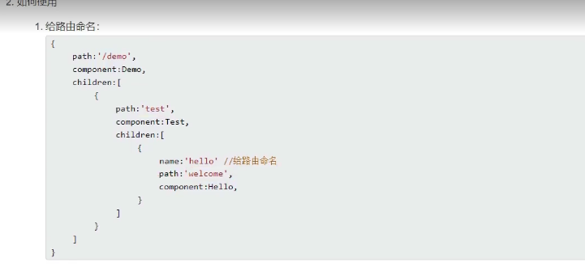

# Vue 2.x

官方文档：https://cn.vuejs.org/

## 1、Vue核心

### 1.1、第一个Vue程序

#### 1.1.1、代码

```html
<!--准备好一个容器-->
<div id="root">
    <h1>你好，{{name}}!</h1>
    <h2>现在是：{{time}}</h2>
</div>
<script>
    new Vue({
        el:'#root',
        data:{
            name:'张三',
            time: new Date().toLocaleString()
        }
    })
</script>
```

#### 1.1.2、注意

1. 想让Vue工作，就必须创建一个Vue实例，且要传入一个配置对象
2. root容器里的代码依然符合HTML规范，只不过混入了一些特殊的Vue的语法
3. root容器里的代码被称为Vue模板
4. Vue实例和容器时一一对应的
5. 真实开发中只有一个Vue实例，并且会配合着组件一起使用
6. {{xxx}}的xxx要写js表达式，且xx可以自动读取到data中的所有属性
7. 一旦data中的数据发生改变，那么页面中用到数据的地方也会自动更新

### 1.2、模板语法

#### 1.2.1、效果和代码


```html
<!--准备好一个容器-->
<div id="demo">
  <h1>插值语法</h1>
  <h3>你好，{{name}}!</h3>
  <h4>现在是：{{time}}</h4>
  <h1>指令语法</h1>
  <a :href="url.baidu" target="_blank">点我去百度</a>
  <a :href="url.google" target="_blank">点我去谷歌</a>
</div>
<script>
  new Vue({
    el:'#demo',
    data:{
      name:'张三',
      time: new Date().toLocaleString(),
      url: {
        baidu: 'https://www.baidu.com/',
        google: 'https://www.google.com/'
      }
    }
  });
</script>
```

#### 1.2.2、总结

* 插值语法

  功能：用于解析标签体内容

  写法：{{xxx}}，xxx是js表达式，且可以直接读取data中的所有属性

* 指令语法

  功能：用于解析标签（标签属性，标签体内容，绑定事件）

  举例：v-bind:href="xx"或者:href="xx" xx同样要写js表达式，且可以直接读取data中的所有属性

  备注：Vue中很多指令都是v-xx，此处我们只是拿v-bind举例

### 1.3、数据绑定

#### 1.3.1、效果和代码


```html
<!--准备好一个容器-->
<div id="demo">
  <h1>单项数据绑定</h1>
  <label>
    <input type="text" :value="name">
  </label>
  <h1>双项数据绑定</h1>
  <label>
    <input type="text" v-model:value="name">
  </label>
</div>
<script>
  new Vue({
    el:'#demo',
    data:{
      name:'张三',
    }
  });
</script>
<script>
  Vue.config.productionTip = false;
</script>
```

#### 1.3.2、总结

Vue中有两种数据版的的方式：

* 单向绑定（v-bind）：数据只能从data流向页面

* 双向绑定（v-model）：数据不仅能从data流向页面，还可以从页面流向data

  备注：

  1. 双向绑定一般都应用在表单类元素上：input，select等
  2. v-model:value可以简写为v-model，因此v-model默认手机的就是value的值

### 1.4、el与data的两种写法

#### 1.4.1、代码

```html
<!--准备好一个容器-->
<div id="demo">
    <h1>你好{{name}}！</h1>
</div>
<script>
    /*const vm = new Vue({
      // el:'#demo',
      data:{
        name:'张三',
      }
    });
    setTimeout(() => {
      vm.$mount('#demo');
    }, 1000);*/
    // data的第二种写法
    new Vue({
        el: '#demo',
        data() {
            return {
                name: '张三',
            };
        }
    });


</script>
```

#### 1.4.2、总结

1. el有两种写法：

   1. new Vue的时候配置el属性
   2. 先创建Vue实例，随后通过$mount()挂载el的值

2. data有两种写法

   1. 对象式
   2. 函数式

   如何选择：目前两种皆可，学到后面组件时，data必须使用函数式，否则会报错

3. 一个重要的原则

   由Vue管理的函数，一定不要写箭头函数，此处的this是Vue实例，如果写成箭头函数，则this指向window

### 1.5、MVVM模型

M：模型 Model：对应data中的数据

V：视图 View：模板

VM：视图模型 ViewModel：Vue实例对象

data中所有的属性，最后都出现在了vm身上

vm身上所有的属性及vue模型上的所有属性，在vue模板中都可以直接使用


### 1.6、数据代理

#### 1.6.1、代码实例

Object.defineproperty

```javascript
<script>
    let index = 'http://localhost:8080/api/';
    let person = {
        name: '张三',
        age: 18,
        job: '学生',
        say: function () {
            console.log(`我叫${this.name}，我今年${this.age}岁，我是一个${this.job}，电话是${this.tel}`);
        }
    };
    Object.defineProperty(person, 'name', {
        writable: false,
        configurable: false,
        enumerable: true
    });
    person.name = '李四';
    Object.defineProperty(person, 'tel', {
        value: '123456789',
        writable: false, // 可写
        configurable: false, // 可以删除属性
        enumerable: false // 可枚举，可以被for...in循环遍历
    });
    Object.defineProperty(person, 'index', {
        get() {
            console.log(`getter: ${index}`);
            return index;
        },
        set(value) {
            console.log(`setter: ${value}`);
            index = value;
        }
    });
    person.say();
    console.log(person);
    console.log(Object.keys(person));
</script>
```

```javascript
  let obj1 = {x: 100}
  let obj2 = {y: 200}
  Object.defineProperty(obj2, 'x', {
    get() {
      console.log('getter: ' + obj1.x)
      return obj1.x
    },
    set(v) {
      console.log('setter: ' + v)
      obj1.x = v
    }
  })
```

#### 1.6.2、示例图


#### 1.6.3、总结

1. Vue中的数据代理：

   通过vm对象来代理data对象中属性的菜哦做（读/写）

2. Vue中数据代理的好处

   更加方便的操作data中的数据

3. 基本原理：

   通过Object.defineProperty()把data对象中所有属性添加到vm上，为每一个添加到vm上的属性都指定一个getter/setter，在getter/setter内部去读/写data中的对应数据

### 1.7、事件处理

#### 1.7.1、事件的基本使用

1. 使用v-on:xx或者@xx绑定事件，其中@xx时事件名
2. 事件的回调需要配置在methods对象中，最终会在vm上
3. methods中配置的函数，不要使用箭头函数，否则this会指向window对象
4. method中配置的函数都是被Vue所管理的函数，this的指向时vm或组件实例对象
5. @click='demo'和@click='demo()'效果一致，但后者可以传参

#### 1.7.2、事件修饰符

1. prevent：阻止默认事件
2. stop：阻止事件冒泡
3. once：事件只触发一次
4. capture：使用事件的捕获模式 在捕获的时候就开始处理事件
5. self：只有event.target是当前操作的元素时才触发的
6. passive：事件的默认行为立即执行，无需等待事件回调执行完毕

例子：

```html
<a @click.prevent="show" href="https://www.google.com" target="_blank">点我提示信息</a>
```

#### 17.3.、键盘事件

1. Vue中常用的按键别名：

   enter，esc，space，tap，up，down，left，right等

2. Vue未提供别的案件，可以使用原始的key值去绑定

3. 系统修饰值（特殊用法）：ctrl，alt，shift，meta

   配合keyup使用：按下修饰符的同时，再按下其他的键，随后释放其他键才触发

   配合keydown使用：正常触发

4. 也可以使用KeyCode指定一些具体的按钮（不推荐）

5. Vue.config.keyCode,自定义键名 = 键码，可以去定制键盘别名

### 1.8、计算属性与监视

#### 1.8.1、计算属性-computed

1. 要显示的属性不存在，要通过计算得来
2. 在computed对象中定义计算属性
3. 在页面中使用`{{方法名}}`来显示计算结果

#### 1.8.2、监视属性-watch

1. 当被监视的属性变化时，回调函数自动调用，进行相关操作
2. 监视的属性必须存在，才能进行监视
3. 监视属性的两种写法：
   1. new Vue()传入watch配置
   2. 通过vm.$watch监视

#### 1.8.3深度监视

1. Vue中的watch默认不监测对象内部值的改变（一层）
2. 配置deep:ture可以检测对象内部值的改变

备注：

1. Vue自身可以监测对象内部值的改变，但Vue提供的watch默认不可以
2. 使用watch时根据数据的具体结果决定是否采用深度监视

#### 1.8.4computed和watch的区别

1. computed能完成的功能，watch都可以完成
2. watch能完成的功能，computed不一定能完成，例如：watch可以进行异步任务

两个重要的小原则：

1. 所有被Vue所管理的函数，最好写成普通函数。这样this的指向才是vm 或 组件实例
2. 所有不被Vue所管理的函数（定时器，ajax的回调函数等），最好写成箭头函数，这样this的指向才是 vm或组件实例

### 1.9、class与style绑定

#### 1.9.1、理解

1. 在应用界面中，某些元素的样式是变化的
2. class/style绑定就是专门来实现动态样式效果的技术

#### 1.9.2、class绑定

1.  `:class=xxx`

2. 表达式是字符串：`'classA'`

   适用于：样式的类名不确定，需要动态指定

3. 表达式是对象：`{classA:boolean,classB:boolean}`

   适用于：要绑定的样式个数确定，名字也确定，但不确定是否启用

4. 表达式时数组：`['classA','classB]`

   适用于：要绑定的样式个数不确定，名字也不确定

#### 1.9.3、style绑定

1. `:style="{color:activeColor,fontSize:fontSize + 'px'}"`
2. 对象写法：`styleObj: {color: 'red',margin: '10px'}`
3. 数组写法：`styleObj: [{color: 'red'},{margin: '10px'}]`

### 1.10、条件渲染

#### 1.10.1条件渲染指令

1. `v-if`与`v-else`	不能被打断
2. `v-show`

#### 1.10.2、比较`v-if`与`v-show`

1. 如果需要频繁切换`v-show`比较好
2. 当条件不成立时，`v-if`的所有子节点都不会解析
3. `v-if`可以和`template`配合使用，但不能和`v-show`配合

### 1.11、列表渲染

#### 1.11.1、`v-for`指令

1. 用于展示列表数据
2. 语法：`v-for="(item,index) in list" :key="item.id"`
3. 可遍历：数组，对象（先value后key），字符串，指定次数

#### 1.11.2、key


#### 1.11.3、总结

面试题：react、vue中key有什么作用？（key的内部原理）

1. 虚拟DOM中key的作用：key时虚拟DOM对象的表示，当状态中的数据发生变化时，Vue会根据 `新数据` 生成 `新的虚拟DOM` ，随后根据Vue进行 `新虚拟DOM` 与 `旧虚拟DOM` 的差异分析比较

2. 对比规则：

   1. 旧虚拟DOM中找到了与新虚拟DOM相同的key：

      1. 若虚拟DOM中的数据没变，直接使用之前的真实DOM
      2. 若虚拟DOM中的数据变了，则生成新的真实DOM，随后替换掉页面中之前的真是DOM

   2. 旧虚拟DOM中未找到与新虚拟DOM相同的key

      创建新的真实DOM，随后渲染到页面中

3. 用index作为key可能引发的问题：

   1. 若数据进行逆序添加、逆序删除等破环顺序的操作：

      会产生没有必要的真实DOM更新 ==> 界面效果没问题，但效率低

   2. 如果结果中包含输入类的DOM：

      会产生错误的DOM更新 ==> 界面有问题

4. 开发中如何选择key

   1. 1.使用数据的唯一标识符作为key，如 id，手机号，邮箱，username等
   2. 如果不存在对数据的逆序添加、逆序修改等破坏顺序操作，仅用于渲染列表用于展示，使用index作为key是没有问题的

### 1.12、Vue监视数据的原理

1. Vue会监视data中所有层次的数据

2. 如何检测对象中的数据

   通过setter实现监视，且要在new Vue时就传入要检测的数据

   1. 对象中后追加的属性，Vue默认不做响应式处理

   2. 如需给后添加的属性做响应式，请使用如下API：

      `Vue.set(target,porpertyName/index,value)`或`vm.$set(target,porpertyName/index,value)`

3. 如何检测数组中的数据

   通过包装数组更新元素的方法实现，本质就是做了两件事：

   1. 调用原生对应的方法对数组进行更新
   2. 重新解析模板，进行更新页面

4. 在Vue修改数组中的某个元素一定要使用如下方法

   1. 使用这些API：`push()` `pop()` `shift()` `unshift()` `splice()` `sort()` `reverse()`
   2. `Vue.set()` 或 `vm.$set()`

   特别注意：`Vue.set()` 和 `vm.$set()`不能给vm或vm的更数据对象添加属性

### 1.13、收集表单数据

若：`<input type="text">`，则`v-mode`收集的书`value`值，用户输入的就是`value`值

若：`<input type="radio">`，则`v-mode`收集的书`value`值，且要给标签配置`value`值

若：`<input type="checkbook">`

1. 没有`value`属性，那么收集的就是checked（`勾选` | `不勾选` `true`|`false`）‘
2. 配置`input`的`value`属性：
   1. `v-mode`的初始值时非数组，那么收集到的就是checked
   2. `v-mode`的初始值是数组，那么收集到的就是`value`组成的数组

备注：`v-mode`的三个修饰符：

1. `lazy`：失去焦点再收集信息
2. `number`：输入字符串转为有效数字
3. `trim`：去掉前后空格

### 1.12、过滤器

定义：对要显示的数据进行特定格式化后再显示（适用于一些简单逻辑的处理）

语法：

1. 注册过滤器：`Vue.filter('filterName',function (value){})`或　`new Vue(filters:{}`
2. 使用过滤器：`{{xx | filterName}}`或 `v-bind:属性=xxx | 过滤器名`

备注：

1. 过滤器也可以接收额外参数，多个过滤器也可以串联
2. 并没有改变原本的数据，是产生新的对应数据

### 1.13、内置指令与自定义指令

```HTML
    学过的
    v-bind  :   单向绑定解析表达式，简写为 :xx
    v-model :   双向绑定数据
    v-for   :   遍历数组/对象/字符串
    v-on    :   绑定事件监听，简写为 @
    v-if    :   条件渲染（鼎泰控制节点是否存在）
    v-else  :   条件渲染（鼎泰控制节点是否存在）
    v-show  :   条件渲染（鼎泰控制节点是否展示）
```

#### 1.13.1、v-text

1. 作用：在其所在的节点中渲染文本内容
2. 与插值语法的区别：v-text会替换掉节点中的内容，{{xx}}不会

#### 1.13.2、v-html

1. 作用：向指定节点中渲染html结构的内容
2. 与插值语法的区别：
   1. v-html会替换掉节点中所有的内容，{{xx}}则不会
   2. v-html可以识别html结构
3. 严重注意：v-html存在安全性问题
   1. 在网站上动态渲染任意html是非常危险的，任意导致XSS攻击
   2. 一定要在信任的内容上使用v-html，永远不再用在用户提交的内容上

#### 1.13.3、v-cloak

1. 本质是一个特殊属性，Vue实例创建完毕并接管容器后，会删掉v-cloak属性
2. 使用css属性配合v-cloak可以解决网速慢时页面展示出母版的问题

#### 1.13.4、v-once

用了后值就不会变了

1. v-once在初次动态渲染后就视为静态内容了
2. 以后数据的改变不会引起v-once所在结构的更新，可以用具优化性能

#### 1.13.5、v-pre

跳过其所在节点的编译过程

可以利用它跳过：没有使用指令语法、没有使用插值语法的节点，会加快编译

#### 1.13.6、自定义指令

函数何时会调用？

1. 指令与元素绑定成功时（一上来）
2. 指令所再的模板重新解析时

定义语法：

1. 局部指令：

   ```
   new Vue({
   directives:{
         directiveName(){}
         }
   })
   ```

   或

   ```
   new Vue({
   	directives:{
         directiveName: {
         	指令名:配置对象
         }
         }
   })
   ```

   

2. 全局指令：

   ```
   Vue.directive(指令名,配置对象) 或 Vue.directive(指令名,回调函数)
   ```

配置对象中常用的三个回调：

1. bind：指令与元素绑定成功时调用
2. inserted：指令所在元素被插入页面时调用
3. update：指令所在模板结构被重新解析时调用

备注：

1. 指令定义时不加v-，但是使用时要加
2. 指令名如果是多个单词，要使用 `kebab-case` 命名方式，不要使用 `camelCase` 命名

### 1.14、Vue实例生命周期

#### 1.14.1、生命周期

1. 又名生命周期回调函数、生命周期函数、生命周期钩子
2. 是什么：Vue在关键时刻帮我们调用的一些特殊名称的函数
3. 生命周期函数的名字不可更改，但函数的具体内容是程序员根据需求编写的
4. 生命周期函数中的this或组件实例对象

#### 1.14.2、流程

路由还有三个，学到再写

```html
// 在beforeCreate之前，初始化：生命周期、时间，但数据代理还未开始
beforeCreate(){
  // 此时，无法通过vm访问到data中的数据，method中的方法
  console.log('创建之前')
  // debugger;
},
// 在created之前，初始化：数据监测，数据代理
created(){
  // 此时，可以通过vm访问到data中的数据，method中的方法
  console.log('创建完成')
  // debugger;
},
// 在beforeMount之前，判断是否有el选项和template选项，此阶段Vue开始解析模板，生成虚拟DOM（内存中），页面还不能显示解析好的内容
beforeMount(){
  // 此时，页面呈现的是未经Vue编译的DOM结构，所有对DOM的操作，最终都不奏效，除非el的节点被删了，一般也没人这么干
  console.log('挂载之前')
  // debugger;
},
// 在mounted之前，将内存中的虚拟DOM转为真实DOM插入页面，创建$el然后将el替换为$el
mounted(){
  // 此时，页面中呈现的都是经过Vue编译的DOM，对DOM的操作均有效（尽可能避免），至此初始化的过程结束，一般在此精选：开启定时器，发送网络请求，订阅消息，绑定自定义时间等初始化操作
  console.log('挂载完成')
  // debugger;
},
beforeUpdate(){
  // 此时：数据是新的，但页面依旧是旧的，即：页面尚未和数据保持同步
  console.log('数据更新前')
  // debugger;
},
// 在updated之前，根据新数据，生成新的虚拟DOM，随后与旧的虚拟DOM进行比较，最终完成页面更新，即：完成了Model -> View的更新
updated(){
  // 此时：数据是新的，页面也是新的，即：页面和数据保持同步
  console.log('数据更新后')
  // debugger;
},
// 当$destroy被调用后才执行后面两项
// 在beforeDestroy之前，
beforeDestroy(){
  // 此时，vm中所有对：data、methods、指令等等，都处于可用状态，但对页面数据的修改不会再更新了，马上要执行销毁的过程，一般在此阶段：关闭定时器，取消订阅消息，解绑自定义事件等收尾操作
  console.log('销毁前')
  // debugger;
},
// 移除所有的监视，子组件
destroyed(){
  console.log('已销毁')
  // debugger;
}
```

#### 1.14.3、总结

常见的生命周期钩子

1. mounted：发送ajax请求，启动定时器、绑定自定义事件、订阅消息等初始化操作
2. beforeDestroy：清楚定时器、解绑自定义事件、取消订阅等收尾工作

关于销毁Vue实例

1. 销毁后借助Vue开发者工具看不到任何信息
2. 销毁后自定义事件不会失效，但原生DOM事件依旧有效
3. 一般不会在beforeDestroy操作数据，因为即使操作数据，页面也不会触发更新流程了

## 2、Vue组件化编程


### 2.1、模块与组件、模块化与组件化

#### 2.1.1、模块

1. 理解：向外提供特定功能的js程序，一般就是一个js文件
2. 为什么：js文件很多，很复杂
3. 作用：复用js，简化js的编写，提高js运行效率

#### 2.1.2、组件

1. 理解：用来实现局部功能效果的代码集合
2. 为什么：一个界面的功能复杂
3. 作用：服用编码，简化项目编码，提高运行效率

#### 2.1.3、模块化

当应用中的js都已模块来编写的，那这个应用是一个模块化的应用

#### 2.1.4、组件化

当应用中的功能都是多组件的方式来编写的，那这个应用就是一个组件化的应用

### 2.2、非单文件组件

一个文件中包含有n个组件

#### 2.2.1、Vue中使用组件的三大步骤

1. 定义组件

   使用`Vue.extend(options)`创建，其中`options`和`new Vue(options)`时传入的那个`options`几乎一样，但也有一点区别：

   * 一定不要写el配置项，因为所有对组件最终都要被一个vm管理，vm决定服务于哪个容器的
   * data必须写成函数，避免组件被复用时，数据存在引用关系

2. 注册组件

   * 局部注册：靠`new Vue`的时候传入`components`选项
   * 全局注册：靠`Vue.component(‘组件名’,组件)`

3. 使用组件

   编写组件标签，如 `<hello></hello>`

关于几个注意点：

1. 关于组件名：

   一个单词组成：

   * 首字母小写：例：hello
   * 首字母大写：例：Hello

   多个单词组成

   * kebab-case：'hello-vue'
   * CamelCase：HelloVue（需要Vue脚手架支持）

   备注：

   1. 组件名尽可能回避HTML中已有的元素名称，如：h2、H2
   2. 可以使用name配置项来指定组件在开发者格局中呈现的字

2. 关于组件标签：

   * `<hello></hello>`
   * `<hello/>`

   备注：不使用脚手架时，`<school/>`会导致后续不能渲染

3. 一个简写方式

   `const hello = Vue.extend(options)`可简写为 `const hello = options`

#### 2.2.2、关于VueComponent

1. `school组件`本质是一个名为 `VueComponent` 的构造函数，且不是程序员定义的，是`Vue.extend`生成的

2. 我们只需要写 `<school/>` 或 `<school></school>` ，Vue解析时会帮我们创建`school`组件的实例对象，即Vue帮我们执行的：`new VueComponent(options)` 

3. 特别注意：每次调用 `Vue.extend` ，返回都是一个 `VueComponent`

4. 关于this指向：

   1. 组件配置中：

      data函数、methods中的函数、watch中的函数、computed中的函数 谈的指向均是 VueComponent实例对象

   2. `new Vue()`配置中：

      data函数、methods中的函数、watch中的函数、computed中的函数 谈的指向均是 Vue实例对象

5. `VueComponent`的实例对象以后简称 vc

   Vue的实例对象简称 vm

2.2.3、一个重要的内置关系

一个重要的内置关系：`VueComponent.prototype.__proto__ === Vue.prototype`


为什么要有这个关系：让组件实例可以访问到Vue原型上的属性，方法

### 2.3、单文件组件

一个文件中只有一个组件

没啥记的，看代码就懂了

## 3、使用Vue脚手架

### 3.1、初始化脚手架

### 3.2、说明

1. Vue脚手架是Vue官方提供的标准化工具
2. 最新版本是5.x
3. 文档 https://cli.vuejs.org/zh/

### 3.3、步骤

```
npm install -g @vue/cli	 # 安装脚手架
cd projectpath
vue create projectname	 # 初始化项目
npm run serve			# 运行项目
```

无法加载文件 D:\Environment\NodeJS\node_global\xxx.ps1，因为在此系统上禁止运行脚本。

无法执行运行 `set-ExecutionPolicy RemoteSigned`


### 3.4、关于不同版本的Vue

1. `vue.js`与`vue.runtime.xxx.js`的区别：
   1. `vue.js`是完整版的Vue，包含核心功能+模板解析器
   2. `vue.runtime.xxx.js`是运行版的Vue，只包含核心功能，没有模板解析器
2. 因为 `vue.runtime.xxx.js` 没有模板解析器，所以不能使用template配置项，需要使用render函数接收到createElement函数去指定具体内容

### 3.5、ref属性

1. 被用来给元素或子组件注册引用信息（id的替代者）
2. 应用在html标签上获取的是真实DOM元素，应用在组件标签上是VueComponent实例对象
3. 使用方法： `<h2 ref="hello">{{msg}}</h2>`
4. 获取方式： `this.$refs.hello`

### 3.6、配置项props

功能：让组件接收外部传来的数据

1. 传递数据 `<elementTarget name="value">`

2. 接收数据

   1. 第一种方式

      ```
      props:['name']
      ```

   2. 第二种方式

      ```
      props: {
      	name=String
      }
      ```

   3. 第三种方式

      ```
      props:　{
      	name: {
      		type:String
      		required:true
      	},
      	sex: {
      		type:String
      		default: '男'
      	},
      }
      ```

备注：props是只读的，Vue底层会检测你对props的修改，如果进行修改，就会发生警告，若业务需求需要修改，那么请复制props的内容到data中一份，然后去修改data中的数据

### 3.7、mixin（混入/混合）

功能：可以把多个组件公用的配置提取成一个混入对象

使用方法：

1. 定义混入：

   ```
   {
   	data(){},
   	methods: {},
   	mounted(){},
   	...
   }
   ```

2. 使用混入

   1. 全局混入 `Vue.mixin(Mixin);`
   2. 局部混入 `mixins: [mixin,mixin2,...]`

### 3.8、插件

功能：用于增强Vue

本质：包含install方法的一个对象，install的第一个参数是Vue，第二个以后的参数是使用者传递的数据

定义插件：

```
对象.isntall = function(Vue,options){
	Vue.xxx
}
```

使用插件：`Vue.use`

### 3.9、tdo-list案例

见代码

总结：

1. 组件化编码流程
   1. 拆分静态组件：组件按照功能点拆分，命名不要与HTML标签重复
   2. 实现动态组件：考虑好数据存放位置，数据是一个组件再用还是一些组件在用
      1. 一个组件在用：放组件自身即可
      2. 一些组件在用：放他们沟通的父组件上
   3. 实现交互：从绑定事件开始
2. props适用于：
   1. 父组件 ==> 子组件通信
   2. 子组件 ==> 父组件通信（要求先给子组件一个函数）
3. 使用v-model时要切记：v-model绑定的值不能是props传过来的值，因为props是不可以修改的
4. props传过来的若是对象类型的值，修改对象中的属性时Vue不会报错，但不推荐这样做

### 3.10、浏览器本地存储


### 3.11、组件的自定义事件

1. 一种组件间通信的方式：适用于： 子组件 ==> 父组件

2. 使用场景

3. 绑定自定义事件：

   1. 第一种方式：在父组件中： `<Demo @xxx="test"/>` 或 `<Demo v-on:xxx="test"/>`

   2. 第二种方式：在父组件中：

      ```html
      <demo ref='demo'>
          ......
      mounted(){
          this.$ref.demo.$on('xxx',this.test)
          }
      ```

      

4. 触发自定义事件： `this.$emit('xxx',args)`

5. 解绑自定义事件： `this.$off('xxx')`，多个用 `this.$off(['xxx','xxx',...])`，解绑全部用 `this.$off()`

6. 组件山也可以绑原生DOM事件，不过要用 `.native` 修饰符

7. 注意：同 `this.$ref.xxx.on('xxx', 回调)` 绑定自定义时间是，回调要么配置在methods中，要么使用箭头函数，否则this的指向有问题

### 3.12、全局事件总线（GlobalEventBus）：任意组件通信

1. 一种组件间通信的方式，适用于任意组件间通信

2. 安装全局事件总线

   ```js
   new Vue({
       render: h => h(App),
       beforeCreate() {
           Vue.prototype.$bus = this  // 安装全局事件总线
       }
   }).$mount('#app');
   ```

3. 使用事件总线

   1. 接收数据：

      ```vue
      mounted() {
        this.$bus.$on('xxx', (data) => {
          
        })
      }
      ```

   2. 提供数据： `this.$bus.$emit('xxx',data)`

4. 最好在 `beforeDestroy` 钩子中用 `$off()` 去解绑组件所用到的事件

### 3.13、消息订阅与发布

个人感觉没有全局事件总线好用

1. 一种组件间通信的方式，适用于任意组件间通信

2. 使用步骤：

   1. 安装 `pubsub` ： `npm install pubsub-js`

   2. 引入 `import pubsub from 'pubsub-js'`

   3. 接收数据：

      ```vue
      methods: {
          getMsg(msgTitle, data) {
            ...
          }
        },
        mounted() {
          this.pid = pubsub.subscribe('msgTitle', this.getMsg)
        },
      ```

   4. 提供数据：`pubsub.publish('msg', data`)

   5. 最好在beforeDestroy钩子中使用 `pubsub.unsubscribe(pid)`去取消订阅

### 3.14、nextTick

1. 语法：`this.$nextTick(callback)`
2. 作用：在下一次DOM更新结束后指向其指定的回调
3. 什么时候用：改变玩数据后，要基于更新数据后的DOM进行某些操作时，要在nextTick所指定的回调函数中执行

### 3.15、过渡动画

不太想看，91-95级

## 4、Vue中的Ajax

### 4.1、解决跨域问题，Vue脚手架配置代理

方法一

​	在 `vue.config.js` 中添加

```
devServer: {
  proxy: 'http://localhost:81'
}
```

说明：

1. 优点：配置简单，请求资源时直接发给前端即可
2. 缺点：不能配置多个代理，不能灵活控制请求是否走代理
3. 工作方式：若按照上述方式配置代理，当请求了前端不存在的资源是，才会转发给服务器（优先匹配本地资源）

方法二

​	编写 `vue.config.js` 的具体代理规则

```
module.exports = {
  devServer: {
    proxy: {
      '/api': {
        target: '<url>',
        ws: true, // 用于支持websockets
        changeOrigin: true, // 用于控制请求头中的host值
        pathRewrite: { // 重写路径
            '^/api': ''
        }
      },
      '/foo': {
        target: '<other_url>'
      }
    }
  }
}
```

说明：

1. 优点：可以配置多个代理，且可以灵活控制请求是否走代理
2. 缺点：配置略微繁琐，请求资源时必须加前缀

### 4.2、GitHub搜索案例

见源码

### 4.3、slot插槽

vue3好像废弃了，需要再看吧

#### 4.3.1、默认插槽

#### 4.3.2、具名插槽

#### 4.3.3、作用域插槽

1. 理解：数据在组件自身，但根据数据生成结构需要组建的使用者来决定

2. 代码：

   这里不好看，看下源码就知道了

   ```html
   <template>
     <div id="category">
       <h3>{{title}}</h3>
       <slot :games="games">
         我是啥
       </slot>
     </div>
   </template>
   
   <script>
   
   export default {
     name: "Category",
     data() {
       return {
           title: 'Games',
           games: [
             {id: 1, name: 'Counter Strike' },
             {id: 2, name: 'Call of Duty' },
             {id: 3, name: 'Mario' },
           ]
       };
     },
   }
   </script>
   ////////////////////////////////////////////////////////////////////////////////////////
   <template>
     <div id="app" class="container">
       <category>
         <template slot="game1">
           <ul>
             <li v-for="game in game1.games" :key="game.id">
               {{game.name}}
             </li>
           </ul>
         </template>
       </category>
       <category>
         <template scope="game2">
           <ol>
           <li v-for="game in game2.games" :key="game.id">
             {{game.name}}
           </li>
           </ol>
         </template>
       </category>
       <category>
         <template scope="game3">
           <h3 v-for="game in game3.games" :key="game.id">
             {{game.name}}
           </h3>
         </template>
   
       </category>
     </div>
   </template>
   ```

## 5、Vuex

### 5.1、理解Vuex

#### 5.1.1、什么是Vuex

1. 概念：专门在Vue中实现集中式状态（数据）管理的一个Vue插件，对Vue应用中多个组件的共享状态进行集中的管理（读/写），也是一种组件间通信的方式，且适用于任意组件间通信
2. GitHub地址：https://github.com/vuejs/vuex

### 5.2、什么时候使用Vuex

1. 多个组件依赖同一状态
2. 来自不同的组件需要变更同一状态

### 5.3、工作原理


### 5.4、搭建Vuex环境

1. 创建文件 `src/store/index.js`

   ```js
   import Vue from "vue";
   import Vuex from "vuex";
   Vue.use(Vuex)
   
   
   const actions= {
       // 用于响应组件中的动作
   }
   
   const mutations= {
       // 操作数据
   }
   
   const state= {
       // 存储数据
   }
   
   
   // 创建并暴露store
   export default new Vuex.Store({
       actions: actions,
       mutations: mutations,
       state: state,
   })
   ```

2. 在 `main.js` 中创建vm时传入 `store` 配置项

   ```js
   import Vue from 'vue'
   import App from './App.vue'
   import store from './store'
   
   Vue.config.productionTip = false
   
   new Vue({
     render: h => h(App),
     store: store,
   }).$mount('#app')
   ```

### 5.5、基本使用

1. 读取数据： `[this.]$store.state.dataname`

2. 组件修改Vuex中的数据： `$store.dispatch('action',data)` 或 `$store.commit('mutation',data)`

   如果没有网络请求，可以直接commit，不用dispatch

### 5.6、getters的使用

1. 概念

2. 在 `store.js` 中追加 `getters` 配置

   ```js
   ....
   const getters = {
       // 用于响应组件中的计算属性
      ....
   }
   ....
   // 创建并暴露store
   export default new Vuex.Store({
       ....
       getters: getters,
   })
   ```

3. 组件中读取数据 `$store.getters.xxx`

### 5.7、四个map方法的使用

有时间再转文本吧，累，115-116集


```js
<template>
  <div id="count">
    <h2>当前和为：{{sum}}，bigSum ：{{getSum}}</h2>
    <select v-model="range">
      <option v-for="item in 100" :value="item" :key="item">{{item}}</option>
    </select>
    <button @click="add(range)">+</button>
    <button @click="reduce(range)">-</button>
    <button @click="addWhileOdd(range)">当基数再加</button>
    <button @click="addWait(range)">等等再加</button>
  </div>
</template>

<script>
import { mapState,mapGetters,mapActions,mapMutations } from 'vuex'
export default {
  name: "Count",
  data(){
    return {
      range: 1
    }
  },
  computed: {
    ...mapState(['sum']),
    ...mapGetters(['getSum'])
  },
  methods: {
    ...mapActions({
      add: 'AddAction',reduce: 'ReduceAction',addWhileOdd: 'AddWhileOddAction',addWait: 'addWaitAction'
    }),
    // add() {
    //   this.$store.dispatch("AddAction", this.range);
    // },
    // reduce() {
    //   this.$store.dispatch("ReduceAction", this.range);
    // },
    // addWhileOdd() {
    //   this.$store.dispatch("AddWhileOddAction", this.range);
    // },
    // addWait() {
    //   this.$store.dispatch("AddWaitAction", this.range);
    // }
  }
}
</script>

<style scoped>

</style>
```

### 5.8、模块化+命名空间


## 6、Vue-router

### 6.1、相关理解

#### 6.1.1、Vue-router的理解

Vue的一个插件，专门来实现 **SPA应用**

#### 6.1.2、对SPA应用的理解

1. 单页面Web应用（`single page web application`）
2. 整个应用只有一个完整的页面
3. 点击页面中的导航栏链接不会刷新页面，只会做页面的局部更新
4. 数据需要通过ajax请求获取

#### 6.1.3、路由的理解

1. 什么是路由
   1. 一个路由就是一组映射关系 key-value
   2. ke为路径，value为function或component
2. 路由分类
   1. 后端路由
      1. 理解：value是function，用于处理客户提交的请求
      2. 工作过程：访问器收到一个请求时，根据请求路径找到匹配的函数来处理请求，返回相应数据 
   2. 后端路由
      1. 理解：value是component，用于展示页面的内容
      2. 工作过程：当浏览器的路径改变时，对应的组件就会显示

### 6.2、基本路由

#### 6.2.1、基本使用

1. 装vue-router `npm i vue-router`

2. 编写路由配置

   ```js
   import Vue from "vue";
   import router from 'vue-router'
   import About from "@/components/About";
   import Home from "@/components/Home";
   Vue.use(router)
   
   export default new router({
       routes: [
           {
               path: '/about',
               component: About
           },
           {
               path: '/home',
               component: Home
           }
       ]
   })
   ```

3. 实现路由切换 

   ```html
     <div id="app">
       <div class="list-group" style="width: 280px;">
             <router-link class="list-group-item list-group-item-action" active-class="active" to="/home">Home</router-link>
             <router-link class="list-group-item list-group-item-action" active-class="active" to="/about">About</router-link>
       </div>
       <div>
         <!-- 指定展示位置 -->
         <router-view></router-view>
       </div>
   
     </div>
   ```

#### 6.2.2、几个注意点

1. 路由组件通常存放在`peges`文件夹，一般组件通常存放在`components`文件夹
2. 通过切换，“隐藏”了的路由组件，默认是被销毁的，需要的时候再去挂载
3. 每个组件都有自己的`$route`属性，里面存放着自己的路由信息
4. 整个应用只有一个`router`，都可以通过组件的`$router`属性获取

### 6.3、嵌套（多级）路由

1. 配置：children配置项

   ```js
   import Vue from "vue";
   import router from 'vue-router'
   import About from "@/views/About";
   import Home from "@/views/Home/Home";
   import HomeMessage from "@/views/Home/HomeMessage";
   import HomeNews from "@/views/Home/HomeNews";
   Vue.use(router)
   
   export default new router({
       routes: [
           {
               path: '/about',
               component: About,
               meta: {
                   title: '关于'
               },
           },
           {
               path: '/home',
               component: Home,
               children: [
                   {
                       path: 'message',
                       component: HomeMessage
                   },
                   {
                       path: 'news',
                       component: HomeNews
                   }
               ]
           }
       ]
   })
   ```

2. 跳转

   ```html
   <router-link class="nav-link" active-class="active" to="/home/message">Message</router-link>
   <router-link class="nav-link" active-class="active" to="/home/news">News</router-link>
   ```

### 6.4、路由器的query参数

   1. 传参

      ```html
      <template>
        <div>
          <ul>
            <li v-for="item in list" :key="item.id">
      <!--        query参数-->
      <!--        <router-link :to="`${item.path}?title=${item.title}`">{{item.name}}</router-link>-->
              <router-link :to="{
                path: item.path,
                query: {
                  title: item.title
                }
              }">{{item.title}}
              </router-link>
            </li>
          </ul>
          <router-view></router-view>
        </div>
      
      </template>
      ```

   2. 接收

      ```html
      <h3>{{$route.query.title}}</h3>
      ```

### 6.4、命名路由

   使用

   

   

### 6.5、路由的parms参数

   ```js
   {
                       name: 'homeMessage',
                       path: 'message',
                       component: HomeMessage,
                       children: [
                           {
                               name: 'messageDetail',
                               path: ':id/:title',
                               component: messageDetail,
                           }
                       ]
                   },
   ```

   ```html
   <template>
     <div>
       <ul>
         <li v-for="item in list" :key="item.id">
           <router-link :to="{
             name: 'messageDetail', /*这里不允许使用path，只能用name*/
             params: {
               id: item.id,
               title: item.title
             }
           }">{{item.title}}</router-link>
         </li>
       </ul>
       <router-view></router-view>
     </div>
   
   </template>
   ```

   接收参数

   ```html
   <h3>{{$route.params.title}}</h3>
   ```

### 6.6、路由的props配置

```js
{
    name: 'homeMessage',
    path: 'message',
    component: HomeMessage,
    children: [
        {
            name: 'messageDetail',
            path: ':id',
            component: messageDetail,
            // props: {a:1,b:2} // 一般不这样写，穿的死数据
            // props: true, // 使用true，会将所有的params参数以props传递给组件
            // props(route) {
            //     return {
            //         title: route.params.title
            //     }
            // }
            props({params:{title}}) { // 和上面二选一
                return {
                    title: title
                }
            }
        }
    ]
},
```

### 6.7、`<router-link>`的replace属性

一个常识，了解即可

1. 作用：控制路由跳转时操作浏览器历史记录的模式
2. 浏览器的历史记录有两种写入模式：`push` 和 `replace`，`push`是追加历史记录，`replace`是替换历史记录，路由跳转时候默认为 `push`
3. 如何开启 `replace` 模式： `<router-link replace ...></router-link>`

### 6.8、编程式路由导航

1. 作用：让不借助`<router-link>` 实现路由的跳转，让路由跳转更加灵活
2. 很简单，具体见代码

### 6.9、缓存路由组件

1. 作用：让不展示的路由组件保持挂载，不销毁

2. 具体编码

   ```html
   <keep-alive :include="['HomeNews']">
     <router-view></router-view>
   </keep-alive>
   ```

### 6.10、两个新的生命周期钩子

1. 作用：路由组件所独有的生命周期钩子，用于捕获路由组件的激活状态

2. 代码

   ```js
   deactivated() { // 组件被激活
     console.log("news deactivated");
     clearInterval(this.timer);
   },
   beforeDestroy() { // 组件失去激活
     console.log("HomeNews beforeDestroy")
     clearInterval(this.timer)
   }
   ```

### 6.11、路由守卫

```js
// 全局前置路由守卫 每次路由切换和初始化的时候调用
router.beforeEach((to, from, next) => {
    console.log('全局前置路由守卫')
    console.log(`from: ${from.path}, to: ${to.path}`)
    next()
})

// 全局后置路由守卫 每次路由切换和初始化的时候调用
router.afterEach((to, from) => {
    console.log('全局后置路由守卫')
    console.log(`from: ${from.path}, to: ${to.path}`)
})
```


独享路由守卫没有后置，只有前置

组件内路由守卫

```js
beforeRouteEnter (to, from, next) {
  console.log('About beforeRouteEnter')
  next()
},
beforeRouteLeave (to, from, next) {
  console.log('About beforeRouteLeave')
  next()
},
```


### 6.12、路由的两种工作模式：hash，history

对于一个url来说， # 及其后面的内容就是hash值

hash值不会包含在HTTP请求内，即不会带给服务器

**hash：**

* 兼容性好，但是不美观
* 若是以后将地址通过第三方手机app分享，若app校验降额，则地址会被标记为不合法

**history：**

* 兼容性略差，但地址干净，美观
* 兼容性和hash模式相比略差
* 应用上线时需要后端人员支持，解决刷新404的问题

## 7、Vue UI组件内容

### 7.1、常用UI组件库

* 移动端：[Vant](https://youzan.github.io/vant)、[Cube UI](https://didi.github.io/cube-ui)、[Miti UI](https://mint-ui.github.io)、[Nut UI](https://nutui.jd.com/#/)
* PC端：[Element UI](https://element.eleme.io/#/zh-CN)、[IView UI](https://www.iviewui.com)

# Vue 3.x

## Vue3简介


## 1、创建Vue3.x工程

1. 使用vue-cli创建

   与之前一样，就不多赘述了，版本再4.5.0上就行

2. 使用vite创建

   

   


```sh
npm init vite-app <project-name>
cd <project-name>
npm install
npm run dev
```

## 2、常用的Composition API

### 2.1、setup

1. 理解：Vue3.0中一个新的配置项，值为一个函数
2. setup是所有composition API “表演的舞台”
3. 组件中所用到的：数据、方法等等，均要配置在setup中
4. setup函数的两种返回值
   1. 若返回一个对象，则对象中的属性、方法，在模板中均可直接使用
   2. 若返回一个渲染函数，则可以自定义渲染内容
5. 注意点：
   1. 尽量不要与Vue2.x配置混用
      * Vue2.x配置（data、methods、computed）中可以访问到setup中的属性、方法
      * 但setup中不能访问到Vue2.x的配置（data、methods、computed）
      * 如果有重名，setup优先
   2. setup不能是一个async函数（现在好像可以了？没试过），因为返回值不再是return的对象，而是promise，模板看不到return对象中的属性，后期可以，需要Suspense和异步组件的配合

### 2.2、ref函数

* 作用：定义一个响应式的数据
* 语法： `const xx = ref(initValue)`
  * 创建一个半酣响应式数据的引用对象（reference对象）
  * JS中操作：`xxx.value`
  * 模板中读取数据：不需要`.value`，直接读取就行
* 备注：
  * 接收的数据可以时：基本类型，也可以是对象
  * 基本类型的数据：响应式依然是靠 `Object.defineProperty()` 的 `get` 与 `set` 完成的
  * 对象类型的数据：内部楸树了vue3.0中的一个新函数：`reactive`函数

### 2.3、reactive函数

* 作用：定义一个对象类型的响应式数据（基本类型不要用，要用ref函数）
* 语法：`const 代理对象 = reactive(源对象)`接收一个对象或数组，返回一个代理对象（proxy对象）
* reactive定义的响应式数据是深层次的。
* 内部基于ES6的Proxy实现，通过代理对象操作的元对象内部数据进行操作

### 2.4、Vue3.0中的响应式原理

**vue2.x的响应式**

* 实现原理
  * 对象类型：通过 `Object.defineProperty()` 对属性的读取、修改进行拦截（数据劫持）
  * 数组类型：通过重写更新数组的一系列方法来拦截（对数组的变更方法进行了包装）
* 存在问题
  * 新增属性、删除属性 界面不会更新
  * 直接通过下标修改数组，界面不会自动更新

**vue3.0的响应式**

* 实现原理：
  * 通过proxy（代理）：拦截对象中的任意属性的变化，包括属性值的读写，属性的添加，属性的删除
  * 通过Reflect（反射）：对被代理对象的属性进行操作
  * MDN文档中面熟Proxy与Reflect：
    * Proxy：自己搜下吧。。。。懒得找了
    * Reflect：自己搜下吧。。。。懒得找了
      

### 2.5、reactive对比ref

* 从定义数据角度对比
  * ref用来定义基本数据类型
  * reactive用来定义对象/数组类型
  * 备注：ref也可以用来定义对象/数组，他内部会自动通过reactive转为代理对象
* 从原理角度对比
  * ref通过  `Object.defineProperty()` 的 `get` `set`来实现响应式（数据劫持）
  * reactive通过使用Proxy来实现响应式（数据劫持），并通过Reflect操作源对象内部的数据
* 从使用角度对比
  * ref定义的数据：操作数据需要 `.value`，模板中直接读取不需要
  * reactive定义的数据：操作数据与读写不需要 `.value`

### 2.6、setup的两个注意点

* setup执行的时机
  * 在beforeCreate之前执行，this是undefined
* setup的参数
  * props：值为对象，包含：组件外部传递过来，且组件内部声明接收了的属性
  * context：上下文对象
    * attrs：值为对象，半酣：组件外部传递过来，但没有在props配置中声明的属性，相当于 this.$attrs
    * solts：收到的插槽内容，相当于 this.$slots
    * emit：分发自定义事件的函数，相当于 this.$emit

### 2.7、计算属性与监视

老师我废了阿，晚点再看看阿

1. computed函数

   * 与Vue2.x中computed配置功能一致
   * 

2. watch函数

   * 与Vue2.x中watch配置功能一致

   * 两个小坑：

     * 监视reactive定义的响应式数据时：oldValue无法正确获取、强制开启了深度监视（deep）配置失效
     * 监视reactive定义的响应式数据中的某个属性时，deep配置有效

     
     
     

3. watchEffect函数

   watchEffect：用谁监视谁

   

### 2.8、生命周期


如果一起写，CompostitionAPI的生命周期钩子优先级比配置项的高，但没十年脑血栓写不出来同时存在两种

### 2.9、自定义hook函数

* 什么是hook？本质是一个函数，把setup中使用的CompostionAPI进行了封装
* 类似于Vue2.x中的mixin（混合；混入）
* 自定义hook的优势：复用代码，让setup中的逻辑更清晰易懂

### 2.10、toRefs

* 作用：创建一个ref对象，其value值指向另一个对象中的某个属性
* 语法：`const name = toRef(persion,'name')`
* 应用：要将响应式对象中的某个属性单独提供给外部使用时
* 拓展：`toRefs`与 `toRef` 功能一致，但可以批量创建多个ref对象，语法： `toRefs(persion)`

## 3、其他Composition API

### 3.1、shallowReactive与shallowRef

* shallowReactive：只处理对象最外层的属性的响应式（浅响应式）
* shallowRef：只处理基本数据类型的响应式，不进行对象的响应式处理
* 什么时候用
  * 如果有一个对象数据，结构比较深，但变化时只是外层属性变化 ===> shallowReactive
  * 如果有一个对象数据，后续功能不会修改对象中的属性，二十生成新的对象来替换 ===> shallowRef

### 3.2、readonly与shallowReadonly

* readonly：让一个响应式数据为只读的（深只读）
* shallowReadonly：让一个响应式数据变为只读的（浅只读）
* 应用场景：不希望数据被修改时

### 3.3、toRow与markRaw

* toRow
  * 作用：将一个由 `reactive` 生成的响应式对象转换为普通对象
  * 使用场景：用于读取响应式对象对应的普通对象，这个普通对象的所有操作，不会引起页面更新
* markRaw
  * 作用：标记一个对象，使其永远不会成为响应式对象
  * 应用场景：
    1. 有些值不应该设置为响应式的，例如复杂的第三方类库
    2. 当渲染具有不可变数据源的大列表时，跳过响应式可以提高性能

### 3.4、customRef

* 作用：创建一个自定义的ref，并对其依赖跟踪和更新触发进行显示控制

* 实现防抖效果：

  ```html
    <input v-model="text" />
    <h3>{{text}}</h3>
  ```

  ```js
  function useDebouncedRef(value, delay = 200) {
    let timeout
    return customRef((track, trigger) => {
      return {
        get() {
          track()	// 通知Vue追踪数据的变化（提前和get商量，让他认为这个数据是有用的）
          return value
        },
        set(newValue) {
          clearTimeout(timeout)
          timeout = setTimeout(() => {
            value = newValue
            trigger()	// 通知Vue重新去解析模板
          }, delay)
        }
      }
    })
  }
  
  export default {
    setup() {
      return {
        text: useDebouncedRef('hello')
      }
    }
  }
  ```

### 3.5、provide与inject

* 作用：实现祖孙组件间通信

* 套路：父组件有一个 `provide` 选项来提供数据，后代组件有一个 `inject` 选项来使用这些数据

* 具体写法

  1. 祖组件中：

     

  2. 孙组件中：

     

### 3.6、响应式数据的判断

* isRef：检查一个值是否为ref对象
* isReactive：检查一个对象是否由 `reactive` 创建的响应式代理
* isReadonly：检查一个对象是否由 `readonly` 创建的只读代理
* isProxy：检查一个对象是否由 `reactive` 或者 `readonly` 方法创建的代理

## 4、Composition API的优势

### 4.1、Compostition API存在的问题

使用传统的OptionsAPI中，新增或者修改一个需求，就需要分别在data，methods，computed中修改

### 4.2、Compostition API的优势

我们可以更加优雅的组织我们的代码，函数。让相关功能的代码更加有序的组织在一起

## 5、新的组件

### 5.1、Fragment

* 在Vue2中，组件必须有一个根标签
* 在Vue3中，组件可以没有根标签，内部会将多个标签包含在一个Fragment虚拟元素中
* 好处：减少标签层级，减小内存占用

### 5.2、Telepot

* 什么是Teleport？

  `Teleport`是一种能够将我们的组件HTML结构移动到指定位置的技术

  

### 5.3、Suspense

* 等待异步组件时渲染一些后备内容，获得更好的用户体验
* 

## 6、其他 

### 6.1、全局API的转移


### 6.2、其他改变

* data选项应该始终被声明为一个函数

* 过度类名的改写

  * Vue2.x的写法

    

  * Vue3.x的写法

    

  * 移除了keyCode作为v-on的修饰符，同时也不再支持 `config.keyCode`

  * 移除 `v-on.native` 修饰符

    * 父组件中绑定shi见

      

    * 子组件中声明自定义事件

      

  * 移除过滤器（filter）

    过滤器虽然看起来很方便，但它需要一个自定义语法，打破大括号内表达式”只是JavaScript“的假设，这不仅有学习成本，而且有实现成本。建议用方法调用或计算属性去替换掉过滤器
